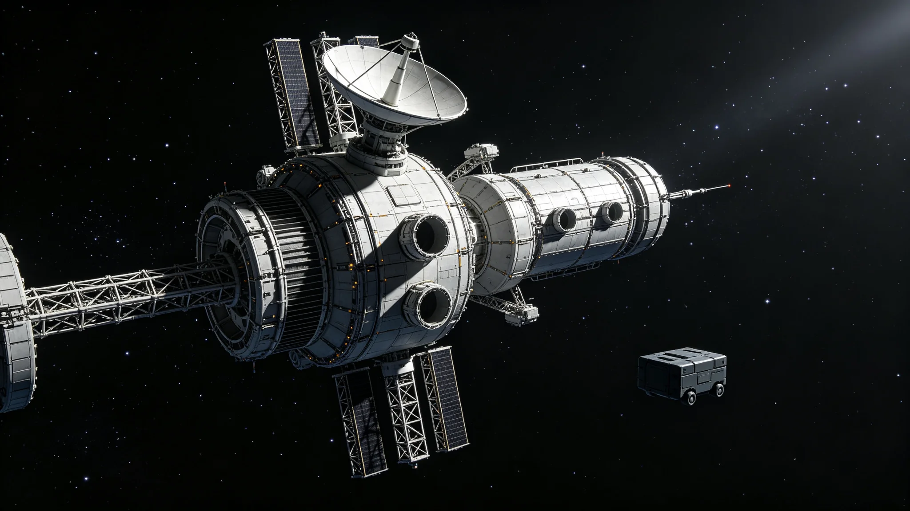

# 跨星系量子通信中继网第四期扩容工程验收公报

**发布机构**：联合体通信工程局 / 量子链路处
**发布日期**：3061年10月5日
**文件等级**：跨星系技术公开
**公报号**：CN-3061-1005

## 一、扩容对象

跨星系量子纠缠通信中继网自2910年首期部署（GS-2910-01）以来，已完成三期扩容。第四期新增12个中继节点，覆盖此前在三恒星系主航道之间的三段"暗区"——此前这三段只能依靠中微子通信（GS-2997-01）的低带宽，量子零延迟链路在这些段落一度中断。

## 二、验收数据

| 指标 | 第三期 | 第四期后 |
|---|---|---|
| 三成员间量子链路总带宽 | 基线100 | 184 |
| 暗区覆盖 | 3段中断 | 0段中断 |
| 单节点量子态保持寿命 | 0.4 s | 1.9 s |
| 跨星系一次完整密钥分发耗时 | 11 s | 2.6 s |
| 链路可用性（年） | 97.2% | 99.4% |

## 三、发现问题

1. **太阳风暴期衰减**：在3061年3月一次中等太阳风暴中，靠近太阳系一侧的两个节点量子态保持寿命下降40%，已加装磁屏蔽外罩；
2. **中继站热循环疲劳**：新节点在轨道日夜交替下，散热肋片热胀冷缩导致接头微松，验收组要求3062年上半年完成一轮紧固巡检。

## 四、边界说明

量子纠缠通信本身不传递超光速信息——它只提供零延迟密钥分发，真正内容仍走光速/中微子信道。本公报重申这一点，以防民间误传"已经实现了超光速通话"。

## 五、结论

第四期扩容通过验收。三恒星系间零延迟密钥分发链路自此无暗区。两个问题列入整改清单。

**签发人**：量子链路处处长（签名略）
**日期**：3061年10月5日
