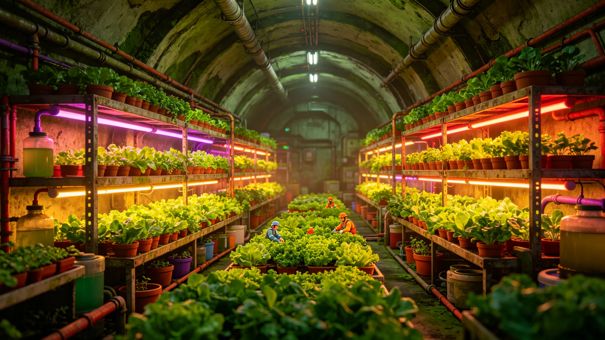

# 鲸鱼座τ星地下城市人工生态系统五百年稳态评估报告

**编制单位**：鲸鱼座τ星下都生态署 / 闭环监测组
**报告日期**：3065年6月28日
**文件等级**：跨星系公开
**报告号**：ECO-3065-0628

## 一、评估对象

下都地下城市自2780年代定居（GS-2780-02）以来，其封闭人工生态系统已运行近三百年——此处"五百年稳态评估"系指将地球封闭生态圈理论（自2049年方舟实验算起）至下都的实际运行合并考察。本报告聚焦下都闭环在最近百年的稳态表现。

## 二、核心指标

| 指标 | 百年前 | 3065年 |
|---|---|---|
| 氧气闭环自给率 | 94% | 99.7% |
| 水循环自给率 | 96% | 99.2% |
| 食物本地生产占比 | 81% | 93% |
| 已知微生态物种数 | 412 | 1,207 |
| 跨区生态事故（百年累计） | — | 3起，均未失控 |

## 三、三次事故复盘

百年间三起生态事件：

1. **3011年藻类污染**：一类引入藻在循环水中过度繁殖，经切断补光、引入其天敌藻控制，23天恢复；
2. **3034年传粉昆虫崩溃**：一批温室蜂因低温集体死亡，人工授粉无人机补位两年，蜂群重建；
3. **3052年微量金属耗竭**：闭环中某种微量元素连续百年无外源，降至临界，经定期微量补入解决——这正是2049年假想预警（见GS-2049-05）所忧的那类耗竭，被实测命中一次。

## 四、结论

下都闭环生态已接近"自持"，但永远不会"完全自持"。百年三起事故证明：封闭生态不是造一个永动机，而是一套永远需要人照看的、会漏的活系统。99.7%的氧气自给率，意味着仍需0.3%的外部补入——那0.3%，就是下都与地表、与跨星系航线之间永远断不开的一根线。

**主笔生态工程师**（签名略）
**日期**：3065年6月28日

## 五、五百年稳态的代价

下都闭环生态运行近三百年，累计维护成本约合星元 1,200 亿，主要用于补光、水循环、微量补入。生态署注明：99.7% 的氧气自给率，意味着仍需 0.3% 的外部补入——那 0.3%，就是下都与地表、与跨系航线之间永远断不开的一根线。

## 六、对第四代生保系统的铺垫

本次评估发现的微量金属耗竭问题，正是下都第四代生命保障系统（GS-3068-01）升级的动因之一。生态署注明：五百年稳态评估不是"庆功"，是"体检"——体检查出来的问题，就是下一代生保系统要改的地方。

## 七、对其他地下城市的参照

下都闭环生态数据已共享给三系其他地下城市，作为其生保系统设计的参照。生态署注明：下都不是唯一的地下城市，但它是运行最久的——它的三起事故，就是其他城市的教材。

## 八、五百年稳态的意义

下都闭环生态运行近三百年，氧气自给率从 94% 升至 99.7%，水循环从 96% 升至 99.2%。生态署注明：99.7% 的氧气自给率，意味着仍需 0.3% 的外部补入——那 0.3%，就是下都与外界永远断不开的一根线。封闭城市永远需要一根这样的线。

## 九、对未来的展望

生态署注明：下都闭环已接近"自持"，但永远不会"完全自持"。百年三起事故证明：封闭生态不是造一个永动机，而是一套永远需要人照看的、会漏的活系统。下一个五十年，继续盯着。

## 十、对其他地下城市的参照

## 十一、五百年稳态的代价

## 附则补充：监测点位与年度巡检日程

下都闭环监测网现布固定监测点412个，其中氧气回路86个、水循环回路124个、温控回路78个、微量营养元素回路124个。每年4月、10月各开展一次全点位校准，校准数据由生态署与独立第三方实验室双签。3052年微量金属耗竭事件后，微量元素回路由半年一检改为季度一检。本补充数据并入3065年评估卷，不另立报告。

## 附则再补：事故档案与外送样本管理

三起生态事故（3011、3034、3052）的处置记录原件存于生态署事故科，副本随本评估卷附送。外送样本每年不超过200份，每份外送须经生物安全员审批，返回后作灭活处理。下都闭环数据不向未签生物安全协议的第三地提供。本补充与GS-3068-01第四代生保升级卷互锁。
