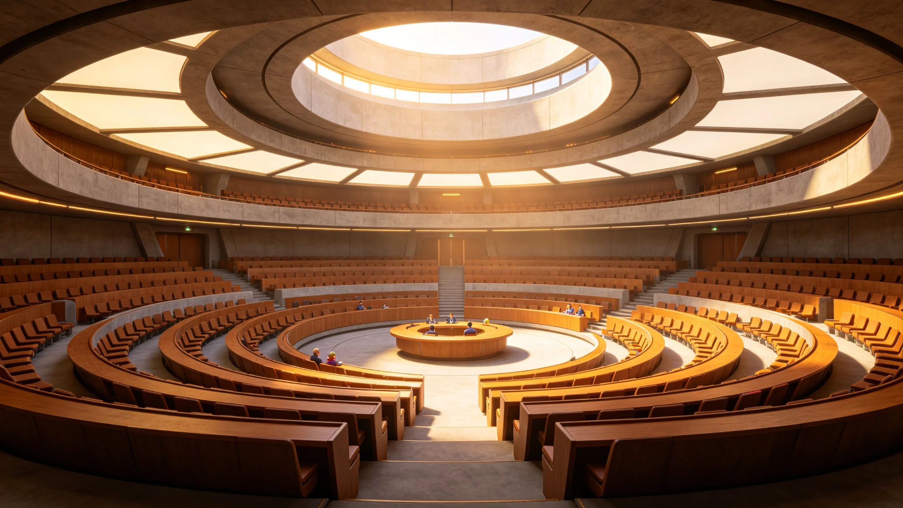

# 联合体预算案跨星系表决程序修订与时差投票规则公报

**发布机构**：联合体议会 / 议事规则委员会
**发布日期**：3066年9月9日
**文件等级**：跨星系公开
**公报号**：PAR-3066-0909

## 一、问题

三恒星系之间4—12年的光延迟，使"议会同时表决"在物理上不可能。原预算表决规则自3000年沿用至今，采用"逐地轮投、以最先到达比邻星b的票群为准"的做法，这使地理位置靠近比邻星b的票客观上先被计入，鲸鱼座τ星的异议常因延迟而"过期"。

## 二、修订要点

新规则引入"同步计票窗"：

1. 预算草案经量子链路同时推送三成员议会；
2. 各成员在各自法定窗口（鲸鱼座τ星最长，给足其光延迟周期）内完成投票；
3. 所有票须在同一"计票截止时刻"（以联合体标准历为准）前抵达，到达后统一计票，不因某票先到而先计；
4. 为防鲸鱼座τ星因延迟而被动"放弃"，新规则允许其在光延迟外另设"电子预委托"程序。

## 三、表决统计

本次修订案经三地议会三读通过，赞成率：比邻星b 68%，鲸鱼座τ星 89%，主带 74%。

## 四、遗留

新规则首次适用于3067年度预算。议会规则委员会承认：这只是把"时间上的不平等"从"先到先计"改成了"同时计"，但无法把4年的光延迟本身消掉。鲸鱼座τ星议员在表决后说："至少这次，我们的票不会再'迟到'到不存在。"

## 五、附则

预算表决改的是计票规则，不是光的速度。光走它的，议会补它的。

**签发人**：议事规则委员会主任（签名略）
**日期**：3066年9月9日

## 六、新规则的首年运行

新规则首次适用于 3067 年度预算。首年三系议会按新规则投票，预算案在计票截止时刻后 48 小时内完成统一计票，未出现"某票先到先计"的争议。议事规则委员会注明：新规则不是把光延迟消掉，是把光延迟造成的"先到先计"不平等消掉——光走它的，议会补它的。

## 七、对鲸港议员的影响

鲸港议员在表决后说："至少这次，我们的票不会再'迟到'到不存在。"议事规则委员会注明：旧规则下，鲸港票因光延迟常被"过期"；新规则下，鲸港票与比邻星b票在同一时刻计票——这不是"迁就鲸港"，是承认三系票在计票权上平等。

## 八、新规则的局限

议事规则委员会承认：新规则只是把"时间上的不平等"从"先到先计"改成了"同时计"，但无法把 4 年的光延迟本身消掉。鲸港议员在议间讨论中说："同时计票是进步，但我们讨论预算时，比邻星b那边已经过了四年——这四年，我们还是没法当面吵。"委员会注明：计票规则改了，议事时差没改——这是下一次修法要面对的事。

## 九、新规则的历史定位

这是联合体预算表决规则自3000年沿用以来的首次修订。议事规则委员会注明：从"先到先计"到"同时计"，用了约 66 年——光的速度没变，但议会的计票方式变了。

## 十、对未来的展望

新规则首次适用于3067年度预算。议事规则委员会注明：预算表决改的是计票规则，不是光的速度。光走它的，议会补它的。

## 十一、新规则的首年运行

新规则首次适用于3067年度预算。首年三系议会按新规则投票，预算案在计票截止时刻后 48 小时内完成统一计票，未出现"某票先到先计"的争议。议事规则委员会注明：新规则不是把光延迟消掉，是把光延迟造成的"先到先计"不平等消掉。

## 十二、对鲸港议员的影响

## 十三、配套技术准备

为支撑新规则落地，议事规则委员会与联合体通信署联合完成三项技术准备：一是三系议会计票终端统一升级，使各成员议会能在同一"计票截止时刻"后自动开启密封箱；二是电子预委托程序通过安全审计，委托票须经议员本人生物特征二次确认方可生效；三是首年运行设独立观察员席，由三系各推举一名计票监督员现场见证拆封。委员会注明：规则改了，终端、审计、观察员三件事得跟着改——否则规则写在纸上，票还是旧票。
