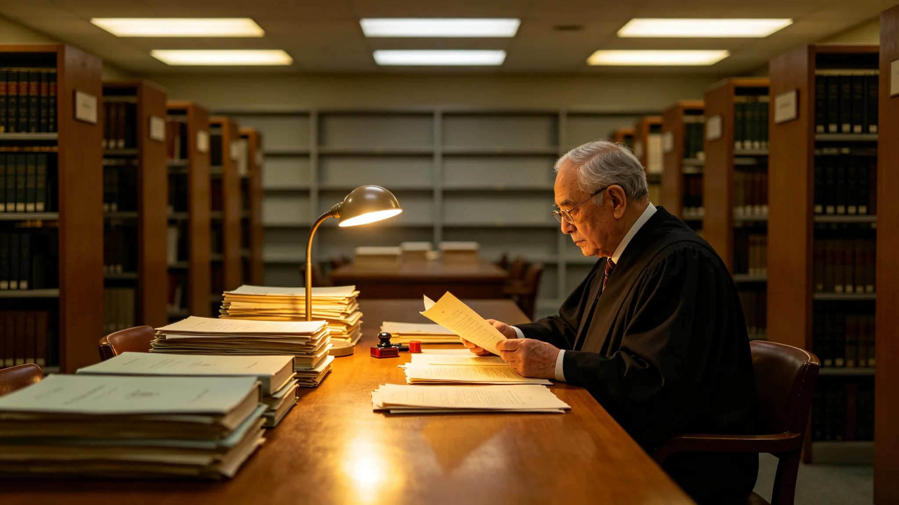

# 联合体跨星系法院退休首席大法官判例签名与体检档案

**归档单位**：联合体跨星系法院 / 书记官室
**归档日期**：3067年12月1日
**文件等级**：公开（医疗隐私遮蔽）
**卷宗号**：JUS-3067-RT-1201

## 一、退休令（节录）

> 兹依《联合体法院组织法》，首席大法官苏莱曼·哈德拉任职满两届，本人申请退休获准。自3068年1月1日起卸职，转任法院荣誉评议员，不参与在审案件。其任内签发判例依《档案法》封存。
>
> 书记官室印 · 3067年12月1日

## 二、履历物证摘录

苏莱曼·哈德拉，2990年生于主小行星带谷神星地下城市，主带自律城市群第二代。3013年自下都大学法学部毕业，回主带任自治法院法官。3038年调任跨星系法院法官，3056年当选首席大法官。

其签名笔迹在3067年退休前被逐卷扫描归档。书记官室抽查了他任首席期间签发的全部412份判例，记录：

- 签名稳定、无涂改者388份；
- 因事实更正重签者19份；
- 因跨星系激光链路延迟补签者5份。

## 三、三件可公查判例

1. 3059年，裁定跨星系迁徙者社保缴费年限"连续计算"（与GS-3060-01互锁）；
2. 3062年，裁定天气控制系统不因其"未消散某风暴"而承担民事责任——理由是系统能力有公开上限，用户应自担剩余风险；
3. 3066年，在预算表决修订案的宪法审查中，裁定新规则合宪，但附言"光的速度不在本院管辖范围"。

## 四、体检遮蔽结论

骨密度T值−1.4（主带0.38g出身，后在新海市1.07g履职11年）；眼部调节疲劳中度；血压在标准区间。医嘱其退休后每半年复查。病历原文封存。

## 五、附则

本档案不写"伟大的法学家"。他是一个主带出生、学法律、签了412份判例、退休时手还稳的普通法官。他写过的那句"光的速度不在本院管辖范围"，将和他的签名一起留在卷宗里。

**归档人**：书记官室（签名略）
**日期**：3067年12月1日

## 六、任内考勤摘录

苏莱曼·哈德拉任首席大法官两届（3056—3067），累计应出勤约 2,200 日，实到约 2,140 日，病事假约 60 日，其中约 40 日系主带低重力导致的骨痛复诊。迟到 4 次，无早退。书记官室注明：一个在 0.38g 低重力里长大的人，在 1.07g 高重力里履职 11 年，骨密度还能保持 T 值 −1.4——这比他签的 412 份判例更值得记一笔。

## 七、退休后的安排

苏莱曼·哈德拉退休后转任法院荣誉评议员，不参与在审案件，不任顾问。他每天去穹顶公园散步，偶尔在咖啡馆坐一坐。书记官室注明：一个首席大法官退休后最大的权力是"没人再来找他签字"——这比任何荣誉头衔都好。

## 八、对继任者的交接

苏莱曼·哈德拉卸任时，向继任首席大法官移交判例卷宗、法院公章、未结事项清单。未推荐任何继任者，只在交接清单末页写一句："光的速度不在本院管辖范围。"继任者将此句记入工作笔记。

## 九、任内三件可公查判例

苏莱曼·哈德拉任首席大法官期间，三件判例可公查：3059年裁定跨系迁徙者社保缴费年限连续计算；3062年裁定天气控制系统不因其"未消散某风暴"而承担民事责任；3066年在预算表决修订案的宪法审查中，裁定新规则合宪，但附言"光的速度不在本院管辖范围"。书记官室注明：这三句话，将和他的签名一起留在卷宗里。

## 十、退休后的安排

苏莱曼·哈德拉退休后转任法院荣誉评议员，不参与在审案件，不任顾问。他每天去穹顶公园散步，不接受媒体采访。书记官室注明：一个首席大法官退休后最大的权力是"没人再来找他签字"——这比任何荣誉头衔都好。

## 十一、任内考勤摘录

## 十二、退休后的安排

## 附则补充：签名抽样与卷宗编号规则

退休前逐卷扫描的412份判例，按年份编号JUS-3056至JUS-3067，每份卷宗附签名扫描件一份。书记官室另留存其任内批注原件37件，均为手写更正，其中19处涉及事实表述修正，5处系光链路延迟补签。本档案自3068年1月1日起对公众开放签名扫描件，病历部分依《档案法》继续封存至本人逝世后50年。
