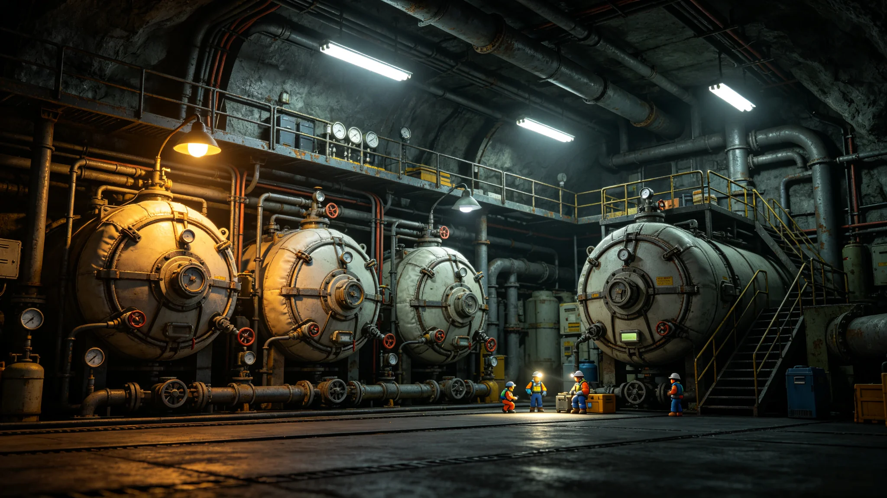

# 鲸鱼座τ星下都地下城市第四代生命保障系统升级验收报告

**编制单位**：鲸鱼座τ星下都工程署 / 生保处
**报告日期**：3068年7月7日
**文件等级**：跨星系技术公开
**报告号**：LS-3068-0707

## 一、升级对象

下都第一代生保系统建于定居初期（GS-2917-01），此后两次大修。第四代升级自3064年立项，目标：把闭环中那0.3%的外部补入（见GS-3065-01）再压缩一半，同时把关键部件的冗余度从双路提升至三路。

## 二、验收数据

| 指标 | 第三代 | 第四代 |
|---|---|---|
| 氧气闭环自给率 | 99.7% | 99.85% |
| 水循环自给率 | 99.2% | 99.6% |
| 关键部件冗余 | 双路 | 三路 |
| 单一部件故障切换时间 | 40 s | 1.2 s |
| 年外部补入物质量 | 基线100 | 41 |

## 三、发现问题

1. 三路冗余中的第三路在调试初期出现一次传感器误报，经查为布线干扰，已整改；
2. 新系统对人工气候（比邻星b方向）的远程调度接口尚需半年磨合；
3. 老系统退役拆下的旧罐体按《空间资产退役规程》封存，不直接回熔。

## 四、结论

第四代生保系统通过验收。下都闭环把那根与外界相连的线，又往回收了一厘米——但仍是一厘米，不是零。封闭城市永远需要一根这样的线。

**主笔工程师**（签名略）
**日期**：3068年7月7日

## 五、升级的成本

第四代生保升级总投资约合星元 120 亿，主要用于罐体、管道、冗余系统。投资由鲸港政府承担。生保处注明：花 120 亿，把氧气自给率从 99.7% 提到 99.85%——这 0.15 个百分点，值不值？值，因为它意味着下都与外界那根线又细了一点。

## 六、对第五代的铺垫

生保处注明：第四代不是终点。第五代要把那 0.15% 的外部补入再压一半，同时把三路冗余扩为四路。第五代预计在 3090 年代立项——届时下都闭环将运行约 310 年。生保处注明：生保系统不是"一次建成"，是每几十年改一代——改了四代，才把那根线收到现在这么细。

## 七、与第五次事故的对照

第四代升级前，下都百年三起生态事故（GS-3065-01）证明：闭环生态永远会漏。生保处注明：第四代升级不是"不漏了"，是"漏得更少了"——那 0.15% 的外部补入，就是下都与外界永远断不开的一根线。

## 七、升级的成本

## 八、对第五代的铺垫

## 九、对第三道冗余的调试

三路冗余中的第三路在调试初期出现一次传感器误报，经查为布线干扰，已整改。生保处注明：三路冗余不是"多一路备用"，是"坏了一路还能跑，坏了两路还能撑"——冗余越多，城市越稳。

## 十、升级的成本

## 十一、验收取样与试运行

本次验收按《地下城市生保系统验收规程》抽取 12 个运行样本：氧气循环回路 4 路、水循环回路 3 路、温控回路 2 路、应急切换回路 3 路。每路连续观测 720 小时，共取得运行数据点 86,400 条，超限点 2 条，均为第三路冗余调试初期的传感器误报，已闭环。验收组另安排三次人为停机演练，分别切断主、备、第三路电源，系统切换时间实测 1.1—1.3 秒，与设计值 1.2 秒相符。生保处注明：验收不是"看一眼就过"，是抽 12 路、跑 720 小时、断三次电——数据摆在那儿，才能签字。

## 附则补充：调试期不合格项与闭环记录

调试期间共记录不合格项7项，其中传感器误报3项、阀门密封微渗2项、远程接口协议不匹配1项、旧罐体封存标识错挂1项。7项均于3068年6月前闭环，复验记录附于验收卷末。第三路冗余布线干扰问题，整改后连续运行1,200小时未再出现同类误报。本补充不改变验收结论。

## 附则再补：旧罐体处置与人员培训

第三代退役旧罐体共36个，按《空间资产退役规程》封存于下都封存区，不直接回熔，留存作逆向研究。第四代系统操作手册已印行120册，生保处全员培训分四期完成，考核通过率100%。新系统远程调度接口与比邻星b气候系统的磨合数据，每月由下都工程署报送一次。
