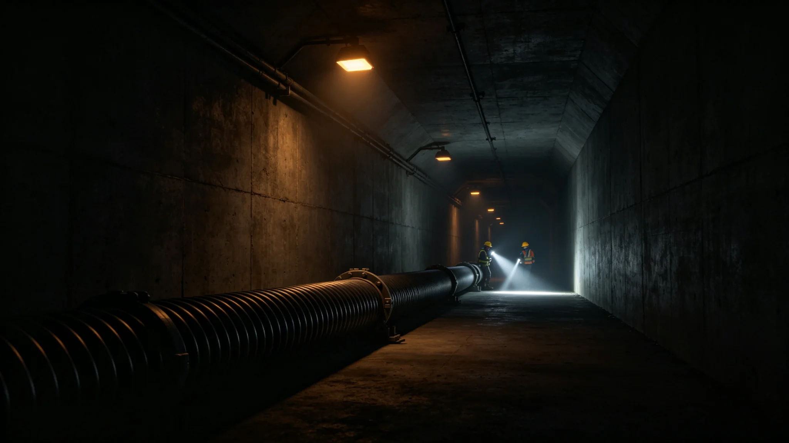

# 鲸鱼座τ星下都主电力缆故障八小时全域停电事件复盘公报

**发布机构**：鲸鱼座τ星下都能源署 / 电力调度
**发布日期**：3069年5月18日
**文件等级**：跨星系公开
**公报号**：EN-3069-0518

## 一、事件经过

3069年4月2日凌晨，下都主供能主缆（地热—中央母线）一处接头因长期蠕变突然断裂，全城八小时全域停电。

- 02:17 主缆断裂，中央母线失压；
- 02:19 应急柴油与燃料电池自动启动，仅保生保、医疗、通风，公共照明、电梯、餐饮停运；
- 02:30 电力调度启动第二路备用缆，但备用缆当时正处计划检修，只能带一半负荷；
- 06:40 主缆接头临时抢修完成；
- 10:17 全负荷恢复。

全程无人员伤亡，生保闭环未受影响（应急电源直供），但8小时黑暗中约3,200名居民滞留于各加压层通道，由自治志愿者引导至安全区等候。

## 二、原因

主缆接头蠕变寿命已超设计8年未更换——这是运维排程的疏漏。备用缆正处检修是叠加因素。两件事撞在一起，造成了八小时停电。

## 三、整改

1. 全部主缆接头按蠕变寿命普查更换，未来每3年超声探伤；
2. 备用缆检修不得与主缆同时进行；
3. 对滞留通道居民：发放误工与不便补偿；
4. 主责运维班组长：依考绩法记过一次，不就地免职——其在停电后抢修到位，不掩其排程之失。

## 四、教训

八小时黑暗里，下都人发现：没有电，这个地下城市就是一个会呼吸但看不见的洞穴。生保救了他们的命，但电才决定他们能不能在洞里走动。本事件记入城市运维档案，作为下一代生保与电网耦合设计的反面教材。

**签发人**：电力调度主任（签名略）
**日期**：3069年5月18日

## 五、对滞留居民的补偿

约 3,200 名居民在 8 小时黑暗中滞留于各加压层通道，由自治志愿者引导至安全区等候。事后发放误工与不便补偿，每人约合星元 800。能源署注明：8 小时黑暗，每人补 800——这不是"赔偿损失"，是"对 inconvenience 的承认"。

## 六、对运维班组长的处分

主责运维班组长依考绩法记过一次，不就地免职——其在停电后抢修到位，不掩其排程之失。能源署注明：记过不是"开除"，是"把你的失误写进档案"——下次排程时，他会记得这次八小时。

## 七、对下都电网的长期影响

全部主缆接头按蠕变寿命普查更换，未来每 3 年超声探伤。备用缆检修不得与主缆同时进行。能源署注明：一次八小时停电，换来了全批次主缆接头更换和 3 年探伤周期——这比一次大事故后再查，便宜得多。

## 八、八小时黑暗的教训

八小时黑暗里，下都人发现：没有电，这个地下城市就是一个会呼吸但看不见的洞穴。生保救了他们的命，但电才决定他们能不能在洞里走动。能源署注明：本事件记入城市运维档案，作为下一代生保与电网耦合设计的反面教材。

## 九、对下都电网的长期影响

## 十、对滞留居民的补偿

## 十一、对运维班组长的处分

## 十二、公众监督与回访

事件后 30 日，能源署会同市民自治委员会对滞留居民开展抽样回访，共回收问卷 2,140 份，其中对引导效率表示满意者占 76%，对补偿金额认为合理者占 69%。另有 41 份问卷反映应急照明电池续航不足 4 小时，已列入下一批电池组更换清单。能源署注明：回访不是"找好听的话"，是把居民实际遇到的问题再记一笔——电池不够亮，就是不够亮，不能用"总体平稳"四个字盖过去。

## 附则补充：补偿发放与回访抽样口径

误工与不便补偿按滞留时长分两档发放：滞留4小时以内者每人500星元，滞留4小时以上者每人800星元。3,200名滞留居民中，领500星元者1,960人，领800星元者1,240人，发放率100%，无一人漏领。30日回访问卷回收率66.9%，41份电池续航反馈已列入下批1,200组电池更换清单，预算另列。
