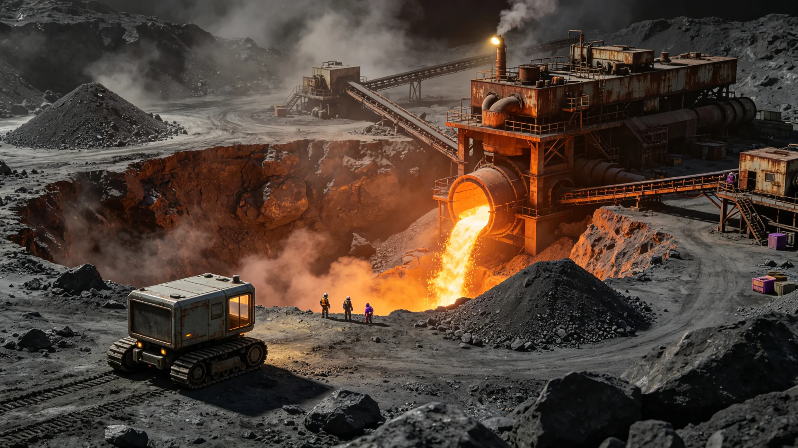

# 主小行星带稀有金属跨星系出口配额年度决算报告

**编制单位**：主小行星带自律城市群贸易公署 / 配额处
**报告日期**：3070年3月3日
**文件等级**：跨星系公开
**报告号**：MB-3070-0303

## 一、决算年度

3069年度主带稀有金属（铁镍精矿、铂族、稀土）跨星系出口，按《跨星系贸易航线运力配额》（GS-2913-01）框架与联合体零关税（GS-3056-01）执行。

## 二、数据

| 品类 | 出口量（吨） | 同比 | 主要去向 |
|---|---|---|---|
| 铁镍精矿 | 4.1×10⁶ | +9% | 比邻星b轨道制造 |
| 铂族金属 | 2.0×10³ | +14% | 三成员高端制造 |
| 稀土精矿 | 1.1×10⁴ | −3% | 下都、主带自用为主 |
| 矿石直接返回地球 | 0.2×10⁶ | −41% | 地球原乡保护区（GS-2610-03）限制 |

## 三、要点

1. **地球方向萎缩**：地球"原乡保护区"政策（GS-2610-03）使主带矿石直返地球大幅下降，主带经济重心已彻底转向比邻星b与鲸鱼座τ星；
2. **本地加工率上升**：铁镍精矿在主带本地冶炼成型材再出口的比例从41%升至58%，出口附加值提高；
3. **配额使用**：本年度配额使用率94%，余6%留待3070年用。

## 四、遗留

- 主带自律城市群对联合体零关税无异议，但坚持本地冶炼出口的原产地认定权；
- 一批小行星采矿平台（GS-2970-01机器人集群）在3069年遭遇一次碎片撞击预警（见GS-3077-01后续），未造成损失。

## 五、附则

主带挖了一千年石头。今天它把石头炼成型材，卖向另外两颗恒星。这就是它在联合体里的位置——它不再是地球的矿，它是三恒星系的矿。

**签发人**：配额处处长（签名略）
**日期**：3070年3月3日

## 六、主带经济重心的转移

地球"原乡保护区"政策使主带矿石直返地球从基线 100 降至 0.2×10⁶ 吨（−41%）。主带经济重心已彻底转向比邻星b与鲸港。贸易公署注明：主带挖了一千年石头，最初是给地球挖的；今天它把石头炼成型材，卖向另外两颗恒星——它不再是地球的矿，它是三恒星系的矿。

## 七、本地加工率的提升

铁镍精矿在主带本地冶炼成型材再出口的比例从 41% 升至 58%，出口附加值提高。贸易公署注明：卖矿石是一锤子买卖，卖型材是赚加工费——主带终于从"挖矿的"变成了"加工的"。

## 八、配额使用的后续

本年度配额使用率 94%，余 6% 留待 3070 年用。贸易公署注明：配额不是"用完拉倒"，是"留一点余量"——今年矿卖得好，不代表明年也卖得好，留点余量，明年好应对。

## 九、主带经济的历史定位

主带挖了一千年石头。今天它把石头炼成型材，卖向另外两颗恒星。贸易公署注明：它不再是地球的矿，它是三恒星系的矿。从给地球挖矿，到给三系加工——这就是主带在联合体里的位置。

## 十、对未来的展望

本年度配额使用率 94%，余 6% 留待 3070 年用。贸易公署注明：主带矿石直返地球逐年萎缩，经济重心已彻底转向比邻星b与鲸港——这不是"忘了地球"，是"找到了新客户"。

## 十一、对采矿平台的影响

一批小行星采矿平台在 3069 年遭遇一次碎片撞击预警，未造成损失。贸易公署注明：采矿平台在主带干活，碎片预警是常事——没撞上，就是好事；撞上了，就是另一件事。

## 十二、主带经济的历史定位

## 十三、原产地认定与对账

本年度出口按原产地认定规则，主带本地冶炼型材须附冶炼批次号与矿石来源星表编号，贸易公署逐批对账，全年共核验出口批次 1,247 批，其中 11 批因批次号缺失被退回补单，无瞒报、无伪报。比邻星b轨道制造方对账回执 3069 年 12 月全部到齐。贸易公署注明：原产地认定不是"卡手续"，是让三系都知道这块型材是从哪颗石头、哪座炉子出来的——账对得上，货才卖得踏实。
