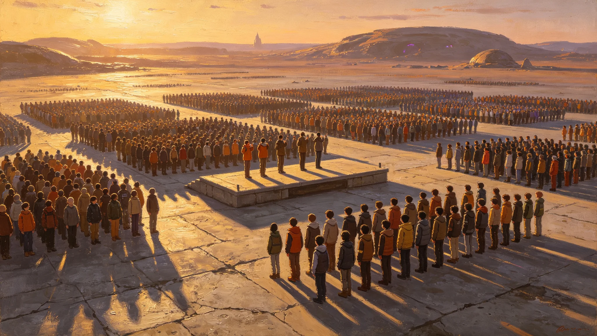

# 联合体第二代公民成人礼联合宣誓规程修订公报

**发布机构**：联合体文化司 / 公民礼俗委员会
**发布日期**：3073年6月16日
**文件等级**：跨星系公开
**公报号**：CIV-3073-0616

## 一、修订背景

比邻星b的成人礼自2926年改革为"露天星空下宣誓"（GS-2926-01）。联合体成立后，跨星系出生、跨星系长大的第二代公民，其成人礼不应只照搬某一成员的旧俗。委员会历时两年调研，修订规程。

## 二、修订要点

1. **三地同礼不同俗**：成人礼在各成员本地按本地风俗举行，但须包含一段"联合体公民宣誓"，内容统一；
2. **统一誓词**（节录）："我生于某星，归于三恒星系。我知通信有光之年，我知重力有大小之别，我知我之权利与义务随我迁徙而连续计算——故我成人，不只对一城负责，亦对散布三恒星系之人负责。"
3. **取消"天选"式独白**：旧规程要求每人上台独白"我的使命"，新规程改为集体宣誓，不设个人独白——委员会认为成人是公共事件，不是个人传奇的开幕；
4. **跨星系缺席处理**：因光延迟无法同日到场者，允许在本地礼成后，凭量子链路领取电子成人证书。

## 三、首次适用

新规程首次适用于3073年度成人礼，覆盖三恒星系约420万年满十八岁的青年。

## 四、附则

成人礼改的是誓词和流程，不是把孩子变成大人那回事。那回事，他们自己会慢慢知道。

**签发人**：公民礼俗委员会主任（签名略）
**日期**：3073年6月16日

## 五、调研过程

公民礼俗委员会自 3071 年起，历时两年走访三恒星系 27 座城市带、14 座地下城市、9 座前哨站，访谈年满十八青年 1,240 人、其父母 860 人、学校教师 312 人。调研记录显示：旧规程中"上台独白我的使命"一项，在跨星系青年中好评率仅 31%——多数青年反映"被要求说出一句不属于自己的豪言"。委员会据此决定取消个人独白，改为集体宣誓。调研另显示：三地青年对"我生于某星，归于三恒星系"一段誓词接受度最高，跨星系长大的青年中 82% 认为该句说出了自己的处境。

## 六、三地仪式安排

3073 年度成人礼按"三地同礼不同俗"执行：比邻星b新海市在公共广场露天举行，沿用 2926 年以来的星空宣誓传统；鲸港下都在中央穹顶大厅举行，加入地下城市特有的"灯火接力"环节；主带各自律城市群按本地自治安排举行，但统一加入"联合体公民宣誓"一段。三地仪式均在联合体标准历 6 月 15 日举行，因光延迟，三地仪式实际起始时刻相差 4—12 年，但誓词内容完全一致。

## 七、参与人数分布

3073 年度成人礼覆盖三恒星系约 420 万年满十八岁的青年，其中比邻星b约 180 万，鲸港约 90 万，主带及太阳系其他成员约 150 万。缺席并凭量子链路领取电子成人证书者约 3.2 万人，主要为远航货船乘员与前哨站青年。委员会注明：420 万人在同一天宣誓——光走不到一起，但誓词走到了一起。

## 八、后续安排

新规程首次适用后，委员会将在 3074 年开展首次执行情况回访，重点收集三地青年对统一誓词、集体宣誓、电子证书三项的反馈。委员会注明：成人礼规程不是"一次定终身"，每十年复评一次——孩子长大的方式变了，礼俗也得跟着变。

## 九、仪式物资与志愿者

3073 年度成人礼三地共需誓词文本 420 万份，其中纸质 280 万份、电子 140 万份；主礼台 27 座，其中露天 12 座、地下 15 座；志愿者共 8,400 人，多为 3072 年度刚完成成人礼的青年，按一地两志愿者服务一名新成人的比例配置。三地仪式均不设观礼费用，公共广场与穹顶大厅向居民开放。委员会注明：成人礼不花钱排场，花在誓词印够、志愿者够、证书发得到——礼俗不是演出。

## 十、历史沿革

比邻星b自 2926 年改革成人礼为"露天星空下宣誓"（GS-2926-01），此前沿用地球时代学校毕业典礼式的个人独白。联合体成立后，跨星系出生的第二代青年渐多，旧规程"上台独白我的使命"在跨星系青年中渐显不合——他们成长于三系之间，对"我的使命"一句不知从何说起。委员会此次修订，不是否定 2926 年改革，是把露天星空下宣誓的传统，从一人独白改成集体宣誓。委员会注明：誓词从"我"变成"我们"，不是孩子变了，是孩子长大的地方变了。
