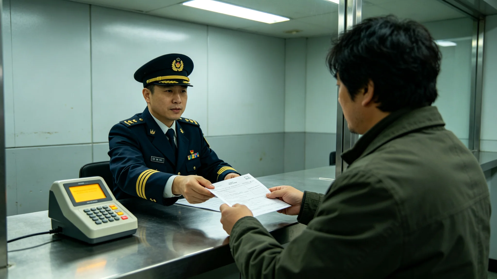

# 联合体公民身份法第二次修订与出生地主义条款公报

**发布机构**：联合体法院 / 跨星系民事庭
**发布日期**：3074年11月11日
**文件等级**：跨星系公开
**公报号**：CT-3074-1111

## 一、问题

《联合体公民身份法》（GS-2909-01）初版以血缘主义为主——父母一方为联合体公民，子女即取得身份。但跨星系迁徙（GS-3060-01）数十年后，出现一批"在三恒星系之间出生、父母任一方均非联合体公民的外来务工者子女"。他们在联合体出生长大，却依血缘主义不自动取得身份，成为法律上的"悬空人"。

## 二、修订

本次修订引入有限出生地主义：

1. 凡在三恒星系成员疆域内出生、且在联合体实际居住满十二年者，可申请联合体公民身份；
2. 不自动取得，仍须申请并通过基本法测验；
3. 原血缘主义条款保留并行，两制并存。

## 三、争议

- 保守一方担心"出生地主义会引来外来潮"；修订方回应：须居住满十二年且经测验，闸门不松；
- 主带部分自治点保留自行决定是否加入出生地主义的权利。

## 四、附则

法律追得上一代人的迁徙，追不上一个孩子在哪里出生。这次修订，只是把追不上的那一小段，又补上了。

**签发人**：跨星系民事庭庭长（签名略）
**日期**：3074年11月11日

## 五、悬空人规模

修订前，跨星系民事庭对"悬空人"规模做过一次普查：在三恒星系成员疆域内出生、父母任一方均非联合体公民、且在联合体实际居住满十二年的外来务工者子女，3074 年约 8,600 人。其中主带各自律城市群约 4,100 人，鲸港约 2,300 人，比邻星b约 2,200 人。这 8,600 人在联合体出生、在联合体上学、在联合体纳税，却无公民身份，不能参加联合体议会投票，亦不能申领跨星系迁徙护照。普查结果由各成员户籍登记厅联合上报，民事庭核对后写入修订说明。

## 六、申请程序

依修订条款，"悬空人"可在年满十八周岁后向居住地户籍登记厅提出申请。申请材料包括：出生证明、居住满十二年的连续考勤或纳税记录、父母国籍或原居地证明。受理后，申请人须参加基本法测验，测验内容为联合体宪章、跨星系迁徙规则、三系基本常识，及格线 70 分。测验每年举办两次，3075 年首次开放申请，预计首批受理约 6,000 人。民事庭注明：不自动取得，仍须申请并通过测验——闸门不松，但门开了。

## 七、主带自治保留

主带部分自治点依《主带自律城市同盟常设议事会章程》保留自行决定是否加入出生地主义的权利。截至 3074 年底，主带 38 座自律城市群中，25 座宣布加入出生地主义，9 座选择暂缓，4 座维持纯血缘主义。暂缓与维持者须每五年复评一次。民事庭注明：主带是同盟，不是大一统——有人先走，有人再看，有人不走，都是合法。

## 八、与双重国籍的衔接

本次修订不影响《双重国籍条款》（GS-2909-01）原规定。依出生地主义取得联合体公民身份者，如父母原属国亦承认其国籍，可保留双重国籍；如原属国不承认，则自动丧失原国籍。民事庭注明：出生地主义补的是"在联合体出生长大却没身份"这一段，不是推翻旧法——血缘主义、双重国籍、出生地主义三套并行，谁符合谁走。

## 九、首批受理预告

3075 年第一季度，各成员户籍登记厅同步开放出生地主义申请。民事庭已印制申请指南 20 万份，分发至主带、鲸港、比邻星b各登记厅与学校。申请指南用三系通用文字与三种方言版本印行。民事庭注明：法改了，得让那 8,600 个孩子知道——门开了，怎么进，指南里写着。

## 十、修订表决统计

本次修订案经三系议会三读通过。赞成率：比邻星b 71%，鲸港 83%，主带 58%。主带议会内部分歧最大：主带西部自律城市群赞成率 74%，东部维持血缘主义的城市群赞成率仅 41%。民事庭注明：主带赞成率刚过半数——这说明出生地主义在主带不是共识，是勉强多数。勉强多数也是多数，法照立，但执行中得留足自治空间。
