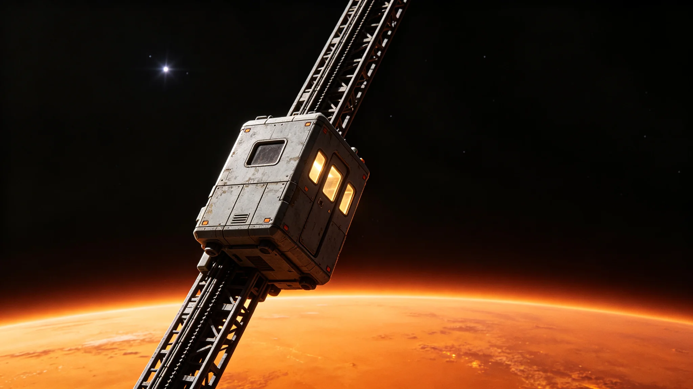

# 比邻星b轨道电梯第四代爬升器换型与全行程试运行报告

**编制单位**：比邻星b轨道电梯工程署
**报告日期**：3076年9月27日
**文件等级**：跨星系技术公开
**报告号**：OE-3076-0927

## 一、换型背景

前三代爬升器沿主缆运送货物与人员，第三代已服役逾二十年。第四代（工程代号"攀云-Ⅳ"）在第三代基础上：提速、降噪、减负。

## 二、试运行数据

| 指标 | 第三代 | 第四代 |
|---|---|---|
| 地表→同步轨道单程 | 11.2 h | 6.8 h |
| 单车最大载荷 | 30 t | 48 t |
| 运行噪声（客舱内） | 78 dB | 61 dB |
| 连续爬升可靠性 | 99.2% | 99.7% |
| 全行程试运行 | — | 12次往返，无故障 |

## 三、设计要点

- 牵引电机由接触式改为磁悬浮无接触，减少磨损与噪声；
- 传感器走线采用悬浮式（沿用GS-3075-01退休总工程师的坚持），避免贴壁疲劳；
- 应急制动为机械冗余，不依赖电控。

## 四、发现问题

1. 高速爬升时客舱微振动频率在某段引发部分乘客不适，需调悬挂阻尼；
2. 主缆在爬升器经过时的张紧波反馈需与三期张紧系统（GS-2962-01）联调。

## 五、结论

第四代爬升器通过全行程试运行。待微振动阻尼调整完成，即投入商业运营。轨道电梯的运力由此再上一台阶。

**主笔工程师**（签名略）
**日期**：3076年9月27日

## 六、试运行组织

全行程试运行自 3076 年 3 月启动，至 9 月完成，共执行 12 次往返。每次往返分三个载荷档：空车、半载 24 t、满载 48 t。12 次往返中，空车 4 次、半载 4 次、满载 4 次。每次往返全程记录牵引电机电流、客舱振动、噪声、张紧波反馈、应急制动触发状态。累计取得运行数据点约 240 万条。试运行期间邀请退休总工程师沈观澜（GS-3075-01）以技术顾问身份列席两次评审会，其对悬浮走线方案未提出修改意见。

## 七、微振动整改

高速爬升时客舱微振动频率在 1.2—1.8 Hz 段引发部分乘客前庭不适。试运行期间 12 次往返共载试乘人员 86 人，其中 14 人反映轻度恶心，3 人反映明显不适。整改方案为调整客舱悬挂阻尼系数，由原设计 0.35 调至 0.52。调整后另执行 4 次往返试乘，试乘人员 28 人，不适率从 16% 降至 4%。工程署注明：微振动不是"小事"，是乘客能不能坐得住的事——阻尼调一档，人舒服一档。

## 八、与三期张紧系统联调

主缆在爬升器经过时的张紧波反馈，需与三期张紧系统（GS-2962-01）联调。联调自 3076 年 7 月启动，至 9 月完成，共调整张紧系统反馈增益 3 次，最终使爬升器经过时主缆张紧波动幅度控制在设计容差 0.1‰ 以内。工程署注明：新爬升器跑新缆，不是装上就跑——主缆得认得它的节奏。

## 九、商业运营时间表

微振动阻尼调整完成、与三期张紧系统联调通过后，第四代爬升器拟于 3076 年 12 月投入商业运营。首批运营班次：每周往返 6 次，其中货运 4 次、客货混载 2 次。第三代爬升器不立即退役，作为备用继续运行至 3080 年。工程署注明：换型不是一夜之间把旧车全换下来，是新车先跑半年，旧车再备半年——主缆上不能一天没车。

## 十、试运行安全记录

12 次全行程试运行期间，未发生人员伤亡、未发生主缆异常应力、未发生应急制动误触发。试运行期间共记录应急制动演练 4 次，均为地面指令触发，制动距离实测 1.8—2.2 m，与设计值 2 m 相符。牵引电机累计运行时间 168 小时，无过热、无振动超标。工程署注明：试运行不是"开出去兜一圈"，是把新车在主缆上跑够次数、测够科目——跑够了，才敢载客。

## 十一、与第三代的对比运营

第四代投入商业运营后，第三代继续作为备用。两型爬升器在主缆上交替运行：第四代跑主力班次，第三代跑应急与备份班次。两型爬升器的牵引电机、传感器、制动系统互不通用，维护队伍需同时培训两套。工程署注明：两型并存是过渡期的常态，不是长久之计——3080 年第三代退役后，维护队伍再统一为一套。
