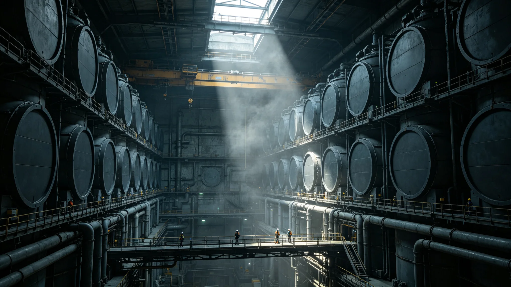

# 第六代反物质储能装置中试线投产与安全鉴定报告

**编制单位**：联合体能源工程研究院 / 反物质储能组
**报告日期**：3082年10月20日
**文件等级**：跨星系技术公开（磁阱参数密级段落删节）
**报告号**：EN-3082-1020

## 一、对象

第五代反物质储能装置于2982年完成实验室原型（GS-2982-01）。第六代目标：把单次磁阱约束时间从原型的数十分钟提升至千小时级，使反物质从"实验室奇观"走向"可工程化储能"。本件为中试线投产鉴定。

## 二、数据

| 指标 | 第五代原型 | 第六代中试 |
|---|---|---|
| 单次磁阱约束时间 | 40 min | 1,180 h |
| 储能密度（相对） | 基线100 | 260 |
| 月产反物质当量 | 实验室量 | 可商用小批量 |
| 失效模式 | 阱内湮灭 | 残余在屏蔽内受控 |

## 三、安全鉴定

中试线投产前，安全组完成：

1. 磁阱失真空应急预案三次演练；
2. 湮灭能量上限核算，确保任一失效模式不击穿厂房屏蔽；
3. 与地方应急体系（GS-3059-01主带民防同类）的联动测试。

结论：中试线安全裕度满足投产要求。

## 四、遗留

- 长时约束下磁阱壁的活化累积仍需五年观测；
- 商用化路线图仍待能源理事会立项。

## 五、附则

反物质储能仍贵。它把能量装进磁阱，像把光关进瓶子——第六代只是让瓶子不漏得那么快。离"家家一瓶"还远。

**主笔工程师**（签名略）
**日期**：3082年10月20日

## 六、中试线建设

中试线自 3079 年立项，至 3082 年投产，历时三年。厂房建于主带自律城市群一处地下岩层中，纵深 400 m，周围 5 km 内无常住人口。厂房内磁阱储罐阵列共 24 台，每台设计容量为第五代原型的 12 倍。建设总投资约合联币 480 亿，其中磁阱超导磁体占 41%，真空系统占 28%，屏蔽与应急系统占 19%，其他占 12%。能源研究院注明：480 亿建一条中试线，产出的反物质还不够烧一壶水——但它把约束时间从 40 分钟拉到了 1,180 小时。

## 七、安全鉴定细则

安全组完成三项鉴定：其一，磁阱失真空应急预案三次演练，分别模拟单台失真空、两台同时失真空、全厂失真空，均在 90 秒内完成注入惰性气体与启动被动屏蔽；其二，湮灭能量上限核算，24 台磁阱同时失效的总湮灭能量折算为 TNT 当量约 1.2 吨，厂房钢筋混凝土屏蔽厚 8 m，足以在最坏情况下不击穿；其三，与主带民防体系（GS-3059-01 同类）联动测试，地方应急队伍接到警报后 25 分钟抵达厂房外围，符合预案。

## 八、投产首季运行

投产首季（3082 年 7—9 月），24 台磁阱共运行 2,160 台时，发生单台失真空事件 1 起，未造成人员伤亡与厂房损坏。月产反物质当量约为第五代原型的 80 倍，仍属可商用小批量。能源研究院注明：首季跑下来，漏了一次，没漏人——中试线的意义就在这儿，先在小批量里把漏找出来。

## 九、五年观测计划

长时约束下磁阱壁的活化累积仍需五年观测。能源研究院拟在 3082—3087 年间每季度检测磁阱壁辐射水平，建立活化累积曲线。商用化路线图仍待能源理事会立项，预计 3085 年前后提交。能源研究院注明：反物质储能仍贵，离"家家一瓶"还远——第六代只是让瓶子不漏得那么快。

## 十、与第五代原型的对比

第五代原型（GS-2982-01）单台磁阱单次约束时间 40 分钟，月产反物质当量仅实验室量。第六代中试线 24 台磁阱并列运行，单次约束时间 1,180 小时，月产当量为第五代的 80 倍。能源研究院注明：从 40 分钟到 1,180 小时，用了一百年——反物质储能不是一步登天，是一百年不漏得那么快。

## 十一、人员与编制

中试线运行编制共 86 人，其中物理学家 12 人，工程师 34 人，安全员 18 人，行政与后勤 22 人。运行班次三班倒，每班在岗 28 人。安全员持特种作业执照，每季度复训一次。能源研究院注明：中试线不是"一个人在实验室里转瓶子"，是 86 个人三班倒——86 个人盯着 24 个瓶子。
