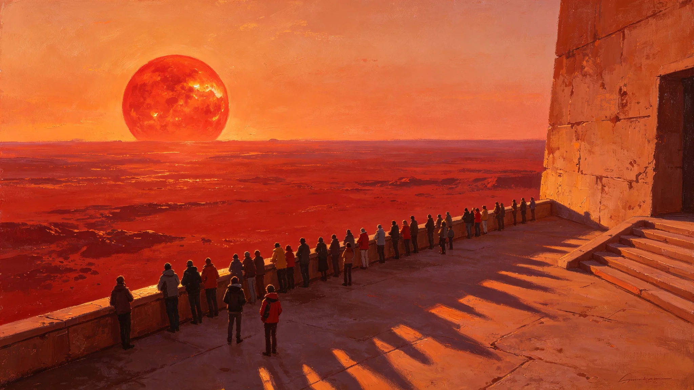

# 第八届鲸鱼座τ星红矮星日出节规程与跨星系观礼公报

**发布机构**：鲸鱼座τ星下都文化署 / 礼俗科
**发布日期**：3084年4月21日
**文件等级**：跨星系公开
**公报号**：FES-3084-0421

## 一、节俗沿革

"红矮星日出节"首届于2956年（GS-2956-01）确立，纪念鲸鱼座τ星定居者第一次在自己的天空看到这颗红矮星的完整日出。此后每约十年一届，本届为第八届。

## 二、本届规程

1. **时刻**：按鲸鱼座τ星历，在该星日出前一小时，下都居民自地下城市升至地表观景崖；
2. **观礼**：不设领导讲话，不设颁奖。全体静立，等红矮星从地平线露出第一缕暗红；
3. **跨星系观礼**：本届首次通过量子链路向比邻星b、主带直播，远方观众可"同步"看到——但因光延迟，他们看到的其实是四年前的那一次日出。本届规程特地注明这一点："远方的你们，看的是我们的过去，也是你们自己的将来。"
4. **散场**：日出后即散，不聚餐，不放烟火。

## 三、人数

本届下都本地观礼约12万人，跨星系直播观众约1.8亿。

## 四、附则

这个节日没有别的事，就是站在地表，看一颗红矮星升起来。看了八届了。还是站着看。

**签发人**：礼俗科科长（签名略）
**日期**：3084年4月21日
