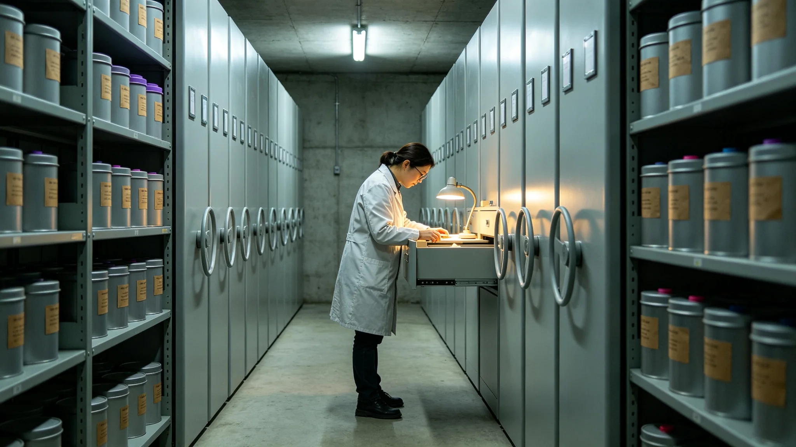

# 联合体跨星系作物种质库第五次更新与深空育种清册

**发布机构**：联合体农业署 / 种质资源处
**发布日期**：3086年11月11日
**文件等级**：跨星系公开
**公报号**：AG-3086-1111

## 一、更新背景

跨星系种子库自2943年扩建（GS-2943-01），约每二十年更新一次种质。本次为第五次。

## 二、本次新增

| 类别 | 新增种质数 | 主要来源 |
|---|---|---|
| 粮食作物 | 214 | 比邻星b露天育种 |
| 蔬菜 | 187 | 下都地下温室选育（GS-2928-01同类） |
| 豆科固氮 | 96 | 主带暗湖受控水培（GS-2112-01同类） |
| 深空辐射诱变 | 43 | 长期轨道种植舱诱变筛选 |

## 三、深空育种说明

本次43个诱变系来自种子在长期轨道微重力+宇宙射线环境下的连续多代选育。它们不是"太空转基因"，而是自然诱变+人工筛选，安全性经跨星系农业安全委员会逐系评估。

## 四、保管

全部种质备份三处：比邻星b新海方舟主库、下都地下库、主带谷神星暗湖库，三地互不依赖。

## 五、附则

种质库是把地球的种子，在三个星系各存一份。万一某一处的世界坏了，还有另外两处的种子，把它再种一遍。

**签发人**：种质资源处处长（签名略）
**日期**：3086年11月11日
