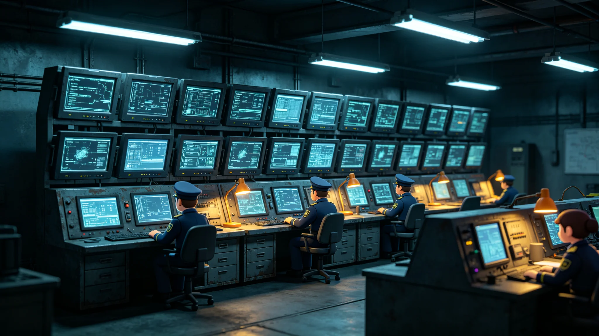

# 联合体跨星系网络安全防御联合演练公报

**发布机构**：联合体安全协调署 / 网络防御处
**发布日期**：3087年7月7日
**文件等级**：跨星系公开
**公报号**：SEC-3087-0707

## 一、演练性质

3087年6月，三成员网络安全部门举行跨星系联合防御演练，模拟一次针对联合体结算与航运系统的协同攻击。演练为非实战，全部注入流量受控。

## 二、演练科目与结果

| 科目 | 设计 | 结果 |
|---|---|---|
| 结算系统注入攻击 | 模拟伪造结算指令 | 识别拦截率100% |
| 航运调度干扰 | 模拟航道指令污染 | 识别拦截率98% |
| 跨星系统联合溯源 | 模拟攻击源定位 | 三成员接力溯源，22分钟定位 |
| 误报率 | — | 0.3% |

## 三、暴露的问题

1. **跨星系协同延迟**：因光延迟，三成员协同溯源比同地场景慢；
2. **民用端防护薄弱**：演练中部分跨星系旅行者的个人终端被"攻陷"（模拟），提示民用端防护是短板；
3. **AI滥用风险**：演练发现，攻击方可借跨星系AI代拟钓鱼指令，须与AI伦理委员会（GS-2987-01）联动。

## 四、纪律重申

演练模拟的是"攻击"，不是敌人。公报重申：本演练为防御性能力检验，不针对任何已知主体。

## 五、附则

网络安全每年练一次。它和太阳风暴疏散一样——练了不代表坏事会来，只代表坏事来的时候，手不生。

**签发人**：网络防御处处长（签名略）
**日期**：3087年7月7日
