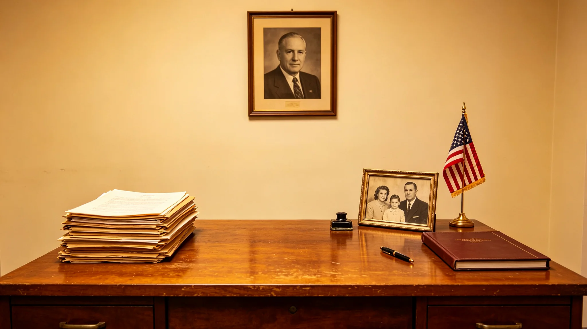

# 主带城市群资深联邦议员病逝讣告与遗产清查档案

**归档单位**：主带自律城市群议会 / 秘书局
**归档日期**：3089年10月10日
**文件等级**：公开（遗产隐私栏遮蔽）
**卷宗号**：MB-3089-OB-1010

## 一、讣告（节录）

> 主带自律城市群联邦议员霍秉谦，于3089年9月28日病逝于谷神星暗湖疗养舱，享年九十有四。依其遗嘱，不设追悼大会，不收花圈，骨灰按其生前意愿随一艘废弃货船送入主带外圈轨道，任其自然。本公报仅录其事，不歌其功。
>
> 秘书局印 · 3089年10月10日

## 二、履历物证摘录

霍秉谦，2995年生于主带谷神星地下城市，主带第三代。3018年毕业于谷神星工业大学（GS-2426-01后续），回主带自治城市群任议员。

| 项 | 记录 |
|---|---|
| 初职 | 主带自治城市群议员秘书 |
| 当选议员 | 3041年 |
| 累计议案 | 217件，其中通过94件 |
| 任内处分 | 3055年一次因缺席关键预算表决，停发当月津贴（记录在案，未销） |
| 临终体检遮蔽 | 心血管自然衰竭，无意外 |

## 三、遗产清查（节录）

依《公务员遗产申报条例》，其遗产经清查后公示：

1. 主带地下住宅一套，按市场价估值联币120万；
2. 其私人藏书约2,000册，其中一批主带工业史旧版（与GS-2570-01同类），按其遗嘱捐赠主带工业遗产保护区；
3. 一笔其在任内攒下的小额跨星系储蓄，依遗嘱平均分予主带三所儿童托管舱。

清查结论：无不当财产来源，无未申报资产。

## 四、附则

讣告不写"伟大的议员"。他是一个主带出生、当了四十多年议员、缺席过一次会、攒了套房和一柜旧书的普通人。他要的葬礼是一艘旧船和一圈轨道。照办了。

**归档人**：秘书局（签名略）
**日期**：3089年10月10日

## 六、履历时间线

| 年份 | 事项 |
|---|---|
| 2995 | 生于主带谷神星地下城市 |
| 3014 | 入谷神星工业大学 |
| 3018 | 毕业，任主带自治城市群议员秘书 |
| 3030 | 升议员办公室主任 |
| 3041 | 当选主带自律城市群联邦议员 |
| 3055 | 缺席关键预算表决，停发当月津贴 |
| 3075 | 连任第五届议员 |
| 3085 | 因健康原因退居二线，任荣誉议员 |
| 3089 | 病逝于谷神星暗湖疗养舱，享年 94 岁 |

## 七、议案清单

四十八年议员任内，累计提出议案 217 件，其中通过 94 件。通过的 94 件中，以本地民生为主：主带地下城市供暖主管更换（3062 年）、主带儿童托管舱扩容（3071 年）、主带工业遗产保护区设立（3078 年）。未通过的 123 件中，多为主张主带在跨星系贸易中提高本地加工比例的提案——部分提案后来以其他形式通过。秘书局注明：217 件提案，通过 94 件——不到一半，但够他当四十八年议员。

## 八、遗产清查细节

依《公务员遗产申报条例》，秘书局会同主带监察处对其遗产进行清查。清查结果：主带地下住宅一套，按市场价估值联币 120 万；私人藏书约 2,000 册，其中主带工业史旧版 340 册，按遗嘱捐赠主带工业遗产保护区；小额跨星系储蓄约联币 86 万，依遗嘱平均分予主带三所儿童托管舱，每所约 28.7 万。清查未发现不当财产来源，未发现未申报资产。秘书局注明：当了四十八年议员，攒下一套房、一柜书、不到一百万联币——这就是主带议员的家底。

## 九、葬礼

依其遗嘱，不设追悼大会，不收花圈。骨灰于 3089 年 10 月 8 日随一艘退役货船送入主带外圈轨道，货船发动机关闭，任其沿轨道自然漂移。秘书局按遗嘱办理，未邀请外部代表，仅其家人与秘书局三名工作人员在场。秘书局注明：他要的葬礼是一艘旧船和一圈轨道——照办了。

## 十、档案归档

其任内议案文本、考勤记录、处分记录、遗产清查清单、遗嘱，全部归档主带自律城市群议会档案库。秘书局注明：讣告不写"伟大的议员"——他是一个主带出生、当了四十多年议员、缺席过一次会、攒了套房和一柜旧书的普通人。档案归档，是给他一个完整的交代。
