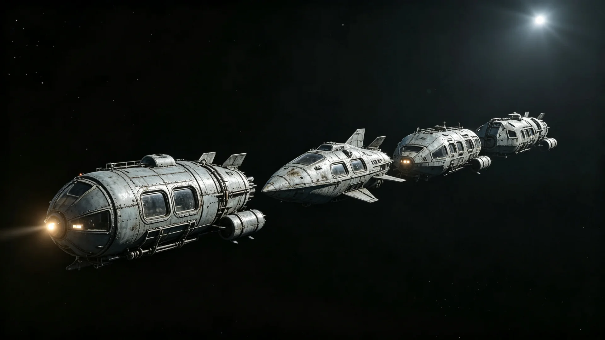

# 跨星系无人货运船队自主避碰算法第三代升级公报

**发布机构**：联合体通信工程局 / 无人货运处
**发布日期**：3090年5月21日
**文件等级**：跨星系技术公开
**公报号**：ROB-3090-0521

## 一、升级对象

跨星系无人货运船队（自2990年遇尘埃云减速事件见GS-2990-01后持续扩容）的自主避碰算法，已迭代两代。第三代升级自3088年立项，针对：

1. 太阳风暴下导航降级时的避碰（与GS-3077-01机器人归坞教训同源）；
2. 多船交汇时的协同决策；
3. 与有人驾驶船的避碰兼容。

## 二、测试结果

| 指标 | 第二代 | 第三代 |
|---|---|---|
| 多船交汇避碰成功率 | 96% | 99.9% |
| 导航降级时避碰 | 81% | 97% |
| 误动作率 | 2.1% | 0.4% |
| 与有人船兼容 | 部分 | 全兼容 |

## 三、遗留

- 算法在极端密集船流（主带港口出港高峰）仍偶有保守等待，需人工接管；
- 与海盗清剿（GS-3072-01）后的航道秩序尚需再校准。

## 四、附则

无人船越来越能自己躲。但躲不过的，仍需人来。

**签发人**：无人货运处处长（签名略）
**日期**：3090年5月21日
