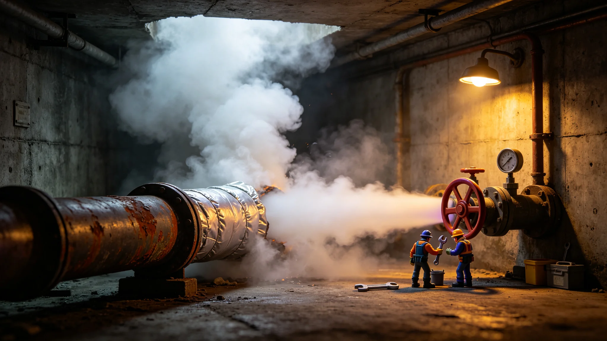

# 火星地下城市供暖主管爆裂与千名居民临时转移公报

**发布机构**：火星地下城市管理署 / 应急处
**发布日期**：3091年8月30日
**文件等级**：跨星系公开
**公报号**：DM-3091-0830

## 一、事件

3091年8月12日，火星奥林匹斯地下城市一条百年供暖主管（地热—居住区）因长期热应力疲劳爆裂，蒸汽涌入一段居住层廊道。

- 爆裂后应急阀12秒内切断该段；
- 约1,200名居民由邻近层临时转移至未受影响区域；
- 全程无人员烫伤，3人因恐慌轻微磕碰，已处理；
- 受影响区域停水停暖约36小时，由相邻层供暖临时补入。

## 二、原因

主管已百年未换，热应力疲劳累积——与GS-3069-01下都主缆蠕变同类问题：制度机器里的老零件，到了该换的时候。

## 三、整改

1. 全部百年供暖主管按热应力普查更换，未来每10年超声探伤；
2. 应急阀更换为更快的快关型；
3. 对转移居民发放取暖与不便补偿。

## 四、附则

火星地下城里，热水管爆裂了，一千人挪了个窝，没人受伤。修管子，发补偿，记一笔。

**签发人**：应急处处长（签名略）
**日期**：3091年8月30日

## 五、事件时间线

3091年8月12日 06:42，奥林匹斯地下城市B区第3供暖廊道主管爆裂，蒸汽涌入廊道；06:42:12，应急阀自动切断该段；06:45，应急广播启动，通知B区居民向邻近层转移；07:20，约 1,200 名居民全部转移至未受影响区域；08:00，维修队进入廊道排查；20:00，爆裂段临时封堵完成；8月13日 08:00，受影响区域恢复供水供暖。全程停水停暖约 36 小时。

## 六、居民安置

转移居民安置于邻近层公共大厅、学校教室与体育馆，共腾出临时住宿空间约 1,800 个床位。每床配备简易被褥与热饮。3 名因恐慌轻微磕碰的居民在应急医疗点处理后返回安置点。火星地下城市管理署注明：一千人挪了个窝，没伤着——应急广播响了不到半小时，人就转完了。

## 七、补偿

事后对转移居民发放取暖与不便补偿，每人约合联币 600 元。补偿发放自 8 月 15 日启动，至 8 月 22 日全部到账。另有 47 户居民家中被褥受潮，由管理署免费更换。应急处注明：36 小时没暖气，每人补 600——这不是"赔偿损失"，是"对不便的承认"。

## 八、整改详情

全部百年供暖主管按热应力普查更换，共更换主管 42 km，投资约合联币 2.8 亿。未来每 10 年超声探伤。应急阀更换为快关型，关闭时间从 12 秒缩短至 3 秒。整改自 3091 年 9 月启动，至 3092 年 6 月完成。应急处注明：百年管子爆了，换 42 km——一次爆裂，换全城的安心。

## 九、教训

火星地下城里，热水管爆裂了，一千人挪了个窝，没人受伤。应急处注明：这与下都主缆蠕变（GS-3069-01）同类问题——制度机器里的老零件，到了该换的时候。不换，它自己会爆；换了，就没事。修管子，发补偿，记一笔。

## 十、与百年管网普查

爆裂主管建于约 2991 年，至 3091 年正好一百年。火星地下城市供暖管网建于火星殖民初期，部分主管已超过设计寿命。应急处会同市政署对全城百年管网做普查，共发现 42 km 主管已达或超过设计寿命，列入更换计划。普查另发现 12 km 主管虽未达设计寿命但存在局部腐蚀，列入五年内更换。

## 十一、居民反馈

事后应急处对转移居民开展抽样回访，共回收问卷 840 份，其中对转移组织表示满意者占 82%，对补偿金额认为合理者占 71%。另有 38 份问卷反映安置点被褥不足，已补充。应急处注明：一千人挪了个窝，82% 满意——不是因为完美，是因为没人受伤。

## 十二、对其他地下城市的通报

本次事件通报火星各地下城市、鲸港下都、主带各自律城市群地下居住区。应急处另向联合体议会报送简报，说明事件经过、影响、整改。应急处注明：热水管爆了，别的地下城市也得查——百年管子，谁那儿都有。
