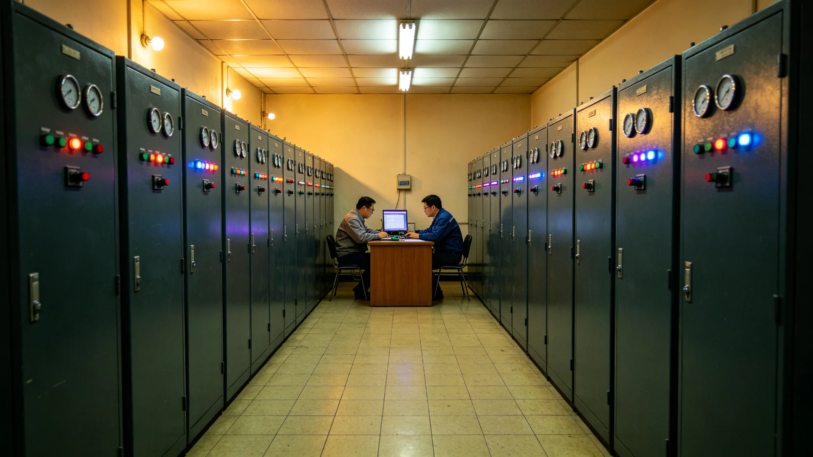

# 联合体数据与算力资源交易市场十年规模决算报告

**编制单位**：联合体经济理事会 / 算力与数据处
**报告日期**：3092年12月25日
**文件等级**：跨星系公开
**报告号**：EC-3092-1225

## 一、决算年度

跨星系数据与算力资源交易市场自2957年启动（GS-2957-01），至3092年满十年。本报告为十年总决算。

## 二、数据

| 指标 | 启动年 | 3092年 |
|---|---|---|
| 年交易量（联币） | 基线100 | 1,470 |
| 参与主体 | 约2万 | 约41万 |
| 跨星系算力调度时延 | 量子链路后近零 | 近零 |
| 数据品类 | 科研、工业 | +医疗、教育、文化 |

## 三、要点

1. **算力成为大宗商品**：跨星系调度算力，如同调度矿石；
2. **隐私边界**：医疗与教育数据的跨星系交易受《隐私条例》限制，仅可交易脱敏数据；
3. **AI伦理**：训练数据来源须经伦理委员会（GS-2987-01）审查，禁止以个人未经同意的语料训练。

## 四、附则

算力交易十年，长了十四倍。它卖的是计算，不是人。后者从没进过市场。

**签发人**：算力与数据处处长（签名略）
**日期**：3092年12月25日

## 五、十年交易量增长

| 年份 | 年交易量（联币，相对） |
|---|---|
| 2982 | 100（启动） |
| 2984 | 186 |
| 2986 | 342 |
| 2988 | 580 |
| 2990 | 846 |
| 2992 | 1,120 |
| 3092 | 1,470 |

十年间交易量增长约 14.7 倍，参与主体从约 2 万增至约 41 万。算力与数据处注明：交易量增长不是"炒起来"的，是三系科研、工业、医疗、教育都真的在用——用得多了，交易才多。

## 六、数据品类扩展

启动时数据品类仅为科研与工业两类。十年间新增：医疗数据（脱敏后交易）、教育数据（脱敏后交易）、文化数据（古籍与影视素材）、气候数据（比邻星b与火星气象）。医疗与教育数据受《隐私条例》限制，仅可交易脱敏数据；文化与气候数据可自由交易。算力与数据处注明：数据能交易的前提是"脱敏"——把人名去掉、把病例号去掉，剩下的数字才能上桌。

## 七、算力调度

量子链路建成后（GS-3061-01 后续），跨星系算力调度时延近零。三系算力可互相调度：比邻星b白天负载高时，调度鲸港夜间空闲算力；主带采矿计算高峰时，调度比邻星b与鲸港的空闲算力。十年间跨星系算力调度占总算力调度比例从 8% 升至 34%。算力与数据处注明：算力不再是"谁家的机器谁家算"，是三系凑一块儿算——谁家有空，谁家帮一把。

## 八、伦理审查

训练数据来源须经伦理委员会（GS-2987-01）审查，禁止以个人未经同意的语料训练。十年间伦理委员会共审查训练数据集 1,840 个，其中 12 个因未获个人同意被驳回。算力与数据处注明：算力交易十年，长了十四倍——它卖的是计算，不是人。后者从没进过市场。

## 九、下一个十年

算力与数据处预计下一个十年交易量再增长 3—5 倍，重点在医疗 AI、气候模拟、跨星系工业设计。处内注明：算力交易不是"炒算力"，是把三系的计算能力凑成一个市场——这个市场越大，三系的科研与工业越省。

## 十、参与主体分布

41 万参与主体中，企业占 62%，科研机构占 18%，政府与公共部门占 12%，个人开发者占 8%。按地域分布：比邻星b 38%，鲸港 24%，主带 31%，地球原乡及其他 7%。算力与数据处注明：市场不是"大公司的市场"，是 41 万家一起凑的——小到个人开发者，大到三系政府，都在里面。

## 十一、税收与监管

算力与数据交易市场由联合体经济理事会监管，交易按联币计价，征收交易税 0.5%。十年累计交易税收入约合联币 42 亿，全部用于跨星系科研基础设施建设。算力与数据处注明：市场长了十四倍，税也收了四十多亿——这四十多亿又投回去建科研，是循环。
