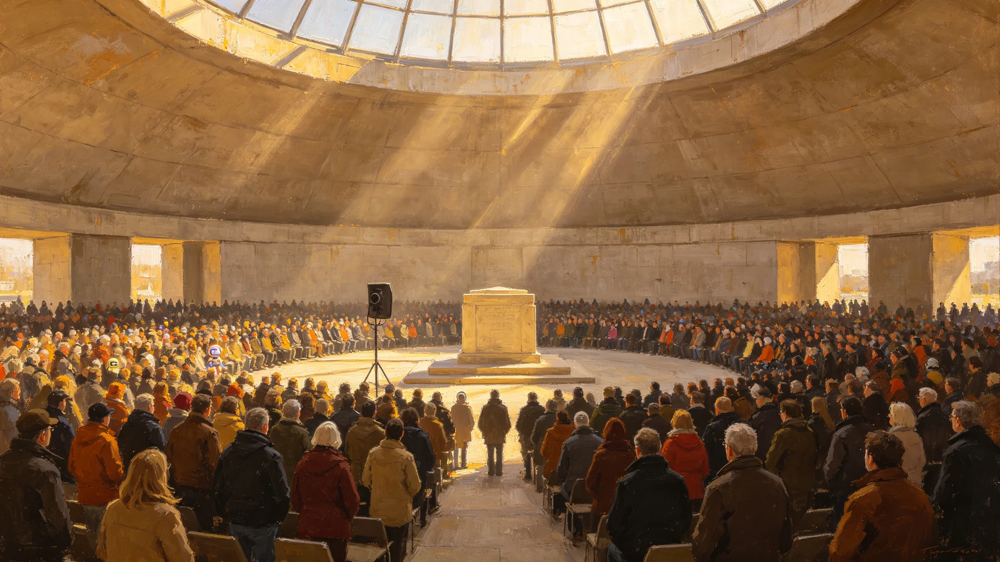

# 联合体文明传承日五十周年大典规程与新一代誓言宣读公报

**发布机构**：联合体文化司 / 礼俗委员会
**发布日期**：3093年1月1日
**文件等级**：跨星系公开
**公报号**：CIV-3093-0101

## 一、节俗沿革

"文明传承日"首届联合庆典于2972年（GS-2972-01）确立。至3093年满五十周年，举行大典。

## 二、大典规程

1. **时刻**：三成员各自地方历1月1日同时举行；
2. **新一代誓言**：由各成员随机抽取的各一名青年（不指定"代表"）宣读统一誓词——誓词沿用GS-3073-01成人礼修订文本；
3. **不设领导讲话**：大典全程不设任何人物的长篇演说，只有誓词、默哀、散场；
4. **纪念物**：三地各封存一枚时间胶囊，定于3143年（百年）开启。

## 三、默哀

大典首项为一分钟默哀，纪念自ARK-01启航（GS-2150-03）以来所有未活到今日的人。

## 四、附则

五十年了。这个节日没有变成阅兵式。它还是站一站，念一念，再把一个胶囊封起来，留给一百年后的人。够了。

**签发人**：礼俗委员会主任（签名略）
**日期**：3093年1月1日

## 五、大典参与人数

三地大典共参与居民约 4,200 万人，其中比邻星b新海市主广场约 120 万人，鲸港下都中央穹顶大厅约 48 万人，主带各自律城市群按本地安排合计约 4,032 万人。新一代誓言宣读人由各成员随机抽取一名年满十八岁青年产生，不指定"代表"，不指定身份。三名青年分别来自比邻星b新海市、鲸港下都、主带谷神星地下城市。

## 六、誓词内容

新一代誓言沿用 GS-3073-01 成人礼修订文本，全文节录："我生于某星，归于三恒星系。我知通信有光之年，我知重力有大小之别，我知我之权利与义务随我迁徙而连续计算——故我成人，不只对一城负责，亦对散布三恒星系之人负责。"三名青年分别用本地方言宣读，三系居民通过公共屏幕同步看到三地画面。

## 七、时间胶囊

三地各封存一枚时间胶囊，定于 3143 年（百年）开启。胶囊内封存：本届大典誓词文本、三地青年签名、3093 年三系日常物件各一件（比邻星b露天呼吸带一片叶、鲸港下都红矮星日出节一块石、主带谷神星暗湖一滴水）、一份给百年后人类的短信（不超过 100 字，由三地居民集体撰稿）。胶囊封存于新海市文明厅、下都中央穹顶、主带谷神星暗湖监测站三处。

## 八、默哀

大典首项为一分钟默哀，纪念自 ARK-01 启航（GS-2150-03）以来所有未活到今日的人。默哀不点名，不读名单——名单太长。礼俗委员会注明：一分钟不够念完所有名字，够了。

## 九、不设领导讲话

大典全程不设任何人物的长篇演说，只有誓词、默哀、散场。礼俗委员会注明：五十年了，这个节日没有变成阅兵式。它还是站一站，念一念，再把一个胶囊封起来，留给一百年后的人。够了。

## 十、后续安排

大典结束后，三地各自清理场地，不设宴会，不放烟火。礼俗委员会将于 3094 年开展一次执行情况回访，统计三地居民对大典规程的反馈。礼俗委员会注明：五十周年不是终点，是下一个五十年的起点——下一个五十年，交给那些刚念完誓词的年轻人。

## 十一、时间胶囊封存细节

胶囊由钛合金制成，直径 0.6 m，壁厚 5 cm，可密封保存 500 年。胶囊内物品清单：本届大典誓词文本（纸质）、三地青年签名（纸质）、3093 年三系日常物件各一件（比邻星b露天呼吸带一片叶、鲸港下都红矮星日出节一块石、主带谷神星暗湖一滴水）、一份给百年后人类的短信（不超过 100 字，由三地居民集体撰稿，最终定稿为："我们把三系缝到了一起，缝得还不算牢。你们接着缝。"）。胶囊封存于新海市文明厅地下、下都中央穹顶地下、主带谷神星暗湖监测站岩层内三处。

## 十二、大典组织

大典组织由三系文化部门联合完成，共投入志愿者 12,000 人。三地仪式均在联合体标准历 1 月 1 日举行，因光延迟，三地仪式实际起始时刻相差 4—12 年，但誓词内容完全一致。礼俗委员会注明：光走不到一起，但誓词走到了一起——这就是文明传承日五十年的意思。
