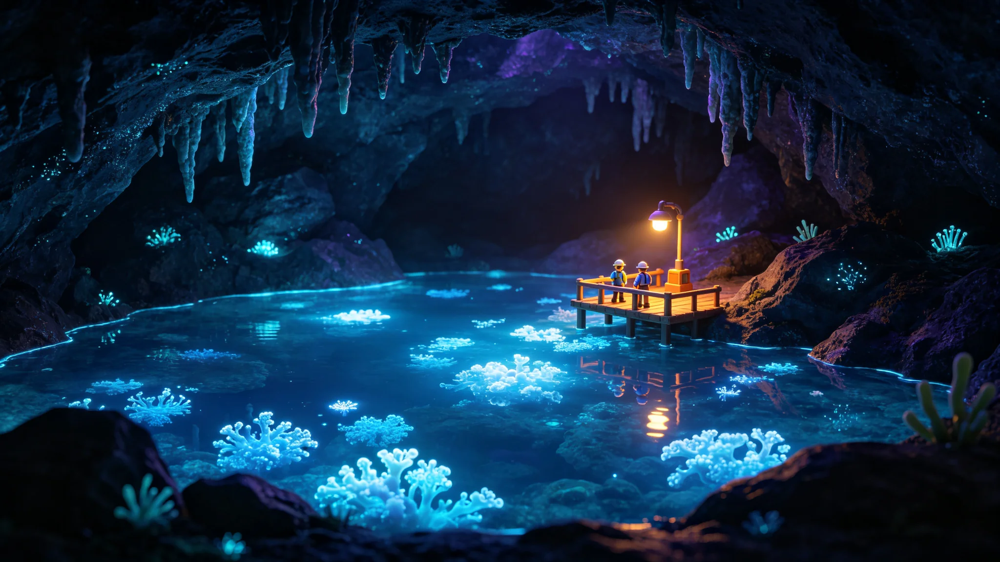

# 主带谷神星地下暗湖人工生态千年演替终期评估公报

**编制单位**：主带自律城市群生态署 / 暗湖监测组
**报告日期**：3094年6月6日
**文件等级**：跨星系公开
**报告号**：ECO-3094-0606

## 一、评估对象

谷神星地下暗湖受控生态系统自2112年前后（GS-2112-01）建立，至3094年已运行近千年。本报告为其千年演替的终期评估。

## 二、数据

| 指标 | 建湖初 | 3094年 |
|---|---|---|
| 生态层级 | 单一藻类 | 藻—浮游动物—贝—鱼 四级 |
| 水体自净率 | 依赖人工 | 94% |
| 已知物种 | 6种 | 87种 |
| 千年内崩溃事件 | — | 0 |

## 三、关键结论

地下暗湖生态已千年不崩，成为主带最稳定的封闭生态样本之一。它证明：在恒常人工光照与极少量外源补入下，一个精心设计的封闭水体可以自持千年。

## 四、保留

1. **不自夸"永生"**：千年未崩，不等于永远不崩；
2. **外源补入仍在**：每年仍有极少量矿物与气体补入，暗湖并非完全封闭；
3. **样本唯一**：这只是一口湖的千年，不能外推到整座城市。

## 五、附则

一口地下湖，在没有太阳的地方，自己转了一千年。它没问过为什么，它只是转着。

**主笔生态监测员**（签名略）
**日期**：3094年6月6日

## 六、千年监测数据

暗湖监测自 2112 年建湖起持续未断，共取得水样记录约 18 万条、生物标本约 4.2 万份。千年间，生态层级从单一藻类演替为藻—浮游动物—贝—鱼四级。已知物种从建湖初的 6 种增至 87 种，其中 12 种为自然迁入（通过空气与水体交换），75 种为人工引入。水体自净率从建湖初的依赖人工提升至 3094 年的 94%。千年内崩溃事件 0 起。

## 七、千年内关键节点

| 年份 | 事件 |
|---|---|
| 2112 | 建湖，引入藻类 6 种 |
| 2400 | 引入浮游动物，形成二级食物链 |
| 2650 | 引入贝类，水体自净率升至 60% |
| 2850 | 引入鱼类，形成四级食物链 |
| 2900 | 一次局部缺氧，未崩溃，自行恢复 |
| 3094 | 千年终期评估 |

生态署注明：千年间唯一一次局部缺氧发生在 2900 年，未崩溃，自行恢复——这不是"运气好"，是闭环设计得够稳。

## 八、外源补入

每年仍有极少量矿物与气体补入，暗湖并非完全封闭。3094 年度补入物质量约为湖水总量的 0.003%，主要为钾、磷、氮三种矿物与二氧化碳气体。生态署注明：94% 自净，不是 100%——那 6% 的外源补入，就是暗湖与外界永远断不开的一根线。

## 九、样本唯一性

这只是一口湖的千年，不能外推到整座城市。主带自律城市群另有人工闭环生态多处，包括地下农场、空气循环系统、废水处理系统，但均未达到千年尺度。生态署注明：一口湖转了一千年，不等于一整座城也能转一千年——样本太少，不敢说。

## 十、后续监测

千年终期评估后，暗湖监测继续进行，不撤编。监测组预计下一个千年（4094 年）再做一次终期评估。生态署注明：一口地下湖，在没有太阳的地方，自己转了一千年。它没问过为什么，它只是转着。我们盯着它，也再盯一千年。

## 十一、监测人员

暗湖监测站长期驻站监测人员共 12 人，其中生态学家 4 人，水质分析员 4 人，机械维护员 4 人。监测站位于暗湖岸边岩层内，常驻生活设施一应俱全。监测人员每六个月轮换一次，轮换期间回主带地面休假。生态署注明：12 个人盯着一口湖，盯了一千年——这不是一个人盯一千年，是一代一代盯下来。

## 十二、与其他封闭生态的对比

主带自律城市群另有人工闭环生态多处，包括地下农场、空气循环系统、废水处理系统，但均未达到千年尺度。比邻星b露天生态圈自改造完成以来约百年，鲸港地下城市闭环生态约三百年。谷神星暗湖是三系中运行时间最长的封闭生态样本。生态署注明：一千年 vs 一百年、三百年——样本越长，越知道它稳不稳。
