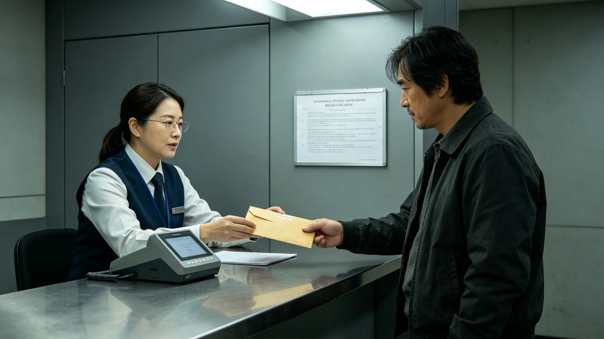

# 联合体公务员廉洁财产申报制度扩展与跨星系联网公报

**发布机构**：联合体法院 / 廉政处
**发布日期**：3095年9月9日
**文件等级**：跨星系公开
**公报号**：INTEG-3095-0909

## 一、扩展背景

原廉洁财产申报仅要求各成员本地公务员申报本地财产。跨星系流动（GS-3060-01）后，公务员可能在三成员均有资产，旧制度查不到外地那部分。

## 二、扩展要点

1. **跨星系联网**：三成员公务员财产申报库联网，一处申报、三地可查；
2. **新增申报项**：跨星系不动产、联币账户、跨星系投资；
3. **公开范围**：司局级以上官员财产对公民公开，其余仅廉政处可查；
4. **与考绩法衔接**：瞒报一经查实，依考绩法直接降两档。

## 三、首次适用

3095年10月1日起，约8,000名司局级以上公务员完成首次跨星系联网申报，经抽查无瞒报。

## 四、附则

联网查得到外地那套房了。制度不指望让人变干净，只指望把脏东西藏不住。

**签发人**：廉政处处长（签名略）
**日期**：3095年9月9日

## 五、申报范围

本次扩展覆盖三系公务员共约 4.2 万人，其中司局级以上约 8,000 人，其余约 3.4 万人。司局级以上财产对公民公开，公民可通过廉政处公开查询系统查阅；其余公务员财产仅廉政处可查，不公开。申报内容包括：本地不动产、跨星系不动产、联币账户余额、跨星系投资、配偶与未成年子女财产。

## 六、联网技术

三成员公务员财产申报库经量子链路联网，一处申报、三地可查。联网技术由联合体通信工程局承建，自 3093 年启动，至 3095 年完成。联网后，公务员在 A 星申报的不动产，B 星廉政处可实时查阅。通信工程局注明：联网不是"监控"，是"让一处藏不住的东西，在另一处也藏不住"。

## 七、首次申报

3095 年 10 月 1 日起，约 8,000 名司局级以上公务员完成首次跨星系联网申报。廉政处随机抽查 800 份（占 10%），核对银行、不动产、投资记录，无瞒报。另 7,200 份未抽查，待 3096 年全面核查。廉政处注明：抽查 10% 没查出问题，不代表剩下 90% 也没问题——全面核查 3096 年跑完。

## 八、瞒报处分

与考绩法衔接：瞒报一经查实，依考绩法直接降两档，并追缴非法所得。3095 年度申报期内，尚未有瞒报案件。廉政处注明：联网查得到外地那套房了——制度不指望让人变干净，只指望把脏东西藏不住。

## 九、公众监督

司局级以上官员财产对公民公开后，3095 年 10—12 月，公民通过公开查询系统查阅约 12 万人次。廉政处收到公民举报 47 件，其中 3 件经初查有线索，已转监察处进一步调查。廉政处注明：公开不是"走过场"，是让公民也能查——查到了，就有线索。

## 十、后续安排

3096 年全面核查全部 4.2 万份申报。廉政处注明：廉洁申报不是"一次报完拉倒"，是每年报一次——今年查完，明年还得报。

## 十一、制度沿革

原廉洁财产申报制度自联合体成立（3000 年）起施行，初版仅要求各成员本地公务员申报本地财产。跨星系流动（GS-3060-01）数十年后，公务员可能在三成员均有资产，旧制度查不到外地那部分。本次扩展为制度建立以来最大一次修订。廉政处注明：制度跟了六十年，跟不上了——跨星系人在哪儿都能买房，制度也得到哪儿都能查。

## 十二、公众质疑与回应

修订过程中，部分公务员担心"公开财产会侵犯隐私"。廉政处回应：仅司局级以上公开，其余不公开；公开内容仅为财产总额，不包括具体账户与交易明细。另有人担心"联网会被滥用"，廉政处回应：联网数据仅廉政处与监察处可查，公民仅可查阅司局级以上公开部分，不可查阅其他公务员。廉政处注明：制度不是"全查到底"，是"该查的查、该公开的公开"——既不能藏，也不能裸。

## 十三、首次申报的数字

3095 年 10 月 1 日首次跨星系联网申报，共申报财产总额约合联币 480 亿，其中不动产占 62%，联币账户占 21%，跨星系投资占 17%。司局级以上官员人均申报财产约合联币 600 万，中位数 380 万。廉政处注明：人均 600 万，不是"清官榜"，是"家底账"——账摆出来， citizen 自己看。
