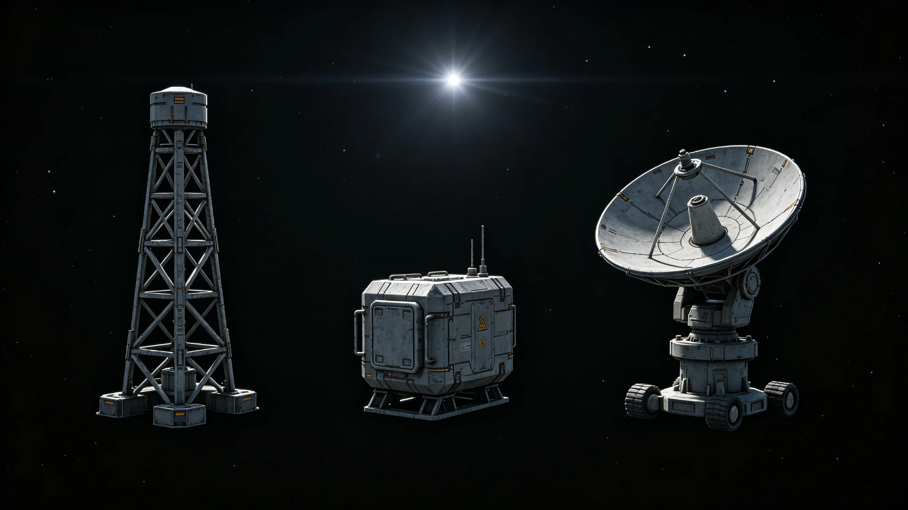

# 联合体深空导航信标网第三代全链升级校准公报

**发布机构**：联合体通信工程局 / 导航信标处
**发布日期**：3097年10月10日
**文件等级**：跨星系技术公开
**公报号**：NAV-3097-1010

## 一、升级对象

三恒星系联合深空导航信标网初建见GS-2555-01，全链相干校时见GS-2820-01。第三代升级自3095年立项，目标：把三成员间的星历统一精度再提一个量级，支撑无人货运（GS-3090-01）与客运（GS-3054-01）的自动驾驶。

## 二、校准数据

| 指标 | 第二代 | 第三代 |
|---|---|---|
| 跨星系星历统一精度 | 基线100 | 34 |
| 单站授时稳定度 | 基线100 | 21 |
| 信标覆盖 | 主航道 | 主航道+边缘航道 |
| 自校准残差 | 0.4 m | 0.06 m |

## 三、发现问题

1. 靠近第四恒星系方向的边缘信标受恒星风扰动，授时漂移略大，需加装补偿；
2. 与无人货运避碰算法（GS-3090-01）的接口需联调。

## 四、结论

第三代信标网通过全链校准。三恒星系间"自己在哪"这道题，算得更准了。

**签发人**：导航信标处处长（签名略）
**日期**：3097年10月10日

## 五、升级组织

第三代升级自 3095 年立项，至 3097 年完成，历时三年。升级内容包括：全部信标站原子钟更换为新一代光钟，授时稳定度提升约 4.8 倍；信站数量从 24 座增至 36 座，新增 12 座边缘航道信标；全链校准软件升级，自校准残差从 0.4 m 降至 0.06 m。升级总投资约合联币 360 亿，由联合体通信工程局承担。

## 六、校准过程

全链校准自 3097 年 6 月启动，至 10 月完成。校准方法：三系信标站互发校准信号，以量子链路同步比对，逐站调整原子钟偏差。共执行校准 48 轮，每轮耗时约 12 小时。校准完成后，三系星历统一精度从基线 100 降至 34，单站授时稳定度从基线 100 降至 21。导航信标处注明：校准不是"调一次就准"，是 48 轮一轮一轮调——调到自校准残差 0.06 m，才敢说准。

## 七、边缘信标补偿

靠近第四恒星系方向的 6 座边缘信标受恒星风扰动，授时漂移略大。整改方案：为这 6 座信标加装恒星风补偿器，实时根据恒星风数据调整授时。补偿器自 3097 年 11 月安装，预计 3098 年第一季度完成。导航信标处注明：边缘信标离主航道远，恒星风吹得狠——加个补偿器，让它别漂。

## 八、与无人货运联调

第三代信标网与无人货运避碰算法（GS-3090-01）的接口需联调。联调自 3097 年 9 月启动，至 10 月完成，共执行联调测试 240 次，无人货运船在第三代信标导航下的定位精度从 0.4 m 提升至 0.06 m。导航信标处注明：信标准了，无人船才敢自己跑——信标和船是一套。

## 九、对客运的影响

第三代信标网同时支撑客运（GS-3054-01）的自动驾驶。客运航线在第三代信标导航下，定位精度提升约 3 倍，航线偏移从平均 0.3 km 降至 0.08 km。导航信标处注明：三恒星系间"自己在哪"这道题，算得更准了——船知道自己在哪儿，人坐得才踏实。

## 十、升级成本与工期

第三代升级自 3095 年立项，至 3097 年完成，历时三年。总投资约合联币 360 亿，其中原子钟更换占 41%，新站建设占 28%，校准软件占 19%，其他占 12%。投资由联合体通信工程局承担。导航信标处注明：360 亿买一个"知道自己在哪儿"——这钱花得值，因为三系的船和人都靠它认路。

## 十一、对旧信标站的处置

第二代信标站不立即退役，作为备份继续运行。36 座第三代信标站中，24 座为原址升级，12 座为新建。原址升级的 24 座中，8 座在升级期间暂停服务，由邻近信标站临时覆盖。导航信标处注明：升级不是一夜之间全换新——老站备着，新站跑着，两班倒。
