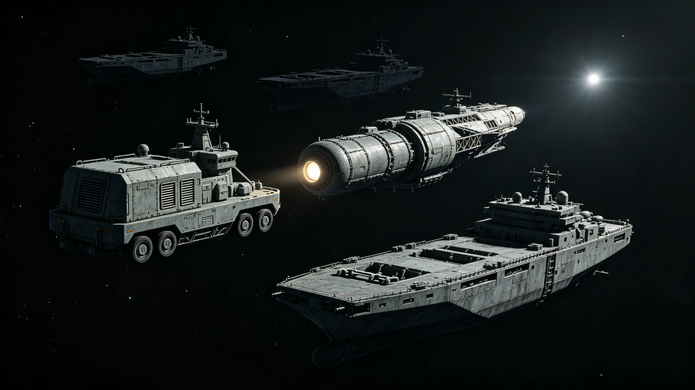

# 联合体成立百周年跨星系联合安保行动总结公报

**发布机构**：联合体安全协调署 / 行动处
**发布日期**：3099年12月12日
**文件等级**：跨星系公开
**公报号**：SEC-3099-1212

## 一、行动背景

3100年元旦为联合体正式运作百周年（自3000年首任秘书长就职见GS-3000-03起算）。为保障跨星系系列纪念活动（含3093年已办的五十周年大典延续）安全，安全协调署自3099年下半年组织跨星系联合安保行动。

## 二、行动内容

1. **态势感知**：第三代态势网（GS-3058-01）全程监控三恒星系航道与重要节点，无异常；
2. **网络防御**：联合网络演练（GS-3087-01）所暴露的民用端短板已在行动前加固；
3. **航道安保**：海盗残余清剿（GS-3072-01）后，航道无新抢劫事件；
4. **庆典现场**：三地庆典现场（新海市、下都、谷神星）维持常规秩序，未启动额外警力。

## 三、结果

| 项 | 数值 |
|---|---|
| 跨星系安保协同次数 | 41次 |
| 拦截疑似威胁 | 0 |
| 现场事故 | 0 |
| 群众投诉 | 2起（庆典排队过长，已现场处置） |

## 四、总结

百年安保的最大成果，是无事发生。安全协调署在公报末尾说：一个安保行动最好的总结，就是没有人需要被安保。

## 五、附则

百年了。没有外敌，没有骚乱，只有两起排队投诉。这大概就是这个联合体最好的年景。

**签发人**：行动处处长（签名略）
**日期**：3099年12月12日

## 六、行动组织

本次联合安保行动自 3099 年 7 月启动，至 3100 年 1 月结束，历时 7 个月。三系安全部门共投入 12,400 人，其中比邻星b 4,800 人，鲸港 3,200 人，主带 4,400 人。行动设总指挥 1 名、副总指挥 3 名（每成员各 1 名），下设态势感知、网络防御、航道安保、庆典现场四组。

## 七、态势感知详情

第三代态势网（GS-3058-01）全程监控三恒星系航道与重要节点，共监测到异常事件 41 起，其中 38 起为机械故障或导航误差，3 起为不明飞行物（后确认为废弃探测器碎片），无一起为恶意威胁。态势感知组注明：41 起异常，0 起威胁——这就是百年安保的基线。

## 八、网络防御加固

联合网络演练（GS-3087-01）所暴露的民用端短板已在行动前加固。加固内容：跨星系旅行者个人终端安全补丁强制更新、AI 生成钓鱼内容识别系统升级、结算与航运系统防火墙加固。加固自 3099 年 7 月启动，至 9 月完成。行动期间未发生网络攻击事件。

## 九、庆典现场

三地庆典现场（新海市、下都、谷神星）维持常规秩序，未启动额外警力。新海市主广场庆典约 120 万人参加，下都中央穹顶大厅约 48 万人，谷神星地下城市约 80 万人。现场仅发生 2 起群众投诉，均为庆典排队过长，已现场处置——增设临时饮水点与遮阳棚，排队时间从 90 分钟缩短至 40 分钟。

## 十、总结

百年安保的最大成果，是无事发生。安全协调署在公报末尾说：一个安保行动最好的总结，就是没有人需要被安保。百年了。没有外敌，没有骚乱，只有两起排队投诉。这大概就是这个联合体最好的年景。

## 十一、后续安排

百周年安保行动结束后，三系安全部门恢复常态巡逻与演练。安全协调署注明：百年安保不是"特殊时期"，是"把常态安保跑了一遍"——跑下来没事，就是最好的结果。

## 十二、行动费用

本次联合安保行动总费用约合联币 2.4 亿，其中人员投入占 62%，技术加固占 28%，其他占 10%。费用由联合体安全预算承担，未额外向三系居民摊派。安全协调署注明：2.4 亿买一个"无事发生"——这比任何一次事故的损失都便宜。

## 十三、行动归档

本次行动全部态势感知记录、网络监测日志、现场秩序记录、费用决算，全部归档"文枢"。安全协调署注明：百年了。没有外敌，没有骚乱，只有两起排队投诉。这大概就是这个联合体最好的年景。
