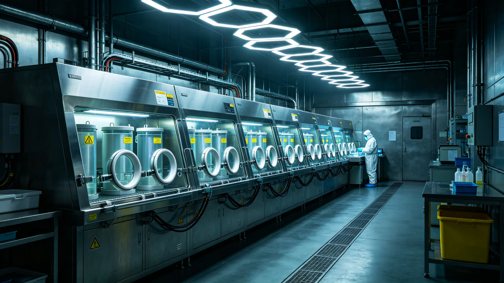

# 第四恒星系地下卤水原生微生物群落生物安全四级隔离鉴定公报

**发布机构**：新拓前哨站生物安全实验室
**鉴定等级**：BSL-4（四级隔离）
**公报日期**：3107年2月11日

## 一、取样背景

3105年，第七勘探艇编队发现之水冰反照率异常区（见 GS-3103-01 第四节）经钻探验证，其下并非纯水冰，而系一受压地下卤水层，温度较地表高约18K，含盐。3106年钻探队在3号钻孔取得岩芯三段、卤水试样120毫升。

试样自取出起，即置于密封运输容器，全程未与新拓站任何非隔离环境接触。运输容器经外舱消毒后，方进入生物安全四级实验室（BSL-4）之密封手套箱。

## 二、初步鉴定

实验室对卤水试样作下列初检：

- 显微镜检：见杆状与球状两种不明颗粒，直径0.2-0.8微米，有细胞壁样结构
- 有机分子：检出氨基酸、短链烃，浓度低于地球深海热液
- 代谢活性：在4℃、避光、惰性气氛下，部分颗粒在添加硫化物后出现缓慢耗氧迹象
- 与地球生命比对：其分子手性偏好与地球生物相反（这是与地球生命最关键的差异点）

实验室判定：试样中存在疑似本地原生自养微生物群落，与地球已知生命无同源关系。此一判定与比邻星b原生微生物之早期发现（参见 GS-2460-01）类同，但二者分属不同星体，不得混为一谈。

## 三、隔离措施

依《跨星系行星生物安全四级隔离规程》，本试样及一切接触过试样之器材，须执行下列措施：

1. 试样永不离开BSL-4手套箱；
2. 一切接触器材（采样管、钻头、手套箱内工具）就地高温灭活后封存，不带出实验室；
3. 取样钻孔3号及周边1公里，划为"生物隔离带"，未经拓荒委员会生物安全处书面批准，不得再钻、不得取水；
4. 新拓站常驻人员如在隔离带内作业，须穿戴全套外服，返回后外服就地消毒，不得穿入居住区；
5. 严禁任何个人私藏、私带、私尝卤水试样。

## 四、人员健康

3106年取样及3107年初检期间，直接接触试样之实验室人员共6人。隔离规程下，无人直接暴露于活培养物。截至公报日：

- 6人健康基线：无急性症状
- 已建立半年期随访，持续至3109年
- 1人（实验室助理）因在BSL-4外舱操作中口罩边缘密封不严，按规程作一次加测，结果阴性，记操作失误一次

## 五、后续

本鉴定为初步。是否确为本地原生生命，须待培养与基因组级证据。在确证或排除之前，3号钻孔隔离带维持原级，不降级、不开放。

实验室主任在公报末尾注："我们没有从这水里尝到任何东西。规程不允许，也不必要。"

新拓前哨站生物安全实验室（盖章）
3107年2月11日
