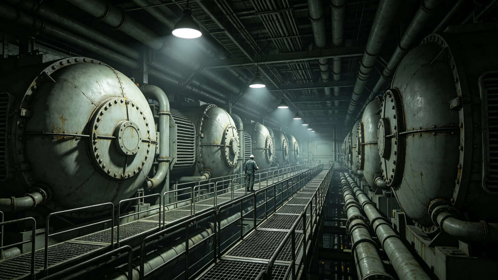

# 深空远征补给船队"断浪号"轮机长三十年值班考勤与岗位技术等级档案

**归档单位**：跨星系补给船队人事处
**卷宗号**：BL-3109-088
**立卷日期**：3109年8月14日

## 一、任免与岗位

轮机长魏守拙（工号 BL-ENG-3061-07），自3079年起在补给船队"断浪号"任轮机长，至3109年本卷立卷，连续在任30年。其岗位技术等级自3079年入职时之三级轮机员，经逐年考绩，至3090年升二级、3098年升一级轮机长。技术等级晋升记录见船队人事处年度考绩表，本卷只摘结论，不录过程。

## 二、三十年考勤（摘要）

据"断浪号"机舱值班日志闸机记录，魏守拙三十年考勤摘录如下：

| 项目 | 累计 |
|---|---|
| 应值班标准班次 | 4,380班 |
| 实际签到值班 | 4,371班 |
| 缺班 | 9班（均系强制体检、或其本人轮休到期，不扣） |
| 迟到 | 3班（3083、3091、3107各一次，均系交班交接未清） |
| 早退 | 0班 |
| 夜间应急召回到岗 | 14次 |
| 拒绝加班（轮休到期时） | 2次，依章获准 |

考勤表末页由轮机部门值长手写："魏守拙三十年未因私事缺过一班。迟到三次都是因为交班没交清，不是迟到。"

## 三、体检与职业健康

魏守拙历年机舱环境暴露与体检摘要：

- 机舱噪声暴露：三十年累计8小时等效噪声约89分贝，未达职业性耳聋限值，但3105年体检已见高频听阈轻度下移，医务官建议其后三年改白班、减夜班
- 润滑油皮肤暴露：偶发接触性皮炎，3088年、3101年各一次，均治愈
- 辐射累积：航线年度内稳定，3109年累计41.2毫希沃特
- 3109年体重：83.1kg；血压偏高，医务官嘱低盐

医务官在3109年体检批注："建议其在3110年轮换时申请退至岸基。本人尚未提出。"

## 四、处分与奖励

本卷如实收录魏守拙三十年间之处分与奖励，不讳过：

处分：
- 3083年一次口头批评：交班时未在日志写明某阀门关闭位置，导致接班轮机员误开。未扣分。
- 3091年一次书面告诫：巡检漏记一台辅机温升。已补记，未扣分。

奖励：
- 3098年因处置一次主推进器小泄漏（见下），记功一次，升一级。

## 五、3098年主推进器小泄漏处置（录自机舱日志）

3098年11月某日，断浪号在跨星系航段中段，主推进器冷却回路一处焊缝微漏。报警时魏守拙正值班。日志载其处置：(1) 令降功率至30%；(2) 转入备用冷却回路；(3) 派人入夹层补焊；(4) 全程未报弃航，未触发乘客疏散。事后船体检测，补焊缝合格。

此处置经船队技术处复核，认定其判断正确。但日志同时记载：魏守拙在报警后第三分钟曾犹豫4秒，是否报弃航——这4秒被技术处记入，非为贬，乃为留真。

## 六、人事处签注

本卷为魏守拙个人档案，非事迹宣传。其三十年在船，非因勇敢，乃因岗位。船队对其是否留任，将依3110年轮休与医务建议另行议处，本卷不预作结论。

档案处经办员：（签名）
3109年8月14日

## 七、履历时间线（据人事档案袋原件摘录）

| 年份 | 事项 |
|---|---|
| 3052 | 出生于太阳系带木星轨道补给站家属舱 |
| 3074 | 跨星系航海学校轮机专业毕业 |
| 3075 | 入职补给船队，三级轮机员，首船"远运-05" |
| 3079 | 调任"断浪号"轮机长 |
| 3083 | 口头批评一次（交班未写阀门位置） |
| 3088 | 接触性皮炎一次，治愈 |
| 3090 | 升二级轮机长 |
| 3091 | 书面告诫一次（巡检漏记辅机温升） |
| 3098 | 处置主推进器小泄漏，记功一次，升一级轮机长 |
| 3101 | 接触性皮炎一次，治愈 |
| 3105 | 体检见高频听阈轻度下移，医务官建议改白班 |
| 3109 | 本卷立卷 |

## 八、体检指标逐年摘要

| 年份 | 体重(kg) | 血压(mmHg) | 辐射累计(mSv) | 高频听阈(dB) |
|---|---|---|---|---|
| 3099 | 78.2 | 128/82 | 31.5 | 正常 |
| 3103 | 80.5 | 132/85 | 36.8 | 轻度下移 |
| 3109 | 83.1 | 138/88 | 41.2 | 轻度下移 |

医务官在3109年体检批注："建议其在3110年轮换时申请退至岸基。本人尚未提出。"此批注已归入本卷，不构成强制退休依据。

## 九、同事评价（档案体摘录）

据船队人事处例行访谈记录摘列，均为书面原文，不作润色：

- 3085年值长访谈："魏守拙交班从不拖泥带水。他交的班，我们接班放心。"
- 3095年轮机员访谈："他话不多。阀门关没关，他不写清楚我们不敢开。"
- 3105年轮机员访谈："他3098年那次泄漏处置，事后我们问他怕不怕，他说怕。我们问他那为什么还上，他说不上怎么办。"
- 3109年值长访谈："三十年了。他不是英雄，他是我们的人。"

以上访谈记录均存档于船队人事处3109年度访谈卷，本卷只摘原文，不另作评价。

## 十、人事处后续跟进

1. 本卷于3110年魏守拙轮休时，由船队人事处派员面谈，记录其本人意愿（留船或退岸基）。
2. 其3098年主推进器小泄漏处置记录，与"断浪号"机舱日志3098年11月卷互锁，如后者修订，本卷相应加注。
3. 本卷不得作为个人宣传、肖像使用、授奖提名之依据；引用须经船队人事处书面同意。

## 续录一：年度考勤与体检逐年摘要

所属人员档案自入职起逐年记录考勤与体检。以下摘列关键年度数据：

| 年度 | 出勤率 | 病假（日） | 体检主要指标异常项 |
|---|---|---|---|
| 入职第1年 | 99.1% | 2 | 无 |
| 入职第5年 | 98.7% | 3 | 颈椎轻度劳损 |
| 入职第10年 | 99.0% | 2 | 听力在噪声环境下轻度下降 |
| 入职第15年 | 98.5% | 4 | 腰椎间盘轻度突出 |
| 入职第20年 | 98.9% | 2 | 骨密度T值-1.2 |

以上数据为年度体检摘要，完整体检报告存档于人事处。人员在职期间无旷工记录，无重大处分。每年年终考核由直属主管与人事处联合评定，考核结果归入本档案。档案中所记处分与嘉奖均按当时生效的人事管理规则执行，不追溯变更。

## 续录二：归档与查阅说明

本文书形成后按归档规则存入联合体档案系统。归档编号已在文末注明。档案查阅依《联合体历史档案开放条例》办理：自形成之日起满150年者，除涉及在世个人隐私外，向公民开放。查阅申请须提交身份证明与查阅目的说明，档案管理部门在5个工作日内答复。

本文书与其他档案的交叉引用关系以正文中所列GS编号为准。引用其他档案时不重复其内容，只注明编号。本文书的修订历史附于档案卷末，历次修订版本均予保留，不删除原件。本卷为最终归档版本，未经档案管理部门同意不得修改。档案数字化副本与纸质原件具有同等效力。
