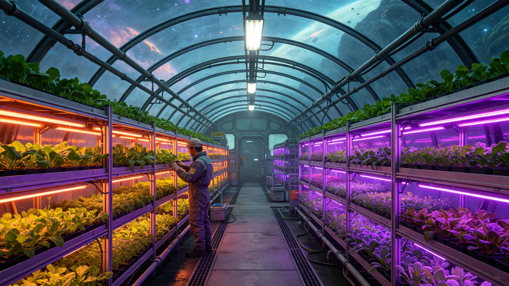

# 新拓定居点密闭生态舱首批作物本地驯化产量报告

**编制单位**：新拓前哨站农业班
**报告年度**：3114种植年
**日期**：3115年3月21日

## 一、背景

新拓前哨站常驻人员配给，初期全部由跨星系航线运入。为降低对外依赖，农业班自3112年起在密闭生态舱试种地球引种作物，目标是在3120年前实现主粮自给30%。本报告为首批作物3114种植年（一个完整周期）之产量报告。

## 二、试种作物与产量

| 作物 | 引种 | 单架产量(kg/周期) | 对照地球同品种 |
|---|---|---|---|
| 马铃薯 | 闭环系 | 41.2 | 地球温室同期约48 |
| 小麦 | 闭环系 | 18.6 | 地球同期约24 |
| 叶菜 | 驯化系 | 63.5 | 与地球相当 |
| 大豆 | 闭环系 | 9.8 | 地球同期约14 |

农业班注：产量普遍低于地球温室，主因有二——其一，第四恒星系主星为M型矮星，自然光弱，全部靠LED补光，光强受限；其二，舱内大气虽可调，但长期密闭，部分作物授粉不稳（与 GS-3111-01 机械授粉臂问题同源）。

## 三、本地驯化

所谓"本地驯化"，并非引种本地原生生物（见 GS-3107-01，原生生物在四级隔离，不得入生态舱），而是将地球引种作物在新拓舱内连续种植数代，使其适应当地光照、大气与配给水。

农业班自3112年引种，3114年为第二代。第二代较第一代：
- 马铃薯产量+11%
- 小麦产量+6%
- 大豆产量+2%
- 叶菜基本不变

## 四、与生物安全

农业班强调：生态舱内一切作物均为地球引种，与 GS-3107-01 所封之本地原生生物物理隔离，物料、人员、工具不交叉。取样钻孔3号隔离带（见 GS-3107-01）未开放。

## 五、结论

首批作物产量虽低于地球，但已可供给新拓站约12%的主粮消耗。农业班预计：按当前驯化速度，3120年可达主粮自给30%之目标。下年度报告将增加大豆授粉专项。

新拓前哨站农业班（盖章）
3115年3月21日
