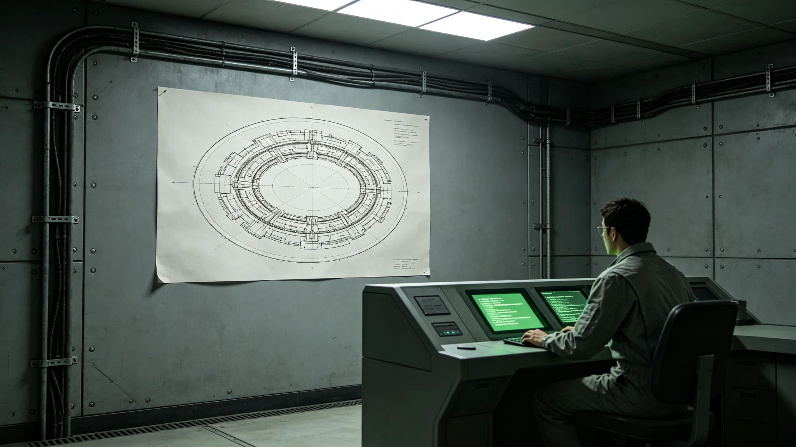

# 新边疆矿产资源"先勘先得"登记与联合体仲裁管辖确立公报

**发布机构**：联合体深空拓荒委员会 · 法务处
**抄送**：新拓前哨站、各采矿主体、跨星系贸易司
**日期**：3118年4月12日

## 一、立法缘起

《土地先占确权暂行办法》（GS-3102-01）施行以来，作业面确权基本理顺。但矿产资源——尤其是铂族金属矿（GS-3106-01）与低温矿床——与地表作业面不同：矿脉可能跨作业面、跨定居点，甚至跨主体。自3106年铂矿投产后，采矿主体对矿脉延伸段之权属争议上升，单靠 GS-3102-01 第八条之议事会抽签已不足以裁决跨主体、跨定居点之矿权。

为此，拓荒委员会法务处制定本《矿产资源"先勘先得"登记与仲裁管辖办法》。

## 二、先勘先得登记

第一条 矿产资源确权以"先勘先得"为原则。所谓"先勘"，指主体对某矿脉完成系统勘探、提交完整地质报告、并经拓荒委员会勘探处备案。

第二条 矿脉登记向拓荒委员会法务处"矿权登记厅"提出。登记时间以备案时间为准，不以口头声称时间为准。

第三条 一条矿脉只登记一个主体。先勘先得，后至者不得重复登记。但后至者如能证明其勘探成果对矿脉认识有实质补充，可申请"共同勘探人"地位，按投入比例分享收益，不主张独立开采权。

第四条 矿权登记为"开采使用权"，非所有权，不据以主张主权。闲置满240个标准日未开采者，登记厅收回。

## 三、仲裁管辖

第五条 跨定居点、跨主体、跨星系之矿权争议，新拓议事会无权裁决，一律上报拓荒委员会仲裁庭。

第六条 仲裁庭依《联合体跨星系仲裁规程》与《跨星系税收协定》（GS-2976-01）之管辖条款审理。仲裁为一审终局，不得再诉至任何定居点法院。

第七条 仲裁庭可委托勘探处对争议矿脉作独立复核，费用由败诉方承担。

## 四、施行首季

3118年4月12日至7月12日：

- 矿权登记申请：23件
- 初审通过：17件
- 退回（勘探报告不完整）：6件
- 立案争议：2件，均提交仲裁庭
- 因闲置收回：0件

## 五、附则

本办法自3118年4月12日起施行。与 GS-3102-01 不一致之处，以本办法为准。

拓荒委员会法务处（盖章）
3118年4月12日

## 六、政策背景与实施细则

实施细则：矿脉登记向拓荒委员会法务处"矿权登记厅"提出，登记时间以备案时间为准。申请须提交完整地质报告，包括矿脉走向、品位估算、储量评估、勘探工程量。勘探报告不完整者，登记厅退回补正，补正期30个标准日。

## 七、施行首季分项数据

3118年4月12日至7月12日：

| 项目 | 数量 | 备注 |
|---|---|---|
| 矿权登记申请 | 23件 | 铂族金属矿8件、低温矿床7件、镍铜矿5件、其他3件 |
| 初审通过 | 17件 | 勘探报告完整 |
| 退回（报告不完整） | 6件 | 补正期30日 |
| 立案争议 | 2件 | 均提交仲裁庭 |
| 因闲置收回 | 0件 | 办法施行未满240日 |

登记厅经办员在季度小结中写："先勘先得，勘字在前。不勘只占，不给登记。"

## 八、仲裁管辖与监督

跨定居点、跨主体、跨星系之矿权争议，新拓议事会无权裁决，一律上报拓荒委员会仲裁庭。仲裁庭依《联合体跨星系仲裁规程》与《跨星系税收协定》（GS-2976-01）之管辖条款审理，仲裁为一审终局。

监督机制：法务处设专职复核员1名，对矿权登记与仲裁逐件抽核，抽核比例不低于20%。首季抽核结果：登记23件中抽核5件，均无程序瑕疵；仲裁2件均符合规程。

## 九、后续安排

本办法自3118年4月12日起施行，每年由法务处复核一次。与 GS-3102-01 不一致之处，以本办法为准。后续如矿权登记数量大幅增长，登记厅编制将相应扩充，不另发文。

## 续录一：施行细则与监督反馈

本公报所定事项自公布之日起施行。施行细则如下：

1. 各执行单位须于公布后30日内制定本单位实施方案，报主管部门备案；
2. 实施方案须列明责任人、时间节点、资源需求；
3. 主管部门每季度对执行情况作一次检查，检查结果书面通知执行单位；
4. 执行单位遇重大困难可申请延期，延期不超过6个月；
5. 本公报施行满一年后作首次评估，评估报告报上级部门。

监督反馈渠道：公民对执行情况有异议者，可通过主管部门公开信箱提交，30日内答复。本公报与相关既有法规交叉引用之处，以正文所列档案编号为准。本公报不溯及既往，施行前已发生的法律事实按当时法规处理。

## 续录二：归档与查阅说明

本文书形成后按归档规则存入联合体档案系统。归档编号已在文末注明。档案查阅依《联合体历史档案开放条例》办理：自形成之日起满150年者，除涉及在世个人隐私外，向公民开放。查阅申请须提交身份证明与查阅目的说明，档案管理部门在5个工作日内答复。

本文书与其他档案的交叉引用关系以正文中所列GS编号为准。引用其他档案时不重复其内容，只注明编号。本文书的修订历史附于档案卷末，历次修订版本均予保留，不删除原件。本卷为最终归档版本，未经档案管理部门同意不得修改。档案数字化副本与纸质原件具有同等效力。
