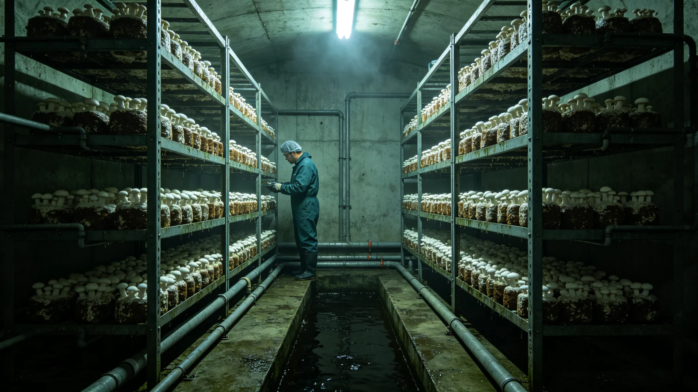

# 新边疆地下真菌分解链与废弃物闭环生物处理试验报告

**编制单位**：新拓前哨站农业班 · 废弃物组
**报告年度**：3130-3131试验年
**日期**：3131年12月3日

## 一、问题

新拓站常驻人员产生之有机废弃物（厨余、作物残体、人粪尿），初期以干燥封存、定期外运处理。随常驻人口增至800余人，外运成本高，且占跨星系货运舱位。农业班自3128年起，试建地下真菌分解链，就地处理有机废弃物。

## 二、分解链构成

分解链全部使用地球引种真菌（与 GS-3107-01 所封本地原生生物物理隔离）：

1. 第一级：白腐真菌，分解木质素、作物秸秆；
2. 第二级：蚯蚓与腐生真菌混合，分解厨余；
3. 第三级：残渣堆肥，回用于 GS-3115-01 生态舱土壤。

分解链全程在地下密闭舱运行，与居住区物理隔离。

## 三、一年试验数据

| 指标 | 设计值 | 实测 |
|---|---|---|
| 有机废弃物处理量 | 全站90% | 87% |
| 残渣堆肥产出 | 年2,000kg | 1,860kg |
| 臭气外溢 | 0 | 0（密闭良好） |
| 真菌感染人员 | 0 | 0 |

## 四、问题

农业班报告两点：

第一，第一级白腐真菌在红矮星弱光下（地下无自然光）生长较慢，须补光。补光能耗计入。
第二，分解链废液须二次处理，方能排入 GS-3111-01 生保水回收膜组。二次处理已加装。

## 五、结论

试验基本成功。农业班建议3132年正式运行，目标将外运有机废弃物降至10%以下。残渣堆肥回用于生态舱，形成闭环。

新拓前哨站农业班废弃物组（盖章）
3131年12月3日
