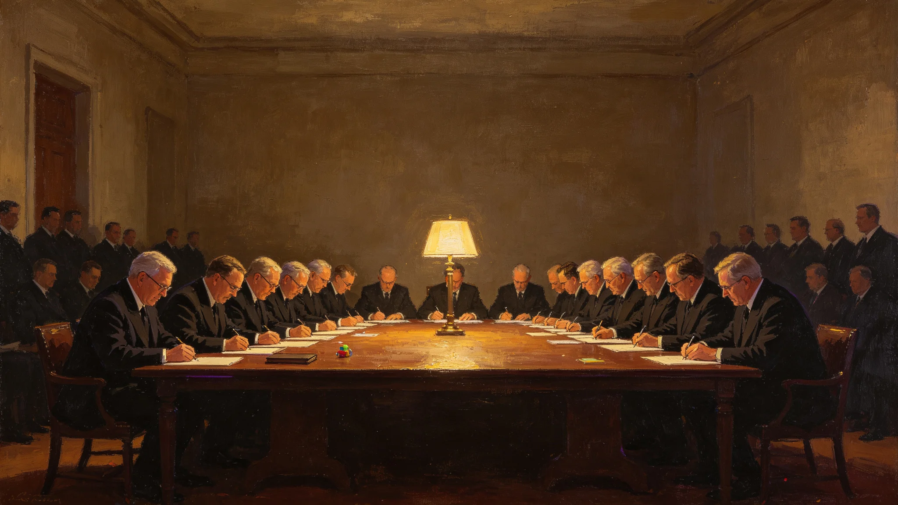

# 深空拓荒者工伤与辐射慢性损伤跨星系互认保险制度公报

**发布机构**：联合体跨星系福利委员会
**抄送**：各定居点、拓荒委员会、工会
**日期**：3133年4月22日

## 一、问题

拓荒者从地球、月球、主带、鲸鱼座τ、巴纳德、新拓之间跨星系调动。其在某一星体受之工伤、累积之辐射慢性损伤，到另一星体后常因"异地认定"不被承认，需重新鉴定，延误治疗。依《工人权利宪章》（GS-2956-01），福利委员会制定本互认制度。

## 二、互认原则

第一条 拓荒者在任一已登记定居点受之工伤，经原属地医务部门鉴定，跨定居点互认，不重新鉴定。

第二条 辐射慢性损伤按累计剂量互认。累计剂量跨定居点累计，不因调动而清零。

第三条 因工伤、慢性损伤之治疗，在任一已登记定居点均可享受，费用由跨星系福利基金承担。

第四条 鉴定争议由跨星系医务仲裁庭裁决，不属定居点法院。

## 三、施行首年

3133年4月至12月：

- 申请跨星系工伤互认：41件，通过38件
- 辐射慢性损伤累计认定：23人
- 医务仲裁案件：2件
- 拒认：0件

## 四、附则

本制度自3133年4月22日起施行。与各定居点旧规不一致之处，以本制度为准。

联合体跨星系福利委员会（盖章）
3133年4月22日
