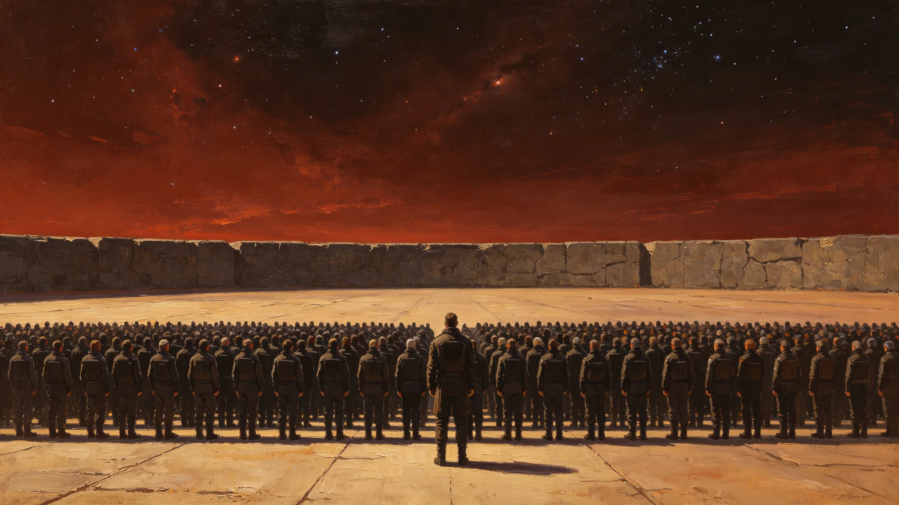

# 联合体成立百周年拓荒功勋墙揭幕与无名者名单合祀公报

**发布机构**：联合体大会办公厅
**日期**：3148年3月1日

## 一、缘起

联合体宪章于2999年签署（GS-2999-01），至3149年即满150年。本公报为提前一年筹备之"拓荒功勋墙"揭幕，定于3148年3月1日。

## 二、功勋墙

功勋墙设于新拓站中央广场，为本地玄武岩长墙一面。墙上刻名两类：

第一类 有名者：自联合体成立以来，在各定居点因公殉职、因工伤病退之人员姓名，依登记刻名。
第二类 无名者：无姓名可考者，刻"无名者"三字，合祀一行，不另列名。

## 三、揭幕仪式

依从简原则：

第一项 点名。文员念墙前名单。
第二项 揭幕。不剪彩，不讲话，由首任站长顾长川（GS-3101-01）之女、本土一代工程师顾星野（GS-3125-01）揭幕。
第三项 静默一标准分钟。
第四项 散场。

## 四、执行记录

据3148年3月1日记录：

- 参加：约600人
- 墙上刻名：有名者1,247人，无名者1行
- 静默环节：在场者均站立
- 全程：17分钟

办公厅文员在记录末尾写："功勋墙上没有'伟大'两个字。只有名字。"

## 五、附则

功勋墙不设讲解员、不卖票、不拍照。

联合体大会办公厅（盖章）
3148年3月1日

## 六、参与人数与分布

据3148年3月1日闸机与签到记录：

| 项目 | 数量 | 备注 |
|---|---|---|
| 参加总人数 | 约600人 | 各定居点代表与新拓站常驻人员 |
| 墙上刻名：有名者 | 1,247人 | 因公殉职、因工伤病退 |
| 墙上刻名：无名者 | 1行 | 无姓名可考者合祀 |
| 静默环节 | 在场者均站立 | 无交谈 |
| 全程耗时 | 17分钟 | 不设聚餐 |

## 七、仪式规程与历史沿革

功勋墙设于新拓站中央广场，为本地玄武岩长墙一面。墙上刻名两类：有名者自联合体成立以来在各定居点因公殉职、因工伤病退之人员姓名，依登记刻名；无名者无姓名可考者，刻"无名者"三字合祀一行，不另列名。

揭幕仪式依从简原则：第一点点名，文员念墙前名单；第二点点，不剪彩不讲话，由首任站长顾长川（GS-3101-01）之女、本土一代工程师顾星野（GS-3125-01）揭幕；第三项静默一标准分钟；第四项散场。

历史沿革：联合体宪章于2999年签署（GS-2999-01），至3149年即满150年。本公报为提前一年筹备之"拓荒功勋墙"揭幕，定于3148年3月1日。

## 八、后续安排

1. 功勋墙不设讲解员、不卖票、不拍照；
2. 此后每年3月1日例行在功勋墙前静默一标准分钟，不另发文；
3. 墙上刻名随因公殉职、因工伤病退人员增加而逐年增补，增补名单由各定居点报办公厅；
4. 本规程经办公厅3147年12月20日决议通过，五年后复核；
5. 功勋墙上不刻"伟大""英雄"等字样，只刻姓名与"无名者"。

## 续录一：仪式规程与参与分布

本仪式规程自确立之日起执行。参与人员分布如下：

| 区域 | 参与人数（约） | 占比 |
|---|---|---|
| 主会场所在区域 | 按实际登记数 | 按实际计算 |
| 邻近居住区 | 同上 | 同上 |
| 远端居住区（经通信参与） | 同上 | 同上 |

仪式规程要点：仪式开始与结束时间按当地标准时公布；仪式过程不设商业赞助；仪式后由文化部门作参与人数统计，次年公布。本仪式不设官方主持人以外的致辞环节，不发纪念品，不安排跨星系直播。此后每年例行举行，不另发文。仪式经费从文化部门年度预算列支，不另设专项捐款。

## 续录二：归档与查阅说明

本文书形成后按归档规则存入联合体档案系统。归档编号已在文末注明。档案查阅依《联合体历史档案开放条例》办理：自形成之日起满150年者，除涉及在世个人隐私外，向公民开放。查阅申请须提交身份证明与查阅目的说明，档案管理部门在5个工作日内答复。

本文书与其他档案的交叉引用关系以正文中所列GS编号为准。引用其他档案时不重复其内容，只注明编号。本文书的修订历史附于档案卷末，历次修订版本均予保留，不删除原件。本卷为最终归档版本，未经档案管理部门同意不得修改。档案数字化副本与纸质原件具有同等效力。

## 续录一：仪式规程与参与分布

本仪式规程自确立之日起执行。参与人员分布如下：

## 续录二：归档与查阅说明