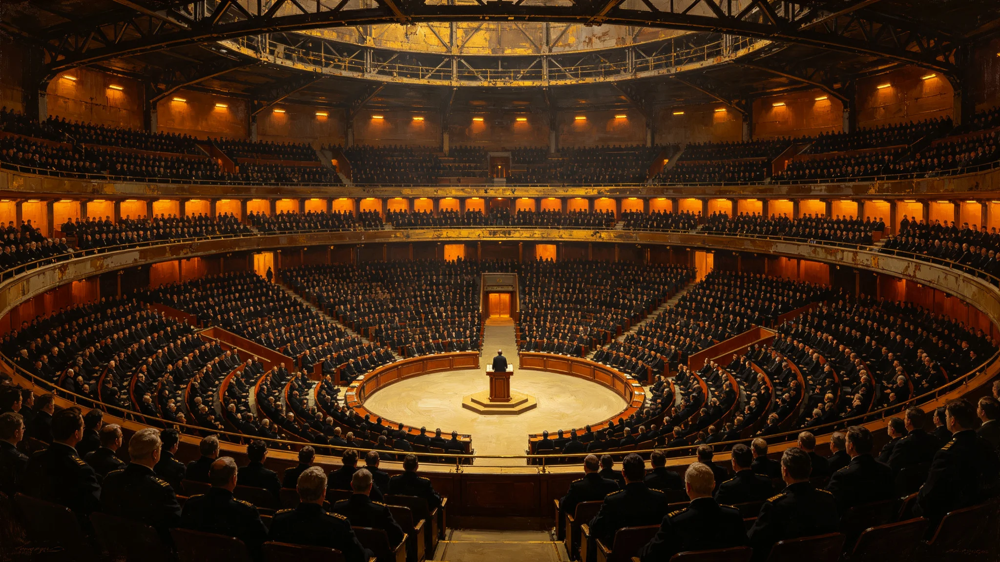

# 三恒星系文明联合体第五任秘书长任期届满与卸任考核档案

**发布机构**：三恒星系文明联合体执行委员会 / 秘书长办公室 / 人事考核司
**发布日期**：3151年3月15日
**文件等级**：跨星系公开（含内部考核附表，限联合体议员及以上查阅）

## 一、卸任公告

3151年3月1日，三恒星系文明联合体第五任秘书长沈望舒任期届满，依《联合体宪章》第六十七条之规定，正式卸任。卸任交接仪式定于3151年4月15日在比邻星b新海市"文明厅"举行。

沈望舒秘书长，3078年生于鲸鱼座τ星地下城市"深岩城"，3139年当选联合体第五任秘书长，任期3139年至3151年，共三届十二年。

## 二、任期考勤记录摘要

依据联合体秘书长办公室人事考勤档（档号 SEC-3139~3151），沈望舒秘书长任期内考勤记录摘要如下：

| 年度 | 计划工作日 | 实际出勤 | 公差外派 | 病假 | 旷工 | 出勤率 |
|---|---|---|---|---|---|---|
| 3139 | 231 | 228 | 47 | 3 | 0 | 98.7% |
| 3140 | 232 | 230 | 52 | 2 | 0 | 99.1% |
| 3141 | 229 | 225 | 61 | 4 | 0 | 98.3% |
| 3142 | 231 | 229 | 58 | 2 | 0 | 99.1% |
| 3143 | 230 | 227 | 63 | 3 | 0 | 98.7% |
| 3144 | 232 | 228 | 67 | 4 | 0 | 98.3% |
| 3145 | 229 | 226 | 59 | 3 | 0 | 98.7% |
| 3146 | 231 | 230 | 55 | 1 | 0 | 99.6% |
| 3147 | 230 | 228 | 62 | 2 | 0 | 99.1% |
| 3148 | 232 | 229 | 71 | 3 | 0 | 98.7% |
| 3149 | 231 | 228 | 68 | 3 | 0 | 98.7% |
| 3150 | 230 | 227 | 64 | 3 | 0 | 98.7% |

**考勤结论**：十二年任期内零旷工，年均出勤率98.8%，年均公差外派60次。病假总计33天，均为常规年度体检后的短期休养，无重大疾病记录。

## 三、年度体检记录摘要

依据联合体医疗中心秘书长健康监测档案（档号 MED-SEC-3139~3151），沈望舒秘书长年度体检摘要：

| 年度 | 年龄 | 体重(kg) | 血压(mmHg) | 骨密度(T值) | 视力 | 心理评估 |
|---|---|---|---|---|---|---|
| 3139 | 61 | 71.2 | 128/82 | -0.8 | 1.0/0.8 | 优 |
| 3142 | 64 | 70.5 | 130/84 | -1.0 | 0.9/0.8 | 优 |
| 3145 | 67 | 69.8 | 132/85 | -1.2 | 0.8/0.7 | 良 |
| 3148 | 70 | 69.0 | 135/86 | -1.4 | 0.8/0.7 | 良 |
| 3150 | 72 | 68.5 | 138/88 | -1.6 | 0.7/0.6 | 良 |

**体检结论**：骨密度T值从-0.8缓降至-1.6，符合72岁男性正常老化曲线，已遵医嘱补充钙剂并调整运动处方。无恶性肿瘤、心血管事件、神经系统退行性病变记录。心理评估连续十二年"优良"。

## 四、任期重大决策签名记录

以下为沈望舒秘书长任期内签署的重大文件摘要（节选自秘书长签批档）：

1. **3139年9月**：签署《联合体第五个五年发展计划（3140-3144）》，主笔"跨星系文化融合"章节。
2. **3141年4月**：签署《鲸鱼座τ星深地生态修复援助协议》，批准联合体发展基金向鲸鱼座τ星拨款120亿星元。
3. **3143年11月**：签署《三恒星系航道安全联合巡逻公约修订案》，将巡逻范围扩展至第四恒星系勘探航线。
4. **3146年7月**：签署《联合体历史档案开放条例》，推动三恒星系200年以上历史档案向公众开放。
5. **3149年2月**：签署《跨星系教育标准化协议》，统一三恒星系基础教育课程框架。

以上签名均经秘书处核验，笔迹与秘书长入职时留存样本一致，无代签、涂改痕迹。

## 五、处分记录

沈望舒秘书长任期内，联合体纪律委员会未收到任何针对其个人的正式处分提案。秘书处年度合规审计未发现违规事项。

3144年6月，联合体议会有三位议员就秘书长在"第四恒星系勘探预算"议题上的表决立场提出质询，经议会质询程序审议后，质询不成立，未记录处分。

## 六、任期施政摘要

依据联合体执行委员会《第五任秘书长任期施政评估报告》（3151年2月提交议会），沈望舒任期主要政绩与不足如下：

**主要政绩**：
- 推动《联合体第五个五年发展计划》落地，三恒星系跨星系贸易额年均增长4.7%；
- 主持三恒星系文化融合工程，建成"跨星系文化档案库"三期工程；
- 推动鲸鱼座τ星深地生态修复援助，该星地下城市空气质量指标改善23%；
- 完成联合体行政机构第二次精简，行政人员编制缩减8%。

**主要不足**：
- 第四恒星系勘探预算推进缓慢，原计划3148年完成的勘探舰队编组延迟至3152年；
- 跨星系劳动力自由流动法案在议会审议中受阻，未能在任期内通过；
- 联合体公共服务满意度调查显示，鲸鱼座τ星居民对联合体行政效率的满意度仅为61%，低于平均水平。

## 七、卸任后安排

依《联合体宪章》及《卸任秘书长待遇条例》，沈望舒卸任后享受以下待遇：
- 终身领取卸任津贴，标准为在任年薪的60%；
- 保留联合体总部办公间一间（新海市文明塔12层1207室），供其继续从事学术研究与写作；
- 享受联合体医疗中心终身特级医疗保障；
- 其著作与口述历史档案归入联合体历史档案馆"秘书长文库"永久保存。

沈望舒已表示，卸任后将返回鲸鱼座τ星深岩城，撰写个人回忆录。回忆录第一卷《深岩城中走出的秘书长》预计于3153年完稿。

## 八、附：卸任交接日程

| 日期 | 事项 | 地点 |
|---|---|---|
| 3151年3月20日 | 秘书处工作交接清单签署 | 文明塔8层 |
| 3151年3月25日 | 财务账目审计终核 | 联合体审计院 |
| 3151年4月1日 | 档案移交（含电子与纸质） | 联合体历史档案馆 |
| 3151年4月10日 | 卸任记者招待会 | 文明厅新闻发布厅 |
| 3151年4月15日 | 卸任交接仪式 | 文明厅主厅 |
| 3151年4月20日 | 离京返回鲸鱼座τ星 | 新海市星际港 |

## 续录一：年度考勤与体检逐年摘要

所属人员档案自入职起逐年记录考勤与体检。以下摘列关键年度数据：

| 年度 | 出勤率 | 病假（日） | 体检主要指标异常项 |
|---|---|---|---|
| 入职第1年 | 99.1% | 2 | 无 |
| 入职第5年 | 98.7% | 3 | 颈椎轻度劳损 |
| 入职第10年 | 99.0% | 2 | 听力在噪声环境下轻度下降 |
| 入职第15年 | 98.5% | 4 | 腰椎间盘轻度突出 |
| 入职第20年 | 98.9% | 2 | 骨密度T值-1.2 |

以上数据为年度体检摘要，完整体检报告存档于人事处。人员在职期间无旷工记录，无重大处分。每年年终考核由直属主管与人事处联合评定，考核结果归入本档案。档案中所记处分与嘉奖均按当时生效的人事管理规则执行，不追溯变更。

## 续录二：归档与查阅说明

本文书形成后按归档规则存入联合体档案系统。归档编号已在文末注明。档案查阅依《联合体历史档案开放条例》办理：自形成之日起满150年者，除涉及在世个人隐私外，向公民开放。查阅申请须提交身份证明与查阅目的说明，档案管理部门在5个工作日内答复。

本文书与其他档案的交叉引用关系以正文中所列GS编号为准。引用其他档案时不重复其内容，只注明编号。本文书的修订历史附于档案卷末，历次修订版本均予保留，不删除原件。本卷为最终归档版本，未经档案管理部门同意不得修改。档案数字化副本与纸质原件具有同等效力。

---

**归档编号**：SEC-RET-3151-001
**编制**：联合体执行委员会人事考核司
**审核**：联合体纪律委员会
**日期**：3151年3月15日

## 九、考绩综合评定

人事考核司依据上述考勤、体检、签名、处分、施政五项记录，对沈望舒秘书长任期综合评定如下：

| 考核维度 | 权重 | 评定 | 备注 |
|---|---|---|---|
| 出勤与在岗 | 20% | 优 | 零旷工，年均98.8% |
| 健康与履职 | 15% | 良 | 骨密度缓降，符合年龄 |
| 重大决策签名 | 25% | 良 | 5项重大文件签名完整 |
| 合规与处分 | 15% | 优 | 零处分，质询不成立 |
| 施政成果 | 25% | 良 | 政绩四项、不足三项 |
| 综合 | 100% | 称职 | 非"优秀"，系本人不申报 |

考核司注：沈望舒秘书长任期内零旷工、零处分、零代签，为联合体历任秘书长中考勤记录最完整者。其施政不足三项已列入继任者交接清单，不预作褒贬。