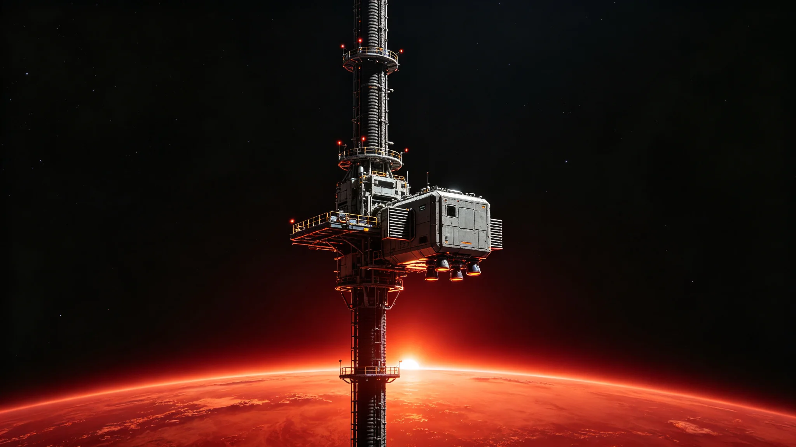

# 比邻星b第二代轨道电梯主缆疲劳检测与更换工程公报

**发布机构**：比邻星b行星基础设施管理局 / 轨道电梯运营中心
**发布日期**：3153年9月20日
**文件等级**：行星级公开 / 跨星系技术通报

## 一、工程概述

3153年9月15日，比邻星b第二代轨道电梯"天索-02"主缆全面更换工程正式启动。本次工程为"天索-02"自3108年建成投运以来的首次主缆整体更换，计划工期24个月，预计3155年9月完工。

"天索-02"轨道电梯是比邻星b第二条轨道电梯（第一条为"天索-01"，2962年建成，见GS-2962-01），主缆总长约96,000公里，从比邻星b赤道表面延伸至同步轨道站，设计载重能力为每年1,200万吨。

## 二、疲劳检测背景

3152年第三季度例行检测中，运营中心结构健康监测系统（SHM）发现"天索-02"主缆中段（距地表约42,000公里处）出现以下异常：

| 检测项目 | 设计阈值 | 实测值 | 判定 |
|---|---|---|---|
| 主缆应变率增量 | ≤0.02%/年 | 0.031%/年 | 超限 |
| 局部微裂纹密度 | ≤0.5条/㎡ | 0.8条/㎡ | 超限 |
| 碳纳米管束断丝率 | ≤0.1% | 0.14% | 超限 |
| 防腐涂层完整性 | ≥95% | 87% | 超限 |

3152年10月，行星基础设施管理局组织第三方检测机构进行独立复检，确认上述检测数据准确。经结构力学仿真评估，主缆剩余安全裕度从设计初始的2.8倍降至1.6倍，虽仍高于最低安全要求（1.2倍），但已进入加速老化阶段。

管理局于3153年1月发布《"天索-02"主缆更换工程可行性论证报告》，建议在3153年至3155年间完成主缆整体更换。该报告经行星议会审议通过，预算获批420亿星元。

## 三、工程方案

本次更换工程采用"逐段替换、不停运作业"方案：

**（一）施工方法**

- 主缆共分120个分段，每段长800公里；
- 每次同时作业不超过3个分段，保持主缆整体结构连续性；
- 替换段采用第六代碳纳米管复合缆材，抗拉强度比原缆材提升35%；
- 每段替换后进行72小时张力测试与振动测试，确认合格后方可进行下一段。

**（二）运力保障**

- 更换期间，"天索-02"年运力从1,200万吨降至约800万吨（降幅33%）；
- 缺口部分由"天索-01"（年运力600万吨）增加班次与"轨道货运飞船"补充；
- 紧急物资与医疗物资运输优先级维持最高。

**（三）安全措施**

- 施工期间，主缆两侧50公里范围内设立禁飞区；
- 每段替换作业配备两艘工程作业艇（封闭式加压船体，配备RCS姿态喷口与机械臂）；
- 施工人员实行12小时轮班制，每班不超过8小时舱外作业；
- 全程由结构健康监测系统实时监控，异常情况立即停工检查。

## 四、施工进展

截至3153年9月20日，工程进展如下：

| 阶段 | 计划内容 | 完成进度 |
|---|---|---|
| 第一阶段 | 施工准备、材料运抵 | 100% |
| 第二阶段 | 地表段（0~8,000km）替换 | 完成3/10段 |
| 第三阶段 | 中段（8,000~48,000km）替换 | 未开始 |
| 第四阶段 | 轨道段（48,000~96,000km）替换 | 未开始 |

首段替换作业于3153年9月15日完成，用时6天（计划7天），提前1天。替换后张力测试结果显示，新缆段张力分布均匀，振动频率在设计范围内。

## 五、工程预算

| 项目 | 预算（亿星元） |
|---|---|
| 新缆材采购 | 180 |
| 施工设备租赁 | 65 |
| 施工人员薪酬 | 45 |
| 监测与检测费用 | 30 |
| 运力补偿与过渡运输 | 70 |
| 应急储备金 | 30 |
| **合计** | **420** |

## 六、风险评估

工程风险评估委员会于3153年8月发布《"天索-02"主缆更换工程风险评估报告》，主要风险项如下：

1. **结构风险**：逐段替换过程中，主缆整体结构可能出现局部应力重分布。已通过有限元仿真验证，最大局部应力不超过设计许用值的85%。
2. **施工风险**：舱外作业存在微流星体撞击风险。施工区域已纳入空间态势感知网络监测，3天内概率性微流星体通量低于预警阈值。
3. **运力风险**：运力下降33%可能影响部分非紧急货物运输。已与"天索-01"运营方达成运力补充协议。
4. **进度风险**：若出现连续7天以上的恶劣太阳活动期，舱外作业需暂停。应急工期预留3个月。

## 七、跨星系影响

本次主缆更换工程期间（3153-3155年），比邻星b轨道货运运力受限，可能对跨星系贸易产生以下影响：

- 跨星系数星元出口（矿产、制造品）运输成本预计上升8-12%；
- 鲸鱼座τ星经比邻星b中转的物资交期预计延长5-10天；
- 联合体发展银行已批准专项过渡贷款150亿星元，用于补贴运力增加部分。

联合体贸易委员会已发布《轨道电梯运力临时调整贸易指南》，指导各贸易方调整运输计划。

## 续录一：施工进度与质量监督

本工程实行分阶段验收制度。各阶段进度安排如下：

| 阶段 | 时间区间 | 主要工作 | 验收标准 |
|---|---|---|---|
| 第一阶段 | 启动后第1至2年 | 基础工程与设备采购 | 材料合格证明齐全 |
| 第二阶段 | 启动后第2至3年 | 主体安装与管线铺设 | 压力测试与密封测试合格 |
| 第三阶段 | 启动后第3至4年 | 系统联调与试运行 | 试运行30日无重大异常 |
| 第四阶段 | 启动后第4至5年 | 竣工验收与交付 | 全部指标达标 |

施工期间安全记录由工程安全科逐周报送。施工人员轮换周期按岗位风险等级设定，高风险岗位连续作业不超过14日。工程预算每季度公示，超支5%以上须报上级主管部门审批。本工程与相关既有工程的接口由工程处统一协调，不得擅自更改既有系统参数。施工期间现有系统维持运行，不停业、不疏散。

## 续录二：归档与查阅说明

本文书形成后按归档规则存入联合体档案系统。归档编号已在文末注明。档案查阅依《联合体历史档案开放条例》办理：自形成之日起满150年者，除涉及在世个人隐私外，向公民开放。查阅申请须提交身份证明与查阅目的说明，档案管理部门在5个工作日内答复。

本文书与其他档案的交叉引用关系以正文中所列GS编号为准。引用其他档案时不重复其内容，只注明编号。本文书的修订历史附于档案卷末，历次修订版本均予保留，不删除原件。本卷为最终归档版本，未经档案管理部门同意不得修改。档案数字化副本与纸质原件具有同等效力。

---

**归档编号**：INFRA-ELEV-3153-002
**编制**：比邻星b行星基础设施管理局轨道电梯运营中心
**审核**：联合体安全工程标准委员会
**日期**：3153年9月20日

## 八、监督与年度复核

本工程实行月度进度报告制度。运营中心每月向行星基础设施管理局报送施工进度、安全记录、运力数据。行星议会每季度听取一次专项报告。

工程完工后，运营中心将作最终结构验收，验收报告另立。新缆材设计寿命为40年，届时例行检测周期由现行每年一次维持不变。本工程不宣告"天索-02已永久安全"，只确认本次更换后结构安全裕度恢复至设计初始2.8倍。