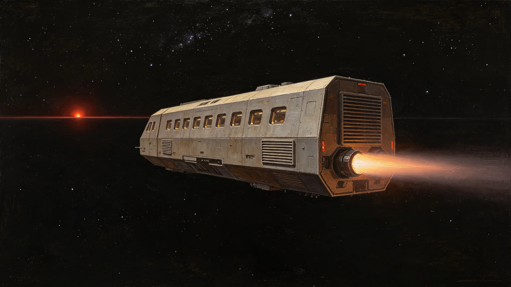

# 跨星系客运航班"星尘号"通信中断与手动进港事件复盘公报

**发布机构**：三恒星系文明联合体航行安全委员会 / 事故调查局
**发布日期**：3154年4月10日
**文件等级**：跨星系公开

## 一、事件概要

3154年3月12日，跨星系客运航班"星尘号"（注册号PAX-CS-0712）在从比邻星b新海市飞往鲸鱼座τ星深岩城的航段中，于距离比邻星b约2.3天文单位处遭遇通信中断事件。事件导致航班在无导航辅助的情况下手动进港，最终安全降落，无人员伤亡。

**事件等级**：二级（严重但无伤亡）
**涉事航班**：星尘号（PAX-CS-0712），第六代聚变推进客运飞船，额定载客420人
**事件时间线**：
- 3154年3月12日 08:42（飞船时间）：量子通信链路突然中断
- 3154年3月12日 08:45：中微子通信链路同步中断
- 3154年3月12日 08:47：船长宣布启动"通信丢失应急程序"
- 3154年3月12日 14:23：飞船完成手动进港，安全停靠鲸鱼座τ星深岩城港口

## 二、事件经过

**（一）事发前状态**

"星尘号"于3154年3月12日06:00从比邻星b新海市星际港起飞，载有乘客387人、机组人员18人，共405人。飞船按预定航线向鲸鱼座τ星方向巡航，航速0.12c，通信链路正常。

**（二）通信中断**

08:42，飞船量子通信收发组突然报"载波丢失"。驾驶舱值班通信官立即切换备用量子信道，30秒内未恢复。08:45，中微子通信链路亦报"信号衰减至零"。船长随即下令全船通信系统自检，自检结果显示：飞船通信硬件无故障，问题出在地面中继站侧。

08:47，船长正式宣布启动"通信丢失应急程序"（Emergency Comms Loss Protocol, ECLP）。该程序规定：
1. 飞船切换至自主导航模式，不再依赖地面导航信号；
2. 驾驶舱保留2名驾驶员，其余机组进入应急岗位；
3. 乘客舱广播系统向乘客通报情况，要求保持镇静；
4. 飞船以当前航向继续巡航，直至进入目标星系通信范围。

**（三）手动进港**

由于无法接收鲸鱼座τ星港口的进港指令和导航信号，飞船在到达鲸鱼座τ星轨道后，由船长与大副手动操控进港。进港过程持续约90分钟，飞船依次完成：
- 轨道捕获（利用目标星引力辅助减速）；
- 姿态调整（以恒星为参考基准校准航向）；
- 手动对接深岩城港口B-12泊位。

14:23，飞船安全停靠，港口地面人员确认船体无损伤，乘客开始有序下船。

## 三、原因调查

事故调查局于3月13日成立专项调查组，经两周调查，事件原因如下：

**直接原因**：比邻星b轨道通信中继站"天路-09"于3月12日08:38（地面时间）发生主电力系统跳闸。跳闸原因是该站太阳能阵列第三组逆变器老化短路。逆变器短路导致全站断电，量子通信与中微子通信同时中断。

**间接原因**：
1. "天路-09"站已超期服役4年，原计划3153年更换，但因预算审批延迟而推迟；
2. 该站备用发电机在主电跳闸后未能自动启动，原因是燃油管路堵塞（维护记录显示该管路上次清洗为3148年，已超期5年）；
3. 飞船通信系统虽然设计了自主导航备份，但备份导航系统的精度在长航程下会累积误差，手动进港仍存在较高风险。

**根本原因**：通信基础设施的预防性维护周期未随飞船巡航速度提升而同步调整。第六代聚变飞船巡航速度达到0.12c，通信中断后飞船可在更短时间内到达目标星系，留给地面抢修的时间窗口更短。

## 四、整改措施

调查局提出以下整改措施，均已被联合体航行安全委员会采纳：

1. **基础设施紧急检修**：3154年6月前，完成全部跨星系通信中继站的备用发电机与燃油管路检修，确保备用电源在30秒内自动启动；
2. **维护周期调整**：将通信中继站预防性维护周期从5年缩短至3年；
3. **飞船导航升级**：要求所有第六代及以上客运飞船加装"惯性导航+恒星参考"双备份系统，精度提升至可支持无地面导航信号下的手动进港；
4. **应急程序演练**：要求所有客运飞船每季度进行一次"通信丢失应急程序"模拟演练，演练记录纳入航行安全审计。

## 五、乘客安置与赔偿

315名乘客在事件发生后选择提前终止行程（在鲸鱼座τ星下船后不再继续原定航程），其余172名乘客继续行程。

联合体航运保险公司已按《跨星系航运客运赔偿标准》向每位乘客发放：
- 事件慰问金：每人2,000星元；
- 行程延误补偿：按实际延误时间，每小时50星元；
- 医疗检查：免费在鲸鱼座τ星深岩城医疗中心进行全身检查。

乘客代表已与航运公司达成和解，未提起集体诉讼。

## 六、事件教训

本次事件虽未造成人员伤亡，但暴露出跨星系通信基础设施的脆弱性。调查局在报告中指出：

> "我们已经习惯了跨星系通信的即时性，以至于忘记了它本质上仍然是一个需要维护的工程系统。在通信中断的7小时41分钟里，'星尘号'上的405人完全依靠船上的仪表和船员的经验完成了进港。这既是对船员训练的肯定，也是对我们基础设施维护松懈的警示。"

---

**归档编号**：INCIDENT-PAX-3154-0312
**编制**：联合体航行安全委员会事故调查局
**审核**：联合体安全标准委员会
**日期**：3154年4月10日
