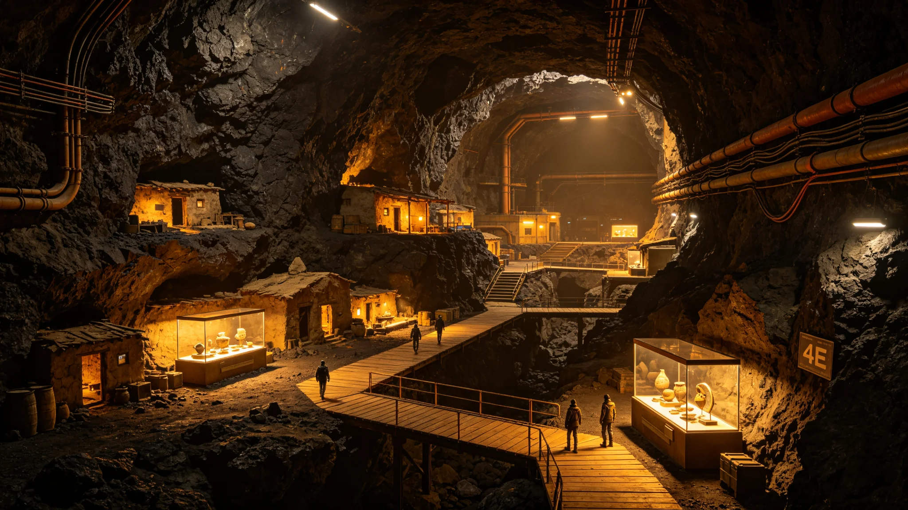

# 跨星系文化遗产保护公约签署与名录制度建立公报

**发布机构**：三恒星系文明联合体文化委员会 / 文化遗产保护局
**发布日期**：3159年10月12日
**文件等级**：跨星系公开

## 一、公约签署

3159年10月8日，三恒星系文明联合体各成员政府代表在比邻星b新海市签署《跨星系文化遗产保护公约》。该公约是继《三恒星系知识产权统一保护公约》（见GS-2988-01）之后，三恒星系在文化领域的又一基础性法律文件。

签署方包括：
- 比邻星b行星管理委员会
- 鲸鱼座τ星自治政府
- 太阳系联合开发署
- 第四恒星系观察代表团（以观察员身份签署）

## 二、公约主要内容

**（一）定义与分类**

公约首次对"跨星系文化遗产"作出统一定义：

> 跨星系文化遗产，指人类在地球以外的恒星系中创造的、具有历史、艺术、科学或人类学价值的物质与非物质遗存，包括但不限于：
> 1. 第一代定居点遗址与建筑；
> 2. 世代飞船ARK-01及其退役船体；
> 3. 跨星系航渡过程中产生的文书、器物、音乐、口述传统；
> 4. 各恒星系本土形成的文化传统与仪式。

**（二）保护等级**

公约建立三级名录制度：

| 等级 | 名称 | 保护要求 |
|---|---|---|
| 一级 | 跨星系世界遗产名录 | 全人类共同遗产，禁止任何商业开发与破坏性利用 |
| 二级 | 成员重点遗产名录 | 各成员政府自行管理，重大变更须报联合体备案 |
| 三级 | 地方登记遗产 | 地方政府管理，鼓励社会参与保护 |

**（三）首批名录收录**

首批"跨星系世界遗产名录"共收录23处遗产：

1. ARK-01退役船体（太阳系外缘轨道）
2. 比邻星b第一处大气改造试验场遗址
3. 鲸鱼座τ星深岩城第一期地下居住区
4. 火星奥林匹斯山地下城市入口
5. 比邻星b"第一口自由呼吸"纪念碑
6. ARK-01出港纪念档案馆
7. 比邻星b第一座轨道电梯基座
8. 鲸鱼座τ星第一处恒星耀斑观测站
9. 太阳系外缘"玄冥-01"远征母港遗址
10. （其余13处见附录）

## 三、保护机制

**（一）资金保障**

联合体设立"跨星系文化遗产保护基金"，首期注资500亿星元，来源为各成员按GDP比例缴纳。基金主要用于：
- 一级遗产的日常维护与监测；
- 濒危遗产的紧急抢救；
- 遗产数字化存档（衔接GS-3190-01项目）；
- 遗产保护人才培养。

**（二）法律责任**

公约规定：
- 对一级遗产造成不可逆损害的，处100万星元以上罚款，并追究刑事责任；
- 非法迁移、盗掘文化遗产的，处50万星元以上罚款；
- 各成员政府有义务将公约内容纳入本国法律体系。

**（三）国际合作**

公约鼓励各成员在遗产保护领域开展技术合作与人员交流。鲸鱼座τ星已向联合体提出申请，希望获得ARK-01船体保护的技术援助。

## 四、公众参与

公约设立"跨星系文化遗产志愿者"制度，鼓励公民参与遗产保护工作。首批志愿者招募计划于3160年启动，预计招募5,000人。

## 五、意义

文化遗产保护局在公报中指出：

> "我们已经在三个恒星系生活了超过250年。250年听起来很长，但相对于宇宙的尺度，这只是一瞬间。
>
> 这些遗产——ARK-01的船体、第一批定居点的墙壁、第一口自由呼吸的纪念碑——是我们与地球、与祖先、与那个出发的夜晚之间唯一的物质联系。如果我们不保护它们，未来的人类将不知道自己是谁。
>
> 公约不是一纸文书，而是一个承诺：我们不会忘记。"

---

**归档编号**：CULT-HERITAGE-3159-001
**编制**：联合体文化委员会文化遗产保护局
**审核**：联合体议会法律事务委员会
**日期**：3159年10月12日
