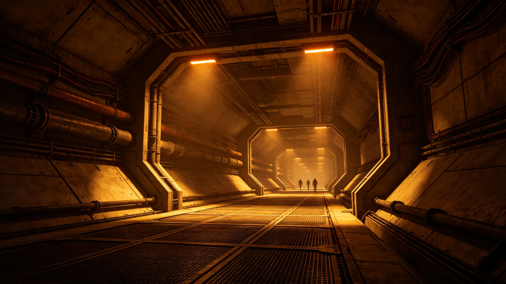

# 鲸鱼座τ星地下城市局部停电与应急供电演练事件公报

**发布机构**：鲸鱼座τ星自治政府 / 深岩城市政管理局
**发布日期**：3161年7月22日
**文件等级**：行星级公开

## 一、事件经过

3161年7月15日22:14（深岩城标准时间），鲸鱼座τ星地下城市"深岩城"第三区（居住区B-12至B-18板块，覆盖人口约12万人）发生局部停电事件。停电持续时间为22:14至23:47，共1小时33分钟。

事件期间，该区域生命维持系统中的空调与新风系统一度中断，应急照明系统在停电后4秒内自动启动。

## 二、原因调查

经深岩城市政管理局电力工程处调查，事件原因如下：

**直接原因**：第三区主供电电缆（编号PWR-3B-04）在22:14发生绝缘层击穿。击穿点位于B-15板块第3层天花板内，为电缆老化导致的短路。

**间接原因**：
1. 该电缆安装于3085年，已服役76年，超过设计寿命（60年）16年；
2. 例行巡检记录显示，该电缆在3158年巡检中已有绝缘电阻下降记录，但因排期原因未及时更换；
3. 停电后，应急供电系统在理论上应在2秒内启动，但实际启动延迟了4秒，原因是应急电池组的自动切换继电器接触不良。

**无人员伤亡**：事件期间无人员伤亡报告。停电区域居民12万人中，约200人在黑暗中发生轻微磕碰，均在深岩城社区医疗点处理。

## 三、应急处置

停电发生后，市政管理局启动以下应急程序：

1. 22:15：应急照明系统启动，楼道、电梯、公共区域恢复照明；
2. 22:18：生命维持系统应急新风启动，维持最低通风标准；
3. 22:25：维修工程队抵达击穿点，开始现场排查；
4. 22:40：确认故障范围，通知居民"请保持冷静，不要使用电梯"；
5. 23:10：备用供电线路接通，恢复B-12至B-15板块供电；
6. 23:47：全部区域供电恢复。

## 四、整改措施

市政管理局于7月18日发布整改通知：

1. **紧急更换**：3161年9月底前，完成深岩城全部超期服役电缆的更换，重点更换B-15板块及同批次电缆；
2. **巡检升级**：将地下城市电力系统巡检周期从5年缩短至3年；
3. **应急系统测试**：3161年8月前完成全部应急供电系统的切换测试，确保切换时间不超过2秒；
4. **居民告知**：在每个居住单元张贴《停电应急指南》，告知居民停电时的正确应对步骤。

## 五、公众反应

根据深岩城市民服务中心3161年7月20日统计，事件期间共收到市民咨询电话456个，主要集中在"何时恢复供电""能否使用电梯""是否影响呼吸"三个问题。

市民满意度调查显示，对本次应急处置的满意度为78%，主要不满点为"应急广播启动太晚"（停电后12分钟才开始广播）。

---

**归档编号**：INCIDENT-PWR-3161-0715
**编制**：鲸鱼座τ星深岩城市政管理局
**审核**：鲸鱼座τ星自治政府公共安全委员会
**日期**：3161年7月22日
