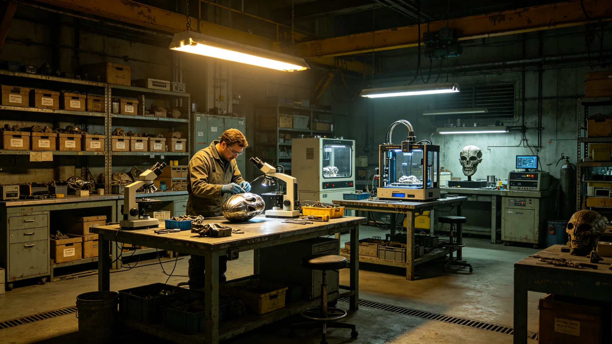

# 比邻星b文物修复与文化遗产产业规模化公报

**发布机构**：比邻星b行星经济发展局 / 文化产业办公室
**发布日期**：3162年4月18日
**文件等级**：行星级公开

## 一、产业背景

自3159年《跨星系文化遗产保护公约》签署以来（见GS-3159-01），三恒星系文化遗产保护需求激增。比邻星b凭借其在文物修复领域的技术积累和人才优势，已成为三恒星系最大的文物修复与文化遗产产业中心。

据行星经济发展局统计，3161年度比邻星b文物修复产业营收达870亿星元，占全球文化产业总营收的12.3%，从业人员约4.2万人。

## 二、产业现状

**（一）修复业务结构**

| 业务类型 | 营收（亿星元） | 占比 |
|---|---|---|
| 纸质文书修复 | 280 | 32.2% |
| 金属器物修复 | 195 | 22.4% |
| 建筑结构修复 | 180 | 20.7% |
| 纺织品与有机物修复 | 120 | 13.8% |
| 数字化存档 | 95 | 10.9% |
| **合计** | **870** | **100%** |

**（二）服务对象**

- 比邻星b本地遗产：45%
- 鲸鱼座τ星委托：28%
- 太阳系委托：18%
- 第四恒星系（观察）：9%

## 三、产业升级规划

为进一步扩大产业规模，行星经济发展局制定《文物修复与文化遗产产业升级规划（3162-3170）》：

1. **技术升级**：引入纳米级材料分析与三维打印修复技术，将修复精度从微米级提升至纳米级；
2. **人才培养**：在比邻星b大学设立"文化遗产修复技术"本科专业，每年招生200人；
3. **产业集聚**：在新海市郊区建设"文化遗产产业园"，集中修复实验室、材料仓库、展示中心；
4. **标准输出**：制定《跨星系文物修复技术标准》，向三恒星系推广。

## 四、预期目标

到3170年，预计：
- 产业总营收达到1,800亿星元；
- 从业人员达到8万人；
- 修复技术标准输出至三恒星系全部主要遗产地。

---

**归档编号**：ECON-RESTORE-3162-001
**编制**：比邻星b行星经济发展局文化产业办公室
**日期**：3162年4月18日
