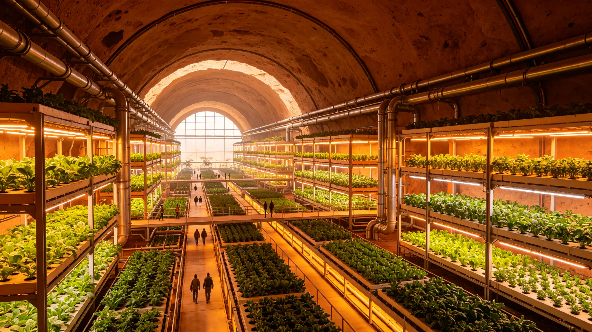

# 火星地下城市第二代生态闭环稳定性百年监测报告

**发布机构**：火星地下城市生态管理局 / 闭环监测中心
**发布日期**：3163年6月30日
**文件等级**：行星级公开

## 一、监测背景

火星地下城市自2933年完成第一期顶板加固（见GS-2933-01）以来，已历经约230年。第二代生态闭环系统于3063年建成投运，至今已运行100年。

本报告为第二代生态闭环系统运行100周年的全面评估。

## 二、系统运行参数

| 参数 | 设计值 | 3163年实测值 | 偏差 |
|---|---|---|---|
| 氧气循环效率 | ≥95% | 96.2% | +1.2% |
| 水循环利用率 | ≥98% | 98.7% | +0.7% |
| 食物自给率 | ≥85% | 89.3% | +4.3% |
| 温度波动范围 | ±1.5℃ | ±1.2℃ | 优于设计 |
| 湿度波动范围 | ±5% | ±4.1% | 优于设计 |
| 二氧化碳浓度 | 0.04-0.08% | 0.052% | 正常 |

## 三、生态系统演替

**（一）植物群落**

经100年运行，地下城市农业区植物群落已从单一作物种植演替为多层次复合种植系统：
- 上层：果树（苹果、梨、柑橘）
- 中层：蔬菜（番茄、黄瓜、叶菜）
- 下层：食用菌与药用植物
- 底层：微藻光生物反应器

**（二）动物群落**

| 类群 | 引入数量 | 现存数量 | 状态 |
|---|---|---|---|
| 家蚕 | 5,000 | 12,000 | 稳定繁殖 |
| 蜜蜂 | 20,000 | 45,000 | 稳定繁殖 |
| 蚯蚓 | 100万 | 320万 | 土壤改良 |
| 观赏鱼 | 5,000 | 8,200 | 稳定 |

## 四、问题与维护

1. **微藻反应器老化**：3063年安装的光生物反应器已运行100年，部分管道出现结垢，预计3165年前完成更换；
2. **土壤微生物多样性下降**：长期单一作物种植导致土壤微生物多样性从初始的1,200种降至870种，已通过引入轮作制度改善；
3. **昆虫授粉效率波动**：蜜蜂种群在3150年代出现一次衰退（疑似微孢子虫感染），经引入抗性蜂种后恢复。

## 五、结论

第二代生态闭环系统运行100年来，整体稳定性优于设计预期。氧气、水、食物三大循环指标均在设计范围内，部分指标优于设计值。系统已具备长期自主运行能力。

## 续录一：监测方法与样本量

本报告数据来自长期监测网络。监测点布设原则如下：

- 固定监测点：按区域均匀布设，覆盖主要生境类型；
- 采样频次：常规指标每月一次，敏感指标每周一次；
- 样本量：每个监测点每次取平行样本3份，取平均值；
- 数据校验：监测数据每年由独立第三方实验室抽核10%样本。

本报告所述趋势与结论基于上述监测数据。报告中未列出的异常数据已在原始记录中标注，不纳入结论。后续监测计划已列入下一年度工作安排，监测点位与频次不变。本报告为公开技术文件，公众可查询各监测点年度数据摘要。下一报告按既定周期发布，不提前。

## 续录二：归档与查阅说明

本文书形成后按归档规则存入联合体档案系统。归档编号已在文末注明。档案查阅依《联合体历史档案开放条例》办理：自形成之日起满150年者，除涉及在世个人隐私外，向公民开放。查阅申请须提交身份证明与查阅目的说明，档案管理部门在5个工作日内答复。

本文书与其他档案的交叉引用关系以正文中所列GS编号为准。引用其他档案时不重复其内容，只注明编号。本文书的修订历史附于档案卷末，历次修订版本均予保留，不删除原件。本卷为最终归档版本，未经档案管理部门同意不得修改。档案数字化副本与纸质原件具有同等效力。

---

**归档编号**：ECO-MARS-3163-001
**编制**：火星地下城市生态管理局闭环监测中心
**日期**：3163年6月30日

## 六、监测方法与样本量

本报告数据来自火星地下城市生态管理局闭环监测中心100年连续记录。监测点遍布地下城市各农业区、水循环区、空气循环区，共240个固定监测点，每小时采样一次。100年累计采样数据约21亿条，经中心计算机系统逐年汇总。

土壤微生物多样性数据每5年取样一次，每次取表层0-20cm土壤样品36个测点。蜜蜂种群数据由农业区养蜂班逐季记录。

## 七、后续维护安排

第二代生态闭环系统运行100年来整体稳定，但以下三项须后续维护：

1. 微藻光生物反应器部分管道结垢，预计3165年前完成更换；
2. 土壤微生物多样性下降已通过轮作制度改善，预计3170年恢复至初始水平；
3. 蜜蜂种群经引入抗性蜂种后已恢复，继续监测。

下一十年监测报告定于3173年发布。本报告为行星级公开，公众可查询各监测点年度数据摘要。

## 续录一：监测方法与样本量

本报告数据来自长期监测网络。监测点布设原则如下：

## 续录二：归档与查阅说明