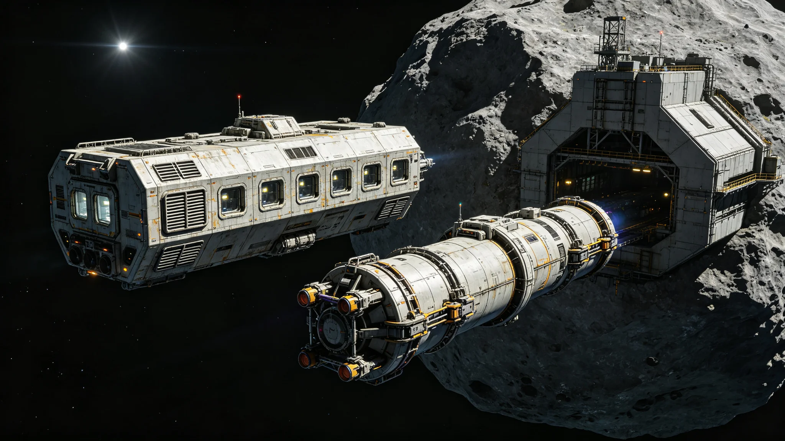

# 三恒星系联合体安全部队联合巡逻机制百年评估公报

**发布机构**：三恒星系文明联合体安全协调委员会
**发布日期**：3164年9月10日
**文件等级**：跨星系公开

## 一、评估背景

三恒星系联合体安全部队联合巡逻机制自3064年建立以来（前身为2979年建立的深空航道巡逻机制，见GS-2979-01），已运行100年。本报告为百年运行的全面评估。

## 二、百年运行数据

| 指标 | 百年累计 |
|---|---|
| 巡逻航次 | 12,847次 |
| 总航程 | 约8.7光年 |
| 登记船舶检查 | 456,200艘次 |
| 海盗/非法活动干预 | 127次 |
| 救援任务 | 342次 |
| 人员伤亡（巡逻方） | 17人 |

## 三、成效评估

**（一）航道安全**

联合巡逻机制建立以来，跨星系航道上的海盗活动发生率从2979年的0.32%降至3163年的0.008%。主要航道（比邻星b-鲸鱼座τ星、比邻星b-太阳系）已实现全时段巡逻覆盖。

**（二）救援响应**

342次救援任务中，共救援遇险船员与乘客约2,800人。平均响应时间从机制初期的72小时缩短至当前的8小时。

**（三）成本效益**

百年累计巡逻成本约1.2万亿星元，而避免的航运损失与救援成本估算约4.8万亿星元，投入产出比约1:4。

## 四、存在问题

1. **第四恒星系方向覆盖不足**：随着第四恒星系勘探活动增加，现有巡逻范围尚未覆盖该方向；
2. **通信延迟影响指挥**：跨星系通信延迟4-12年，紧急情况下巡逻艇需自主决策；
3. **人员轮换困难**：长期深空巡逻对乘员身心压力大，人员流失率约8%。

## 五、未来规划

1. 3170年前将巡逻范围扩展至第四恒星系方向；
2. 升级巡逻艇自主决策AI系统，减少对地面指挥的依赖；
3. 改善巡逻艇生活条件，将单次巡逻时长从90天缩短至60天。

---

**归档编号**：SEC-PATROL-3164-001
**编制**：联合体安全协调委员会
**日期**：3164年9月10日
