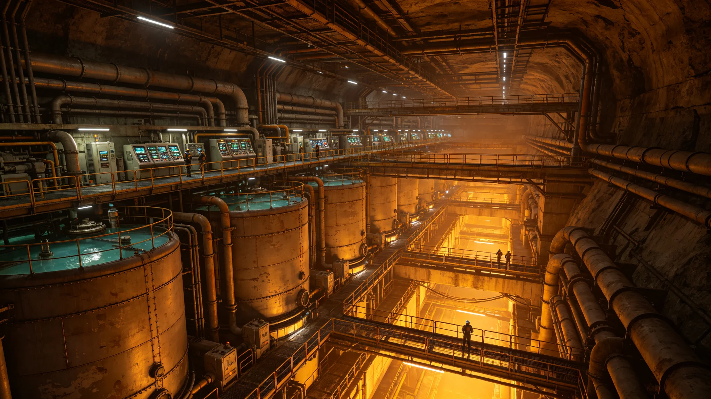

# 鲸鱼座τ星地下城市第二代生命保障系统换型工程公报

**发布机构**：鲸鱼座τ星自治政府 / 深岩城市政工程局
**发布日期**：3167年5月14日
**文件等级**：行星级公开

## 一、工程背景

深岩城第一代生命保障系统（见GS-2917-01）自2917年投运以来，已运行250年。第二代系统于3067年建成，至今已运行100年。经3166年度系统评估，第二代系统部分核心组件已达设计寿命，需进行整体换型。

## 二、换型内容

| 系统 | 现有（第二代） | 换型后（第三代） |
|---|---|---|
| 氧气再生 | 分子筛+电解水 | 膜分离+电解水 |
| 水循环 | 三级过滤 | 五级超滤+反渗透 |
| 温控 | 中央集中供冷 | 分布式热泵 |
| 空气净化 | 活性炭 | 光催化+生物滤池 |
| 监控 | 本地SCADA | 分布式物联网 |

## 三、施工计划

工程分三期进行，不停运作业：
- 一期：3167-3169年，更换氧气与水循环系统；
- 二期：3169-3171年，更换温控与空气净化系统；
- 三期：3171-3173年，更换监控系统与联调。

总预算：380亿星元。

## 四、安全保障

施工期间，现有系统维持运行。每一期施工前进行72小时系统切换演练，确保不发生类似3161年停电事件（见GS-3161-01）。

---

**归档编号**：ENG-ECLSS-3167-003
**编制**：鲸鱼座τ星深岩城市政工程局
**日期**：3167年5月14日
