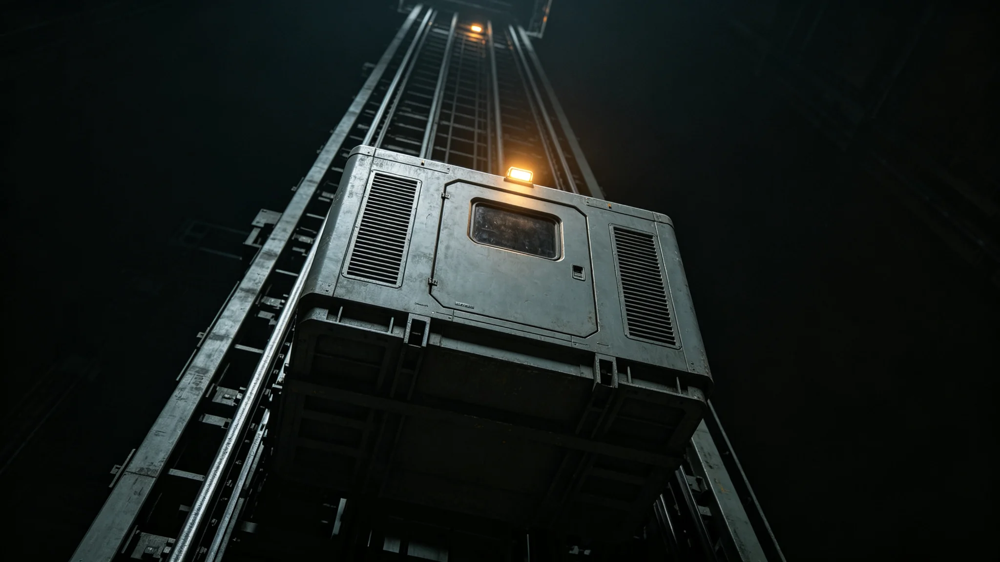

# 比邻星b轨道电梯货运舱轻微脱轨事件与检修报告

**发布机构**：比邻星b行星基础设施管理局 / 轨道电梯运营中心
**发布日期**：3168年8月22日
**文件等级**：行星级公开

## 一、事件经过

3168年8月18日14:32（新海市时间），"天索-02"轨道电梯第47号货运舱（载重12吨，装载工业零部件）在从地表向同步轨道上升过程中，于距地表约36,000公里处发生轻微脱轨。货运舱主轮缘偏离导轨约15毫米，未发生坠落。

驾驶舱操作员立即启动紧急制动，货运舱在偏离后23秒内完全停稳。

## 二、原因分析

经检修工程队现场排查：

1. **直接原因**：第47号货运舱导向轮轴承磨损超标，导致轮缘与导轨间隙增大；
2. **间接原因**：该导向轮上次更换为3162年，已使用6年，超过5年更换周期。

## 三、处置

- 8月18日16:00：维修工程艇抵达，更换导向轮；
- 8月18日18:30：测试通过，货运舱恢复运行；
- 8月19日：全部47个货运舱导向轮逐一检查，发现另有3个磨损超标，已同步更换。

## 四、整改

1. 导向轮更换周期从5年缩短至4年；
2. 货运舱每航次增加导向轮状态自检；
3. 3168年底前完成全部货运舱导向轮升级为耐磨型。

无人员伤亡。无货物损失。

---

**归档编号**：INCIDENT-ELEV-3168-0818
**编制**：比邻星b轨道电梯运营中心
**日期**：3168年8月22日
