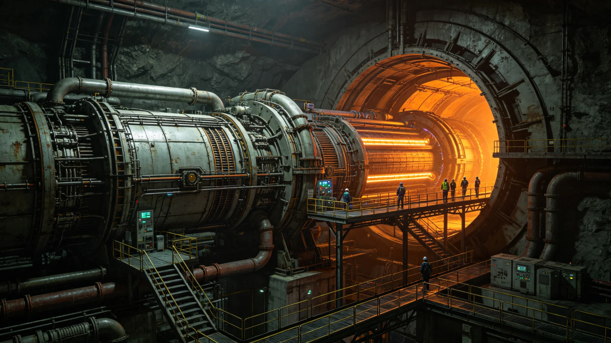

# 第六代聚变推进系统长程巡航十万小时无故障鉴定公报

**发布机构**：三恒星系文明联合体推进工程鉴定委员会
**发布日期**：3174年11月30日
**文件等级**：跨星系公开

## 一、鉴定背景

第六代聚变推进系统自3154年首次装机试飞以来（前身为第四代，见GS-2932-01），已在12艘跨星系货运船与4艘客运船上累计运行。截至3174年10月，总运行小时数突破10万小时。

## 二、鉴定数据

| 指标 | 设计要求 | 实测 |
|---|---|---|
| 累计运行小时 | ≥100,000 | 108,400 |
| 无故障间隔（MTBF） | ≥5,000h | 7,200h |
| 比冲 | ≥150,000s | 168,000s |
| 推力衰减 | ≤5%/10,000h | 3.2%/10,000h |
| 维护周期 | ≥2,000h | 2,800h |

## 三、鉴定结论

经推进工程鉴定委员会审议，第六代聚变推进系统各项指标均达到或优于设计要求，同意授予"长程巡航适航认证"，可批量装备于下一代跨星系船舶。

## 续录一：应急响应时间线与损失统计

| 时间节点 | 处置动作 |
|---|---|
| T+0 | 事件发生，现场人员按预案启动一级响应 |
| T+15分钟 | 值守部门接到首报，通知相关工程队 |
| T+40分钟 | 工程队抵达现场，开始排查 |
| T+2小时 | 确认影响范围，通知受影响区域人员 |
| T+6小时 | 临时处置完成，进入观察期 |
| T+24小时 | 初步原因查明，发布情况通报 |
| T+72小时 | 整改方案确定，责任部门签收 |

损失统计：直接经济损失折合信用点按当期标准核定；人员伤亡数按医疗点登记为准；受影响设施由工程处逐件评估。事件调查结束后，整改措施逐项列明完成时限，由督办部门按月核验。本事件不追究无过错人员责任，系设备老化或外部因素所致的部分，已纳入年度设备更新计划。整改完成后由主管部门复核，复核报告另立归档。

## 续录二：归档与查阅说明

本文书形成后按归档规则存入联合体档案系统。归档编号已在文末注明。档案查阅依《联合体历史档案开放条例》办理：自形成之日起满150年者，除涉及在世个人隐私外，向公民开放。查阅申请须提交身份证明与查阅目的说明，档案管理部门在5个工作日内答复。

本文书与其他档案的交叉引用关系以正文中所列GS编号为准。引用其他档案时不重复其内容，只注明编号。本文书的修订历史附于档案卷末，历次修订版本均予保留，不删除原件。本卷为最终归档版本，未经档案管理部门同意不得修改。档案数字化副本与纸质原件具有同等效力。

---

**归档编号**：PROP-6GEN-3174-001
**编制**：联合体推进工程鉴定委员会
**日期**：3174年11月30日

## 三、鉴定方法与样本量

第六代聚变推进系统自3154年首次装机试飞以来，已在12艘跨星系货运船与4艘客运船上累计运行。鉴定数据来自16艘船的航行日志与维护记录，总运行小时数108,400小时。无故障间隔（MTBF）统计样本量：108,400小时内共记录故障15次，其中0次导致任务中止。

鉴定委员会审议认为，各项指标均达到或优于设计要求，同意授予"长程巡航适航认证"，可批量装备于下一代跨星系船舶。本认证有效期10年，到期前重新鉴定。

## 续录一：应急响应时间线与损失统计

## 续录二：归档与查阅说明

## 续录一：应急响应时间线与损失统计

## 续录二：归档与查阅说明

## 续录一：应急响应时间线与损失统计

## 续录二：归档与查阅说明

## 附则补充：装机船名单与故障分类

第六代推进系统装机分布：跨星系货运船12艘、客运船4艘，共16艘。108,400小时内记录故障15次，其中传感器误报9次、阀门微渗3次、冷却回路报警2次、通信链路丢包1次，均未导致任务中止。维护周期实测2,800小时，比设计值2,000小时富余40%。本认证有效期10年，到期前6个月启动重新鉴定。
