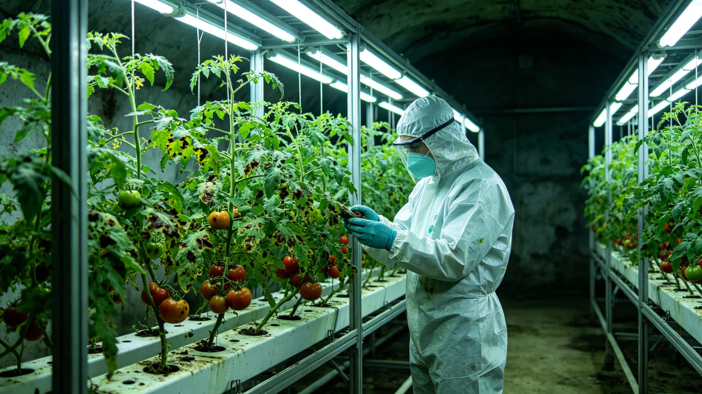

# 火星地下温室真菌感染与跨星系农业检疫通报

**发布机构**：三恒星系文明联合体农业检疫局
**发布日期**：3183年5月10日
**文件等级**：跨星系公开

## 一、事件

3183年4月，火星地下温室第三区B-7种植舱发现一种新型真菌感染，导致番茄作物减产约15%。经鉴定，该真菌为地球新型变种，疑似通过跨星系货运物资意外传入。

## 二、处置

1. B-7种植舱立即隔离，停止作物外运；
2. 全部感染作物销毁，种植舱消毒；
3. 对火星全部地下温室进行真菌筛查；
4. 跨星系农业检疫局提升货运物资检疫标准。

## 三、检疫新规

自3183年6月起，所有跨星系农业物资运输须经过三层检疫：
1. 启运前检疫；
2. 航行中微生物监测；
3. 到达后隔离观察72小时。

无人员健康风险。

---

**归档编号**：AGRI-QUAR-3183-001
**编制**：联合体农业检疫局
**日期**：3183年5月10日
