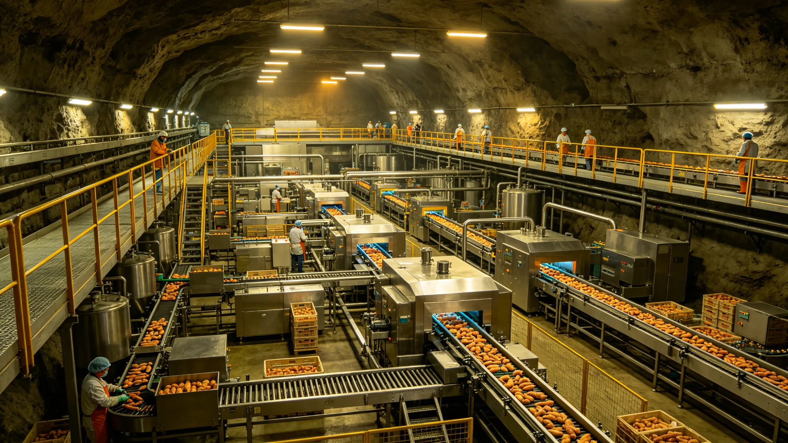

# 鲸鱼座τ星深地农业与地下食品工业升级公报

**发布机构**：鲸鱼座τ星自治政府 / 产业发展局
**发布日期**：3185年9月30日
**文件等级**：行星级公开

## 一、升级背景

鲸鱼座τ星地下城市农业自2914年建立以来（见GS-2914-01），已运行约270年。现有深地农业产能已无法满足不断增长的人口需求。

## 二、升级内容

1. **新增种植层**：在深岩城下方新增3层地下种植空间，种植面积扩大40%；
2. **自动化升级**：引入第七代农业机器人，实现播种、灌溉、采收全自动化；
3. **新品种引入**：经跨星系农业检疫（见GS-3183-01），引入5种高产作物；
4. **食品加工**：新建地下食品加工厂，实现从原料到成品的本地化加工。

## 三、预期效果

| 指标 | 升级前 | 升级后（3190年） |
|---|---|---|
| 食物自给率 | 78% | 95% |
| 农业就业人口 | 12万 | 8万 |
| 食品出口 | 无 | 年出口5万吨 |

## 续录一：施工进度与质量监督

本工程实行分阶段验收制度。各阶段进度安排如下：

| 阶段 | 时间区间 | 主要工作 | 验收标准 |
|---|---|---|---|
| 第一阶段 | 启动后第1至2年 | 基础工程与设备采购 | 材料合格证明齐全 |
| 第二阶段 | 启动后第2至3年 | 主体安装与管线铺设 | 压力测试与密封测试合格 |
| 第三阶段 | 启动后第3至4年 | 系统联调与试运行 | 试运行30日无重大异常 |
| 第四阶段 | 启动后第4至5年 | 竣工验收与交付 | 全部指标达标 |

施工期间安全记录由工程安全科逐周报送。施工人员轮换周期按岗位风险等级设定，高风险岗位连续作业不超过14日。工程预算每季度公示，超支5%以上须报上级主管部门审批。本工程与相关既有工程的接口由工程处统一协调，不得擅自更改既有系统参数。施工期间现有系统维持运行，不停业、不疏散。

## 续录二：归档与查阅说明

本文书形成后按归档规则存入联合体档案系统。归档编号已在文末注明。档案查阅依《联合体历史档案开放条例》办理：自形成之日起满150年者，除涉及在世个人隐私外，向公民开放。查阅申请须提交身份证明与查阅目的说明，档案管理部门在5个工作日内答复。

本文书与其他档案的交叉引用关系以正文中所列GS编号为准。引用其他档案时不重复其内容，只注明编号。本文书的修订历史附于档案卷末，历次修订版本均予保留，不删除原件。本卷为最终归档版本，未经档案管理部门同意不得修改。档案数字化副本与纸质原件具有同等效力。

---

**归档编号**：ECON-AGRI-3185-001
**编制**：鲸鱼座τ星自治政府产业发展局
**日期**：3185年9月30日

## 四、升级监督与检疫衔接

升级工程分三期：新增种植层3185-3188年，自动化升级3186-3189年，食品加工厂3187-3190年。总预算经自治议会审议。引入5种高产作物须经跨星系农业检疫（GS-3183-01）三层检疫，检疫合格方可种植。

升级后食物自给率目标95%，农业就业人口由12万降至8万，食品年出口5万吨。本升级不宣告"深地农业已完美"，只确认产能扩展目标。每年由产业发展局作进度评估，3190年作终期评估。

## 续录一：施工进度与质量监督

本工程实行分阶段验收制度。各阶段进度安排如下：

## 续录二：归档与查阅说明

## 续录一：施工进度与质量监督

本工程实行分阶段验收制度。各阶段进度安排如下：

## 续录二：归档与查阅说明

## 续录一：施工进度与质量监督

本工程实行分阶段验收制度。各阶段进度安排如下：

## 续录二：归档与查阅说明

## 附则补充：三期预算分解与检疫衔接

新增种植层预算约90亿星元（3185—3188年），自动化升级约55亿星元（3186—3189年），食品加工厂约35亿星元（3187—3190年），合计180亿星元。引入5种高产作物须经三层检疫（衔接GS-3183-01），检疫未通过品种不补种。农业就业由12万降至8万一项，由产业发展局会同转岗中心作人员安置，不强制解雇。
