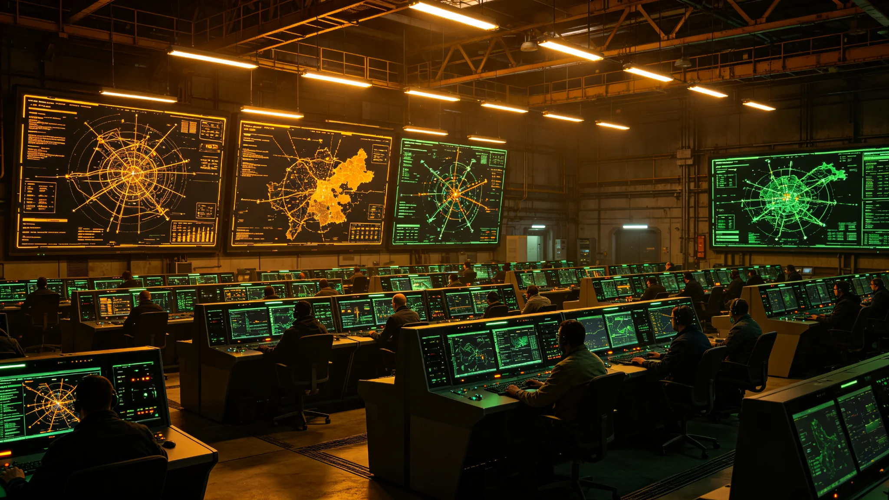

# 三恒星系联合网络安全防御体系百年升级与演练公报

**发布机构**：三恒星系文明联合体安全协调委员会
**发布日期**：3187年8月30日
**文件等级**：跨星系公开

## 一、升级背景

比邻星b网络安全体系升级（见GS-2944-01）至今已约243年。跨星系网络威胁形态已发生根本变化。联合体决定对三恒星系联合网络安全防御体系进行百年最大规模升级。

## 二、升级内容

1. **量子加密升级**：全部跨星系通信链路升级至后量子加密标准；
2. **AI威胁检测**：部署第七代AI网络威胁检测系统，误报率降至0.1%；
3. **应急响应**：跨星系网络应急响应时间从4小时缩短至30分钟；
4. **人员培训**：三恒星系网络安全人员统一培训认证。

## 三、联合演练

3187年8月15日至20日，三恒星系联合网络安全演练"坚盾-07"举行：
- 模拟跨星系通信网络遭受协同攻击；
- 三恒星系安全团队联合处置；
- 演练结果：攻击在25分钟内被识别并阻断，无关键业务中断。

---

**归档编号**：SEC-CYBER-3187-001
**编制**：联合体安全协调委员会
**日期**：3187年8月30日
