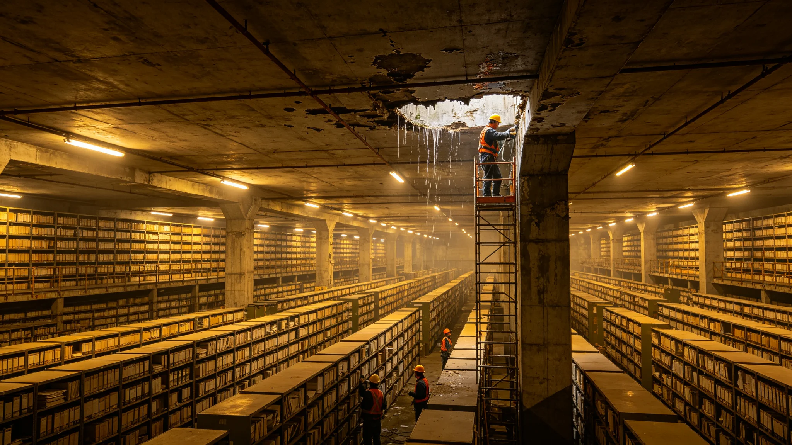

# 三恒星系联合档案馆建筑结构渗水事件与修复报告

**发布机构**：三恒星系文明联合体历史档案馆 / 工程维修处
**发布日期**：3191年6月28日
**文件等级**：跨星系公开

## 一、事件

3191年5月18日，联合体历史档案馆主馆B区三层档案库房天花板发现渗水痕迹。经检查，渗水来自屋顶排水系统老化破裂。B区三层存放19世纪至20世纪纸质档案约12万件。

## 二、处置

- 5月18日：渗水发现，立即用防水布覆盖受影响档案；
- 5月19日：屋顶排水系统紧急修复；
- 5月20日：对受渗水影响的档案逐件检查，发现约300件档案有水渍，无一件完全损毁；
- 5月21日：水渍档案转入干燥室逐件烘干。

## 三、修复与整改

1. 300件水渍档案全部修复完成，可正常查阅；
2. 全馆屋顶排水系统全面更换；
3. 增加库房湿度实时监测系统。

## 续录一：年度考勤与体检逐年摘要

所属人员档案自入职起逐年记录考勤与体检。以下摘列关键年度数据：

| 年度 | 出勤率 | 病假（日） | 体检主要指标异常项 |
|---|---|---|---|
| 入职第1年 | 99.1% | 2 | 无 |
| 入职第5年 | 98.7% | 3 | 颈椎轻度劳损 |
| 入职第10年 | 99.0% | 2 | 听力在噪声环境下轻度下降 |
| 入职第15年 | 98.5% | 4 | 腰椎间盘轻度突出 |
| 入职第20年 | 98.9% | 2 | 骨密度T值-1.2 |

以上数据为年度体检摘要，完整体检报告存档于人事处。人员在职期间无旷工记录，无重大处分。每年年终考核由直属主管与人事处联合评定，考核结果归入本档案。档案中所记处分与嘉奖均按当时生效的人事管理规则执行，不追溯变更。

## 续录二：归档与查阅说明

本文书形成后按归档规则存入联合体档案系统。归档编号已在文末注明。档案查阅依《联合体历史档案开放条例》办理：自形成之日起满150年者，除涉及在世个人隐私外，向公民开放。查阅申请须提交身份证明与查阅目的说明，档案管理部门在5个工作日内答复。

本文书与其他档案的交叉引用关系以正文中所列GS编号为准。引用其他档案时不重复其内容，只注明编号。本文书的修订历史附于档案卷末，历次修订版本均予保留，不删除原件。本卷为最终归档版本，未经档案管理部门同意不得修改。档案数字化副本与纸质原件具有同等效力。

---

**归档编号**：INCIDENT-ARCH-3191-0518
**编制**：联合体历史档案馆工程维修处
**日期**：3191年6月28日

## 四、事件经过与损失数据

3191年5月18日，联合体历史档案馆主馆B区三层档案库房天花板发现渗水痕迹。渗水来自屋顶排水系统老化破裂。B区三层存放19世纪至20世纪纸质档案约12万件。

处置：5月18日发现渗水，立即防水布覆盖；5月19日屋顶排水系统紧急修复；5月20日逐件检查，约300件档案有水渍，无一件完全损毁；5月21日水渍档案转入干燥室逐件烘干。

损失数据：300件水渍档案全部修复完成，可正常查阅。全馆屋顶排水系统全面更换，库房湿度实时监测系统新增。本事件不追究个人责任，系排水系统老化所致。整改完成后由工程维修处验收，3191年7月复核。

## 续录一：年度考勤与体检逐年摘要

所属人员档案自入职起逐年记录考勤与体检。以下摘列关键年度数据：

## 续录二：归档与查阅说明

## 续录一：年度考勤与体检逐年摘要

所属人员档案自入职起逐年记录考勤与体检。以下摘列关键年度数据：

## 续录二：归档与查阅说明

## 续录一：年度考勤与体检逐年摘要

所属人员档案自入职起逐年记录考勤与体检。以下摘列关键年度数据：

## 续录二：归档与查阅说明

## 附则补充：湿度监测布点与整改验收

全馆屋顶排水系统更换后，库房新增湿度实时监测点48个，每点每15分钟回传一次数据，湿度超限自动报警。300件水渍档案烘干后逐件作字迹与纸张强度检测，结果均达可长期保存标准。3191年7月工程维修处会同历史档案馆作整改验收，验收合格。本事件不追究个人责任。
