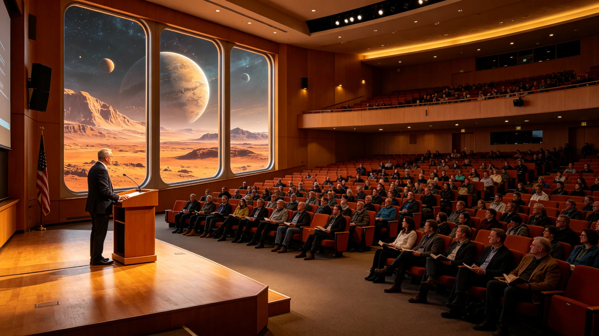

# 三恒星系"原乡文献"公开朗读大会与跨星系文化融合公报

**发布机构**：三恒星系文明联合体文化委员会
**发布日期**：3192年10月10日
**文件等级**：跨星系公开

## 一、大会举办

3192年10月1日至7日，三恒星系"原乡文献"公开朗读大会在比邻星b新海市举行。大会邀请来自三恒星系的朗读者，朗读各自家族保存的第一代移民家书、日记、航行日志等原乡文献。

## 二、大会内容

| 日期 | 主题 | 朗读文献 |
|---|---|---|
| 10月1日 | ARK-01航行日志 | 出港日志、航行日记 |
| 10月2日 | 比邻星b家书 | 第一代移民家信 |
| 10月3日 | 鲸鱼座τ星日记 | 地下城市拓荒日记 |
| 10月4日 | 火星书信 | 火星地下城市家书 |
| 10月5日 | 跨星系婚姻 | 跨星系家庭通信 |
| 10月6日 | 青年朗读 | 年轻一代朗读祖辈文献 |
| 10月7日 | 闭幕合诵 | 全体合诵《出港宣言》 |

## 三、影响

大会通过量子通信向三恒星系直播，累计观看约12亿人次。文化委员会决定将该大会制度化，每五年举办一次。

---

**归档编号**：CULT-READING-3192-001
**编制**：联合体文化委员会
**日期**：3192年10月10日
