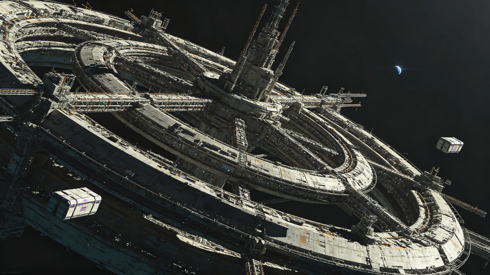

# 三恒星系第二代基础设施投资决算与下一轮规划公报

**发布机构**：三恒星系文明联合体发展银行 / 投资委员会
**发布日期**：3193年12月30日
**文件等级**：跨星系公开

## 一、第二轮投资决算（3174-3193）

| 项目 | 计划投资（亿星元） | 实际投资 | 完成度 |
|---|---|---|---|
| 量子通信升级（见GS-3160-01） | 1,000 | 985 | 98.5% |
| 轨道电梯维护（见GS-3153-01） | 420 | 435 | 103.6% |
| 生命保障换型（见GS-3167-01） | 380 | 392 | 103.2% |
| 文化遗产数字化（见GS-3190-01） | 250 | 248 | 99.2% |
| 深地农业升级（见GS-3185-01） | 180 | 178 | 98.9% |
| **合计** | **2,230** | **2,238** | **100.4%** |

## 二、第三轮规划（3194-3213）

下一轮基础设施投资重点：
1. 第四恒星系方向基础设施布局；
2. 第四代轨道电梯与磁悬浮货运联网（见GS-3198-01）；
3. 跨星系交通运力扩容。

预计总投资：3,500亿星元。

---

**归档编号**：ECON-INFRA-3193-001
**编制**：联合体发展银行投资委员会
**日期**：3193年12月30日
