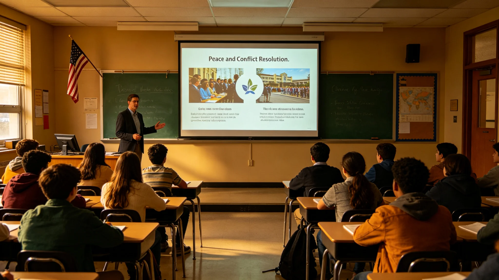

# 三恒星系联合反恐怖与极端思想预防教育体系公报

**发布机构**：三恒星系文明联合体安全协调委员会 / 教育委员会
**发布日期**：3199年4月20日
**文件等级**：跨星系公开

## 一、体系建立

自2994年三恒星系联合反恐演习以来（见GS-2994-01），三恒星系已建立联合反恐机制。3199年，安全协调委员会与教育委员会联合发布《反恐怖与极端思想预防教育体系》，将反恐教育纳入基础教育课程。

## 二、教育内容

1. **文明认同教育**：跨星系文明共同体意识；
2. **批判性思维**：识别极端思想宣传的能力；
3. **冲突解决**：非暴力沟通与协商能力；
4. **法律意识**：跨星系法律体系基本认知。

## 三、实施

该教育内容自3199学年起纳入三恒星系基础教育课程，每学年不少于16学时。

## 续录一：施行细则与监督反馈

本公报所定事项自公布之日起施行。施行细则如下：

1. 各执行单位须于公布后30日内制定本单位实施方案，报主管部门备案；
2. 实施方案须列明责任人、时间节点、资源需求；
3. 主管部门每季度对执行情况作一次检查，检查结果书面通知执行单位；
4. 执行单位遇重大困难可申请延期，延期不超过6个月；
5. 本公报施行满一年后作首次评估，评估报告报上级部门。

监督反馈渠道：公民对执行情况有异议者，可通过主管部门公开信箱提交，30日内答复。本公报与相关既有法规交叉引用之处，以正文所列档案编号为准。本公报不溯及既往，施行前已发生的法律事实按当时法规处理。

## 续录二：归档与查阅说明

本文书形成后按归档规则存入联合体档案系统。归档编号已在文末注明。档案查阅依《联合体历史档案开放条例》办理：自形成之日起满150年者，除涉及在世个人隐私外，向公民开放。查阅申请须提交身份证明与查阅目的说明，档案管理部门在5个工作日内答复。

本文书与其他档案的交叉引用关系以正文中所列GS编号为准。引用其他档案时不重复其内容，只注明编号。本文书的修订历史附于档案卷末，历次修订版本均予保留，不删除原件。本卷为最终归档版本，未经档案管理部门同意不得修改。档案数字化副本与纸质原件具有同等效力。

---

**归档编号**：SEC-EDU-3199-001
**编制**：联合体安全协调委员会、教育委员会
**日期**：3199年4月20日

## 四、实施监督与课程评估

该教育内容自3199学年起纳入三恒星系基础教育课程，每学年不少于16学时。教育委员会设课程评估处，每年对三恒星系抽样学校作一次课程实施情况评估，评估指标包括学时落实、学生参与度、教师培训覆盖率。

教育内容四项：文明认同教育、批判性思维、冲突解决、法律意识。本课程不培养学生举报同学，不设思想审查。课程目标是识别极端思想宣传的能力，而非限制言论。本体系与GS-2994-01联合反恐演习、GS-3187-01网络安全升级互锁。

## 续录一：施行细则与监督反馈

本公报所定事项自公布之日起施行。施行细则如下：

## 续录二：归档与查阅说明

## 续录一：施行细则与监督反馈

本公报所定事项自公布之日起施行。施行细则如下：

## 续录二：归档与查阅说明

## 续录一：施行细则与监督反馈

本公报所定事项自公布之日起施行。施行细则如下：

## 续录二：归档与查阅说明

## 附则补充：教师培训与课程评估指标

课程自3199学年起实施，每学年不少于16学时。三恒星系首期教师培训于3199年暑期完成，参训教师1,240人，考核通过率98.7%。课程评估指标四项：学时落实率、学生参与度、教师培训覆盖率、课程内容合规性。本课程不培养学生举报同学，不设思想审查，与GS-2994-01、GS-3187-01互锁。

## 附则再补：课程评估与教师轮换

课程评估处每年抽样学校不低于三恒星系学校总数的5%。教师培训每三年复训一次，复训未通过者不得继续授课。本课程内容不含针对特定族群或宗教的评价，只作跨星系文明共同体意识教育。课程教材每五年修订一次，修订稿公开征求意见30日。
