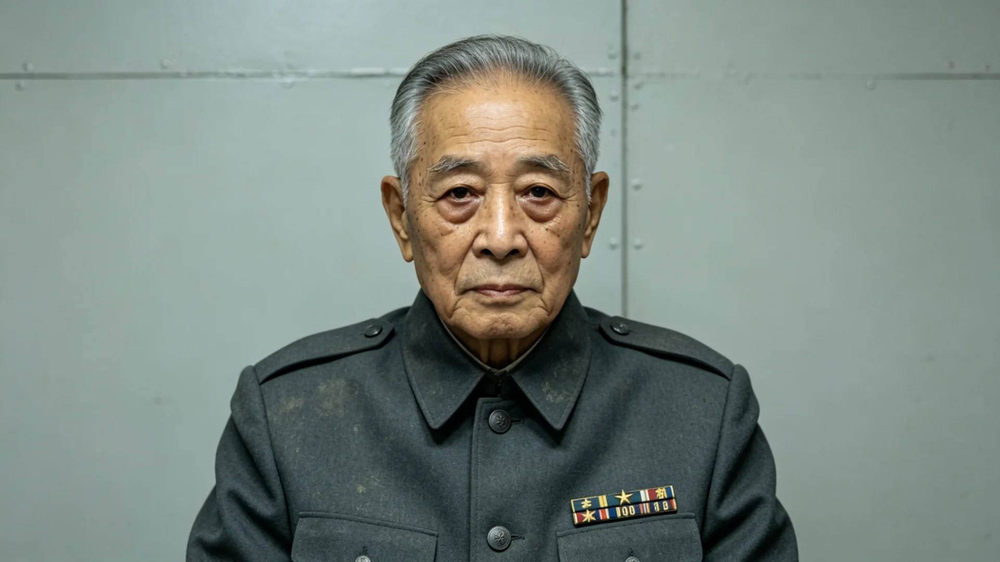

# 跨星系仲裁庭资深仲裁员任内考勤体检与处分档案

**案卷保管单位**：三恒星系文明联合体跨星系仲裁庭人事档案科
**卷内材料**：考勤表、年度体检通报、签名样卡、处分与嘉奖记录、任满交接清单
**立卷日期**：3201年3月1日
**密级**：跨星系公开（个例资料隐名后可作训鉴）

## 一、人员基本登记

姓名：闻观澜。籍贯：新海市第三环第七居住带。出生年：3159年，父系为主小行星带谷神星第二矿站移民后裔，母系为比邻星b新海岸农业区人氏，系联合体成立后第三代跨星系通婚家庭子女。本人自述幼年随父往返谷神星与新海市间六次，对跨系户籍与学籍迁移之不便有切身体会，此为后来选择仲裁专业之由（见3193年毕业面试笔录，存档）。

3187年入联合体法政学院跨星系法专业，主修跨系商事与航道争议方向，3193年毕业，毕业论文《运力配额拍卖争议中的时差举证规则》指导教师评语为"平允有据"。3196年经公务员统一考任（见GS-3019-01）入跨星系仲裁庭任助理仲裁员，3204年起任资深仲裁员，至3201年立卷时累计办理跨星系商事与航道争议案件四百一十七件，其中独立任首席仲裁员一百八十六件。

登记照附注（档案科3201年1月复核）：本人面貌较任职初年明显清瘦，左眉骨有一处早年随父探访矿站时事故遗留浅疤，体检表背面本人手写"照实归档，不必修饰"。

## 二、考勤摘录（3196—3200年度）

| 年度 | 应到席次数 | 实到 | 迟到 | 早退 | 病假 | 备注 |
|---|---|---|---|---|---|---|
| 3196 | 142 | 142 | 0 | 0 | 0 | 见习年 |
| 3197 | 158 | 157 | 1 | 0 | 0 | 迟到因跨系航班延误，附证明 |
| 3198 | 161 | 160 | 0 | 1 | 1 | 母病探假，已补 |
| 3199 | 155 | 155 | 0 | 0 | 0 | 办案满百件 |
| 3200 | 149 | 148 | 0 | 0 | 1 | 流感，未影响开庭排期 |

仲裁庭考勤以"开庭日到席"为准，跨系出差按航班回执另计。闻观澜五年间累计跨系出差三十九次，其中第四恒星系方向十一次，航程均在四十日以上，往返均按时交回差旅回执，无一次压件。3197年那次迟到，系因"星尘号"（GS-3154-01）通信中断同类事件之早期个案，航班在航道临时改道后延误十一小时，本人当面向合议庭说明并附航道管制证明，未计违纪。

## 三、年度体检通报摘录

- 3197年体检：视力矫正后1.0，前庭功能因频繁跨系航行评定为"适应良好"，骨密度较同年龄段新海市常住人口低3.2%，系早年两次长期微重力航行所致，航医建议每半年复查一次。
- 3198年体检：血压、听力正常；腰椎X线未见异常。
- 3199年体检：腰椎间盘轻度膨出，与长期伏案阅卷有关，航医建议停用连续阅卷超四小时排班两月，复查后恢复，未影响办案数量。
- 3200年体检：各项指标平稳，骨密度较3197年回升0.8个百分点，与增加离心环锻炼有关。航医评语"作息规律，无酗酒吸烟记录，档案优良"。

## 四、处分与嘉奖记录

1. 3198年第三季度，因在一宗航道运费争议中误引已废止之旧版运力指数（见GS-3114-01附表），被合议庭退回重写裁决理由，记"书面诫勉"一次，入卷。本人在卷尾附三页更正说明，逐条比对新旧指数口径，未上诉，亦未再犯同类错误。
2. 3199年，主办一宗主带矿站跨系供货违约案，查明事实与法律适用均无误，双方服裁，未上诉，记嘉奖一次。
3. 3200年，因连续三年全勤且跨系出差零投诉，获仲裁庭"勤勉任事"通报表扬一次。

五年间无一次警告以上处分，无一次被当事人依监察专员程序（GS-3043-01）正式投诉成立。

## 五、签名样卡与笔迹备注

卷内附3196年、3198年、3200年签名样卡各一。3196年签名锋棱尚锐，"闻"字起笔重；3198年趋稳；3200年签名末笔略枯，与腰椎患病后伏案姿势改变有关。档案科备注：签字逐年稳定，与办案签批件比对一致，无代签痕迹；三份样卡均为本人当场书写，有监签人在场。

## 六、卷内物证清单

1. 3196—3200年度考勤表五张，均有本人逐日手签，迟到病假处另附证明；
2. 年度体检通报五份，其中3199年腰椎复查报告附影像片号，未附影像原件（原件在航医档案库）；
3. 签名样卡三张，监签人分别为书记员贺知、周允、马衡；
4. 处分决定书一份（3198年书面诫勉）、嘉奖令两份；
5. 跨系出差差旅回执三十九份，按年装订；
6. 交接清单两页，本人与接收人双签。

卷内无本人私人书信、无家属来信、无任何与办案无关之材料。档案科说明：依公民知情权制度（见GS-3181-01），本人申请调阅本卷已获批准，调阅记录附卷末。

## 七、任满交接意见

3201年初，闻观澜申请转任仲裁庭研究室，不再一线办案，理由为"久在海上，愿以余年整理跨系裁决要旨，供后学参照"。交接清单列明：在办案件六件，已逐案移交卷宗与电子卷，并附每件之争议焦点摘要；个人阅卷笔记十一册，依档案管理规定（见GS-3015-01）归档文枢中心，附目录一页；私人物品无。人事科签注：同意转任，五年考核均为称职以上，无未结处分。研究室表示接收，拟以其办案经验主持跨系裁决要旨年度汇编。

---

**立卷人**：仲裁庭人事档案科科员 岑立
**复核**：仲裁庭秘书室
**日期**：3201年3月1日
