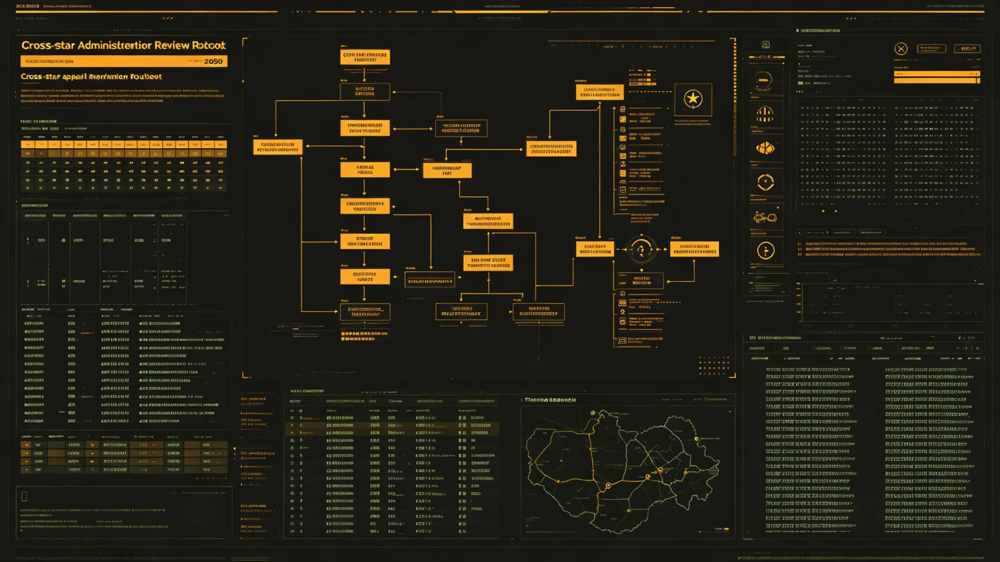

# 联合体跨星系行政复议与申诉审查制度完善公报

**发布机构**：三恒星系文明联合体行政复议审查委员会
**发布日期**：3202年6月18日
**文件等级**：跨星系公开

## 一、修订背景

联合体行政复议与申诉审查制度自公务员统一考任（GS-3019-01）与议会公开议事制度（GS-3020-01）建立以来，已运行逾百年。随着跨星系人员自由流动（GS-3060-01、GS-3166-01）与户籍选举权并轨（GS-3138-01）的深入，公民在星际间迁徙、任职、就学、纳税的频率较百年前高出一个数量级，对联合体各级行政机关的决定提出异议的案件逐年增多。原复议程序在跨系送达、时差听证、异地审理三个环节上的规则，仍是按"同一行星表面"的假设设计的，已明显滞后。3201年全年，跨系复议申请因"未在期限内收到文书"或"须本人到原机关所在地"而被补正或驳回的，达一百一十一件，占当年跨系复议总量的一成四。经宪法法院建议（GS-3013-01），本委员会于3201年启动制度完善，前后召开跨系听证七次、征求三系意见两轮，3202年6月完成修订。

## 二、本次完善的七项细则

| 序号 | 细则 | 原规则 | 修订后 |
|---|---|---|---|
| 1 | 复议申请期限 | 自知道决定起30协星日 | 跨系送达情形按通信时延最长顺延至90协星日 |
| 2 | 听证方式 | 原则上现场 | 一律允许跨系光程远程听证，笔录同步存证 |
| 3 | 异地审理 | 原则上由原机关所在地管辖 | 申请人可申请在定居地就近复议点审理 |
| 4 | 代理与法律援助 | 未明确 | 跨系案件申请人有权获一名免费跨系法助代理人 |
| 5 | 重大公共利益案件 | 不公开 | 涉及生态红线（GS-3031-01）者应公开审理摘要 |
| 6 | 复议不停止执行 | 一律不停止 | 涉及人身、居住、学籍迁移（见GS-3219-01）者可申请暂停 |
| 7 | 复查次数 | 可无限制复查 | 同一事项经一次复议、一次诉讼后不再受理 |

## 三、重点条款说明

第3项异地审理，是本次修订中争议最大的一条。反对意见担心分散审理会造成裁判口径不一；修订组的回应是：异地审理只改变开庭地点，不改变裁判适用之统一规则，裁决文书仍由原管辖合议庭署名，口径不因此分裂。第6项暂停执行，限定于"一旦执行即难以回复"的事项，如学籍迁移、强制迁出、查封跨系账户等，普通税费缴纳不在暂停之列，以免滥用。

## 四、执行数据（3202上半年试行）

修订稿于3202年1月起在新海市、谷神星第二矿站、鲸港下都三地先行试行半年。试行期内：

- 受理跨系复议案件一百二十七件，较上年同期增加四成，主要来自学籍迁移（四十一）、纳税退籍（见GS-3207-01，二十八）、津贴与工龄折算（见GS-3233-01，二十二）；
- 异地审理申请四十二件，全部在十五协星日内排定，无一件超期；
- 因通信时延顺延申请期限的案件十九件，无一件因超期被拒；
- 远程听证开庭八十三次，因光程延迟导致的"双方抢答"问题，通过统一延迟提示音解决，未影响笔录；
- 维持原决定率61%，变更或撤销率29%，撤诉率10%，与修订前大体相当，未见滥诉增加。

## 五、征求意见与社会反响

修订草案公示期间，共收到三系及第四恒星系意见四百一十二条。其中赞成异地审理者二百八十九条，主要为跨系任职公务员与在第四恒星系服役的远征船员家属；持保留意见者九十一条，多为担心裁判口径分散的地方行政机关。意见处理结果：异地审理条款按原案保留，另增"裁决文书统一署名、口径由庭务会季度复核"之说明，以回应顾虑。另有三十一条意见建议将学籍迁移（见GS-3219-01）明确列入可暂停执行事项，已采纳为第6项之列举。

## 六、配套措施

1. 复议文书统一接入文枢档案中枢（GS-3015-01），跨系申请人可在任一复议点调阅本人卷宗，不必千里往返；
2. 跨系远程听证录音录像保存三十年，公民凭身份证号可申请本人案件的查阅，涉密案件按另则办理；
3. 对行政机关首次因程序瑕疵被撤销决定的，只作书面指导，不直接追究经办人责任；再次发生的，依公务员考绩法（GS-3052-01）处理；
4. 复议点工作人员每年须接受一次跨系规则轮训，考核不合格者不得受理跨系案件。

## 七、施行安排

本细则自3202年7月1日起在三恒星系各定居点及第四恒星系前哨同步施行。第四恒星系方向因通信时延较长，异地审理点先行设在新拓前哨（GS-3101-01）一处，待航线稳定后增设。各地旧有与本细则抵触的规程，自施行日起一律以本细则为准。

## 七、后续年度评估

细则施行满一年后，行政复议审查委员会将对跨系复议受理量、异地审理排队时长、撤诉率三项作年度评估。委员会说明：制度完善非一劳永逸，跨系社会在变，规则亦须随年修订。本细则自施行起，每三年小评、每五年大评，评估结果公开，接受议会旁听（见GS-3020-01）。

---

**签发**：行政复议审查委员会主任 邵知微
**日期**：3202年6月18日
**归档编号**：ADM-REV-3202-011
